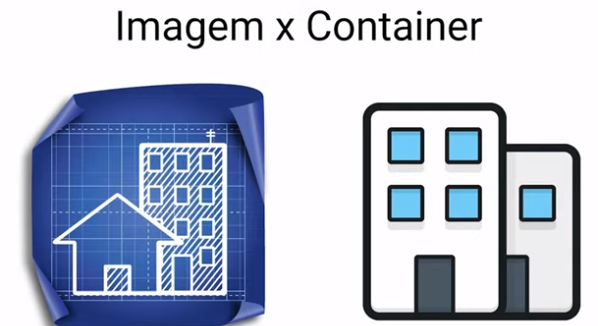
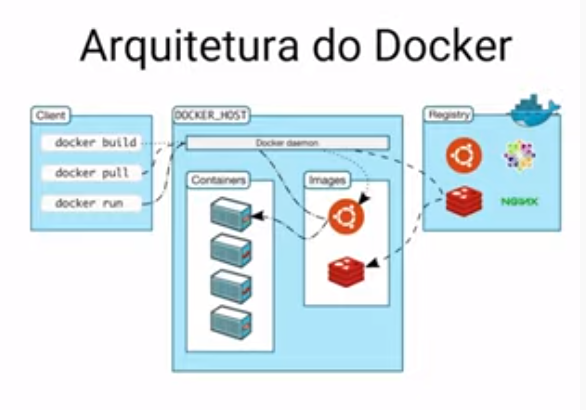
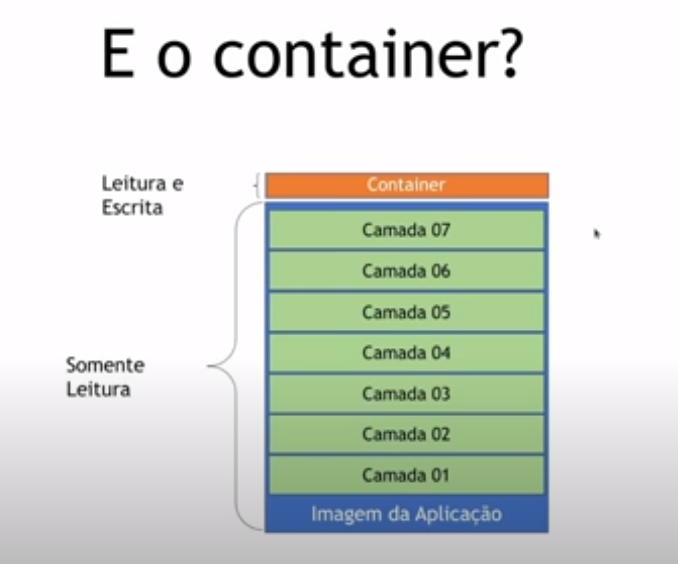
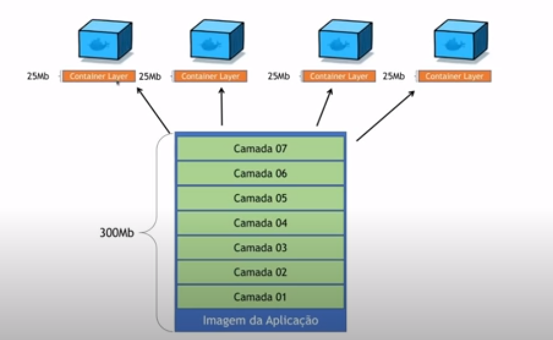
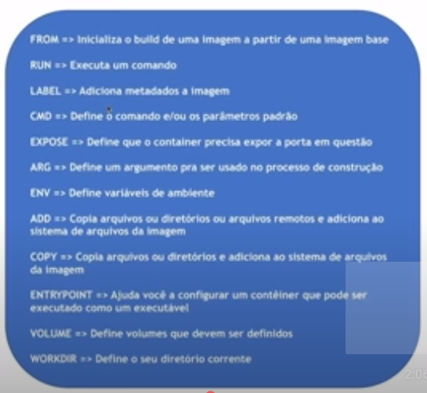

# Docker: The Basic

## Introduction

> ```https://www.youtube.com/watch?v=Zz1q0TyJLGE```

## Docker Image vs Docker Container

> Docker Image:
>
> Docker Container:



Components:

- Docker deamon
- Docker client
- Docker registry (hub.docker.com)



## Install

Follow instructions on:

- [Install Docker Engine on Ubuntu](https://docs.docker.com/engine/install/ubuntu/)

Verify, first run and other basic commands:

```s
docker --version
docker version
time docker container run hello-world
docker container ls
docker container ls -a
docker image ls
time docker container run --name segundo-container hello-world
docker container ls
docker container ls -a
docker image ls
docker container rm <id container>
docker container rm segundo-container
time docker container run --name terceiro-container --rm hello-world
docker container ls
docker container ls -a
```

## Interactive mode

```s
docker container run -it --name my-ubuntu ubuntu /bin/bash
```

- On another terminal execute this:

```s
docker container ls
```

- On container, execute this:

```s
ls -lah
ip -br -c a
apt update
cat /etc/lsb-release
exit
```

- Then on terminal execute this:

```s
docker container ls
docker container ls -a
```

## Deamon mode

```s
docker container run --name server1-nginx nginx
```

- On another terminal execute this:

```s
docker container ls
docker container stop server1-nginx
docker container ls -a
```

- Back to the first terminal:

```s
docker container run --name server2-nginx -d nginx
docker container ls
docker container run --name server3-nginx -d -p 8080:80 nginx
```

## Other basic commands

```s
docker container ls
docker container exec -it <CONTANER ID> /bin/bash
docker container stop <CONTANER ID>
docker container ls
docker container start <CONTANER ID>
docker container rm -f <CONTANER ID>
docker container rm <CONTANER ID>
docker container logs <CONTANER ID> 
docker container logs -f <CONTANER ID> 
docker container logs -t <CONTANER ID> 
```

## Passing environment variables

> Inspect Mongo image Docker on ```hub.docker.com```.

```s
docker container run -d -p 27017:27017 -e MONGO_INITDB_ROOT_USERNAME=mongouser -e MONGO_INITDB_ROOT_PASSWORD=mongopwd --name mymongo mongo
```

Connect by [Robo 3T](https://robomongo.org/) on container MongoDB.

## Inspect commands

```s
docker container ls
docker container inspect <CONTANER ID>
``` 

## Images



Image is a conjunct of read-only layers

On a Container we put a read-write layer on top



How to construct?

- Docker Commit
- Dockerfile

### Docker Commit mode

```s
docker container run -it ubuntu /bin/bash

# inside container
apt-get update
apt-get upgrade
apt-get install curl
exit

# on host machine
docker container ls -a
docker commit <CONTAINER ID> ubuntu-curl-commit
docker image ls 

docker container run -it ubuntu-curl-commit

# inside new container
curl --version 
exit

# on host machine
docker container run ubuntu-curl-commit curl https://www.google.com
```

### Dockerfile mode

```Dockerfile
FROM ubuntu

RUN apt-get update
RUN apt-get install curl --yes
```

```s
docker image build -t ubuntu-curl-file .
docker image ls 
docker image ls -a
```

- Cache problems

```Dockerfile
FROM ubuntu

RUN apt-get update
RUN apt-get install curl --yes
RUN apt-get install vim --yes
```

```s
docker image build -t ubuntu-curl-file .
docker image ls 
docker image ls -a
```  

- Avoinding this problem (and layers)

```Dockerfile
FROM ubuntu

RUN apt-get update && apt-get install curl vim --yes
```

```s
docker image build -t ubuntu-curl-file .
docker image ls 
docker image ls -a
```  

- Manipulating images

```s
docker image ls 
docker image ls -a
docker image prune 
docker image rm <REPOSITORY>
docker image inspect <REPOSITORY>
docker image history <REPOSITORY>
```

### Dockerfile optins

Other options to use with Dockerfile

- FROM
- RUN
- LABEL
- CMD
- EXPOSE
- ARG
- ENV
- ADD
- COPY
- ENTRYPOINT
- VOLUME
- WORKDIR



## First container app

> Resources on ```https://github.com/KubeDev/conversao-temperatura```

```Dockerfile
FROM node
WORKDIR /app

COPY package*.json ./
RUN npm install
COPY . .

EXPOSE 8080
CMD ["node", "server.js"]
```

```s
docker image build -t conversao-temperatura .
docker container run -d -rm -p 8080:8080 --name conv-temp conversao-temperatura
```

## Best practices

- Nomenclature

```s
# <NAMESPACE>/<REPOSITORY>:<TAG>

docker image build -t tarsoqueiroz/conversao-temperatura:v1 .
 ```

- It's better to use official image
- Use the image version (tag)
- A process by container
- Optimize layers
- Use .dockerignore
- COPY vs ADD - COPY is preferred
- ENTRYPOINT vs CMD - Or both

```s
# on ./EntrypointVsCmd
docker build -t tarsoqueiroz/ubuntu-start:cmd -f Dockerfile-cmd .
docker container run tarsoqueiroz/ubuntu-start:cmd # echoe "Initializing container..."
docker container run tarsoqueiroz/ubuntu-start:cmd echo "Other command..."  # echoe "Other command..."

docker build -t tarsoqueiroz/ubuntu-start:entry -f Dockerfile-entry .
docker container run tarsoqueiroz/ubuntu-start:entry # echoe "Initializing container..."
docker container run tarsoqueiroz/ubuntu-start:entry echo "Other command..."  # echoe "Initializing container..."

docker build -t tarsoqueiroz/ubuntu-start:entrycmd -f Dockerfile-entrycmd .
docker container run tarsoqueiroz/ubuntu-start:entrycmd # echoe "Initializing container without parm..."
docker container run tarsoqueiroz/ubuntu-start:entrycmd echo "OTHER PARM"  # echoe "Initializing container with parm OTHER PARM..."
```

## Arguments in building images

- ```Dockerfile``` with arguments

```dockerfile
ARG TAG=latest

FROM ubuntu:${TAG}
RUN apt-get update && \
    apt-get install curl --yes
```

```s
docker image build -t tarsoqueiroz/ubuntu-arg:v1 --build-arg TAG="18.04" .
```

## Multistage build

Program languages types:

- Interpreted
- Compiled
- JIT (Just In Time)

- ```main.go```

```go
package main
import "fmt"

func main() {
  fmt.Println("Hello World!!!")
}
```

- ```Dockerfile.gosimples```

```dockerfile
FROM golang:1.7.3
WORKDIR /app
COPY main.go .
RUN CGO_ENABLED=0 GOOS=linux go build -a -installsuffix cgo -o main 
CMD [ "./main " ] 
```

```s
docker image build -t tarsoqueiroz/go-app:simples -f Dockerfile.gosimples .
```

Result: image with 679MB

- ```Dockerfile.gomulti```

```dockerfile
FROM golang:1.7.3 as build
WORKDIR /app
COPY main.go .
RUN CGO_ENABLED=0 GOOS=linux go build -a -installsuffix cgo -o main 

FROM alpine:3.14 as final
WORKDIR /app
COPY --from=build /app/main .
CMD [ "./main " ] 

```

```s
docker image build -t tarsoqueiroz/go-app:multi -f Dockerfile.gomulti .
```

Result: image with 7.23MB

## Docker Registry

> hub.docker.com

Options:

- Docker Hub
- Elastic Container Registry
- Azue Container Registry
- Google Container Registry
- Harbor (Registry on-premise)

Steps:

- Create account
- 

```s
docker image ls
docker login
docker push tarsoqueiroz/go-app:multi 
docker tag tarsoqueiroz/go-app:multi tarsoqueiroz/go-app:latest
docker push tarsoqueiroz/go-app:latest
docker image rm tarsoqueiroz/go-app:multi
docker image rm tarsoqueiroz/go-app:latest
docker run docker tarsoqueiroz/go-app:latest
```

## That's all folks!!!
___
