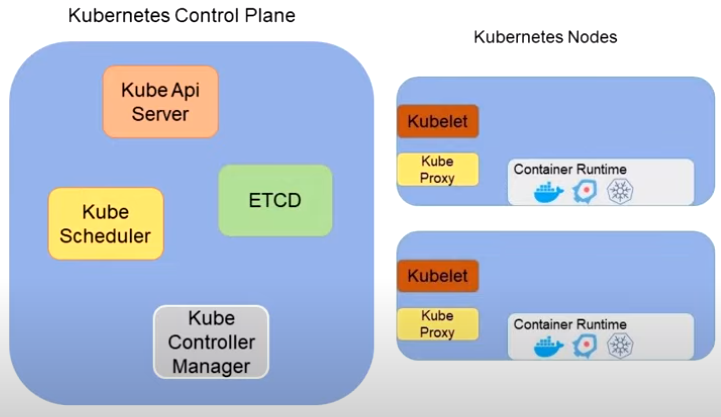
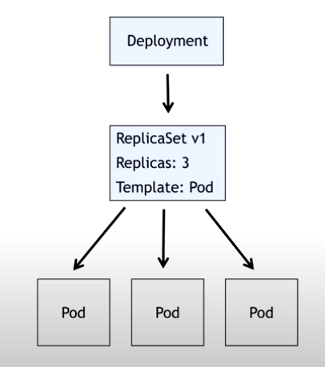
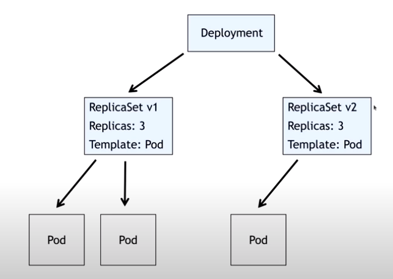
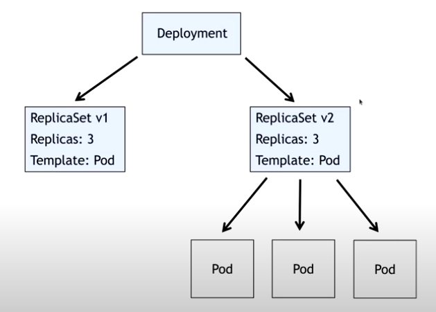
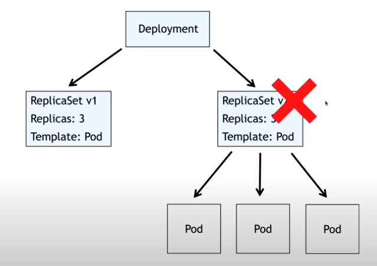
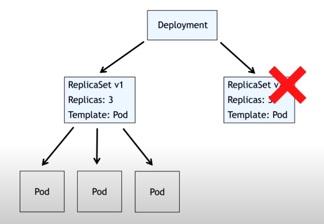

# Desvendando o Kubernetes

> ```https://www.youtube.com/watch?v=5y6GYa3crvs```

## Introduction



## Formas

On-Premisse

- Kubeadm
- Kubespray
- RKE
- K3S
- MicroK8S

Kubernetes as a Service

- AKS
- EKS
- GKE

Local

- Minikube
- Kind
- K3D
- MicroK8S
- K3S

## Usando o Kind

- Installing Kind

> Tip from ```https://kind.sigs.k8s.io/docs/user/quick-start```

```s
curl -Lo ./kind https://kind.sigs.k8s.io/dl/v0.11.1/kind-linux-amd64
chmod +x ./kind
mv ./kind /some-dir-in-your-PATH/kind
```

- Installing ```kubectl```

> Tip from ```https://v1-18.docs.kubernetes.io/docs/tasks/tools/install-kubectl/```

- First Kind Cluster

```s
kind create cluster --name tqcluster

kind get clusters
kind delete cluster --name tqcluster
```

- Config file for cluster creation

```yaml
kind: Cluster
apiVersion: kind.x-k8s.io/v1alpha4

nodes:
- role: control-plane
- role: control-plane
- role: control-plane
- role: worker
- role: worker
- role: worker
```

- Cluster creation with config file

```s
kind create cluster --name tqcluster --config ./cluster.yaml 
kubectl get nodes
docker container ls
```

## Deploy on Kubernetes

Basic elements

- Pod
- ReplicaSet
- Deployment

### Pod

- Menor unidade de desenvolvimento dentro do Kubernetes.
- Separar uma aplicação em diversos Pod's

- Pod manifest file ```meupod.yaml```

```yaml
apiVersion: v1
kind: Pod
metadata:
  name: meupod
spec:
  containers:
    - name: web
      image: kubedevio/web-page:blue
      ports:
        - containerPort: 80
```

- Executing this pod

```s
kubectl api-resources  # how to verify apiVersion? use this command

kubectl create -f meupod.yaml
kubectl get pods

kubectl describe pod meupod

kubectl port-forward pod/meupod 8080:80

kubectl delete pod meupod
kubectl get pods
```

## Labels and Selectors

- Pod manifest file ```meupod.yaml``` with labels

```yaml
apiVersion: v1
kind: Pod
metadata:
  name: meupod
spec:
  containers:
    - name: web
      image: kubedevio/web-page:blue
      ports:
        - containerPort: 80
---
apiVersion: v1
kind: Pod
metadata:
  name: meusegundopod
  labels:
    app: web
spec:
  containers:
    - name: web
      image: kubedevio/web-page:blue
      ports:
        - containerPort: 80
```

- Executing this new Pod manifest

```s
kubectl apply -f meupod.yaml 
kubectl get pods 
kubectl get pods -l app=web
```

## Replicaset

- Replicaset manifest file ```meureplicaset.yaml```

```yaml
apiVersion: apps/v1
kind: ReplicaSet
metadata:
  name: meureplicaset
spec:
  replicas: 2
  selector:
    matchLabels:
      app: web
  template:
    metadata:
      labels:
        app: web
    spec:
      containers:
        - name: web
          image: kubedevio/web-page:blue
          ports:
            - containerPort: 80
```

- Executing this new ReplicaSet manifest

```s
# Com 1 pod"
kubectl apply -f meureplicaset.yaml 
kubectl get replicaset
kubectl get pods
# Ajustando para 3 pods"
kubectl apply -f meureplicaset.yaml 
kubectl get replicaset
kubectl get pods
kubectl describe replicaset meureplicaset
kubectl describe pod meureplicaset-28rd2
kubectl delete pod meureplicaset-t4fmh
kubectl get pods
# Ajustando para 2 pods"
kubectl apply -f meureplicaset.yaml 
kubectl get pods
```

> ***TIP:  Port-forward for a specific pod***
>
> ```kubectl port-forward pod/<POD_ID> <HOST PORT>:<POD PORT>```

## Deployment

Version control for my ReplicaSet (or Deployment)



Deploy a new version



Migration to new version



But if new version had a problem?



Roll-back to old release



- Deployment manifest file ```meudeployment.yaml```

```yaml
apiVersion: apps/v1
kind: Deployment
metadata:
  name: meudeployment
spec:
  replicas: 1
  selector:
    matchLabels:
      app: web
  template:
    metadata:
      labels:
        app: web
    spec:
      containers:
        - name: web
          image: kubedevio/web-page:blue
          ports:
            - containerPort: 80
```

- Executing this new Deployment manifest

```s
kubectl apply -f meudeployment.yaml
kubectl get deployment
kubectl get replicaset
kubectl get pods

# Testing resiliência
kubectl delete pod meudeployment-dc9f67696-mm7t5
kubectl get pods

# Testing escalability (replicas from 1 to 6)
kubectl apply -f meudeployment.yaml 
kubectl get pods

# Testing new version (from blue to green)
kubectl apply -f meudeployment.yaml 
kubectl get pods
kubectl get replicaset

# If I need to roolback
kubectl rollout history deployment meudeployment
kubectl rollout undo deployment meudeployment
kubectl get replicaset
kubectl describe replicaset meudeployment-dc9f67696
kubectl rollout history deployment meudeployment
kubectl get pods
kubectl describe pod meudeployment-dc9f67696-9bxjk
```

## Services

Types of Service

- ClusterIP - Internal communication
- NodePort - External channel (30000 - 32767) for any IP of nodes in my cluster
- LoadBalancer - For Internet external channel

- Deployment with Services manifest file ```meudeloyment.yaml```

```yaml
apiVersion: apps/v1
kind: Deployment
metadata:
  name: meudeployment
spec:
  replicas: 6
  selector:
    matchLabels:
      app: web
  template:
    metadata:
      labels:
        app: web
    spec:
      containers:
        - name: web
          image: kubedevio/web-page:green
          ports:
            - containerPort: 80

---

apiVersion: v1
kind: Service
metadata:
  name: web
spec:
  selector:
    app: web
  ports:
    - port: 80
      protocol: TCP
      name: http
  type: ClusterIP

```

- Executing this new Deployment manifest

```s
kubectl apply -f meudeployment.yaml 
kubectl get services

# Change to NodePort"
kubectl apply -f meudeployment.yaml 
kubectl get services
```

## Adjusting my cluster

We need to adjust our cluster to bind my host ip to my kubernetes cluster

- Cluster config file ```cluster.yaml```

```yaml
kind: Cluster
apiVersion: kind.x-k8s.io/v1alpha4

nodes:
- role: control-plane
- role: control-plane
- role: control-plane
- role: worker 
- role: worker
- role: worker
  extraPortMappings:
  - containerPort: 30000
    hostPort: 8080
```

- Deployment with Services for port-bind manifest file ```meudeloyment.yaml```

```yaml
apiVersion: apps/v1
kind: Deployment
metadata:
  name: meudeployment
spec:
  replicas: 6
  selector:
    matchLabels:
      app: web
  template:
    metadata:
      labels:
        app: web
    spec:
      containers:
        - name: web
          image: kubedevio/web-page:green
          ports:
            - containerPort: 80

---

apiVersion: v1
kind: Service
metadata:
  name: web
spec:
  selector:
    app: web
  ports:
    - port: 80
      protocol: TCP
      name: http
      nodePort: 30000
  type: NodePort
```

- Now, hands on

```s
kind get clusters
kind delete cluster --name tqcluster
kind create cluster --name meucluster --config cluster.yaml
kubectl get nodes
docker container ls
kubectl apply -f meudeployment.yaml 
kubectl get all
# When ready, try to access from you host on localhost:8080
```

## Deployment of an application from scratch

> Rotten Potatoes from ```https://github.com/KubeDev/rotten-potatoes.git```

- Clone the project
- Recreate the Kubernetes cluster
- Create a ```Dockerfile``` on ```rotten-potatoes/src```

```dockerfile
FROM python:3.8
WORKDIR /app

COPY requirements.txt .
RUN python -m pip install -r requirements.txt
COPY . . 
EXPOSE 5000
CMD [ "gunicorn", "--workers=3", "--bind", "0.0.0.0:5000", "app:app" ]
```

- Build, view and up to hub the image

```s
docker build -t tarsoqueiroz/rotten-potatoes:v1 .
docker image ls
docker login
docker push tarsoqueiroz/rotten-potatoes:v1
docker tag tarsoqueiroz/rotten-potatoes:v1 tarsoqueiroz/rotten-potatoes:latest
docker push tarsoqueiroz/rotten-potatoes:latest
```

- Create deployment.yaml on ```rotten-potatoes/k8s``` for MongoDB

```yaml
# Deployment do MongoDB
apiVersion: apps/v1
kind: Deployment
metadata:
  name: mongodb
spec:
  selector:
    matchLabels:
      app: mongodb
  template:
    metadata:
      labels:
        app: mongodb
    spec:
      containers:
        - name: mongodb
          image: mongo:4.4.6
          resources:
            limits:
              memory: "512Mi"
              cpu: "500m"
          ports:
            - containerPort: 27017
          env:
            - name: MONGO_INITDB_ROOT_USERNAME
              value: mongouser
            - name: MONGO_INITDB_ROOT_PASSWORD
              value: mongopwd
---
# Service do MongoDB
apiVersion: v1
kind: Service
metadata:
  name: mongodb
spec:
  selector:
    app: mongodb
  ports:
    - port: 27017
  type: ClusterIP
```

- Deploy and test of MongoDB

```s
kubectl apply -f deployment.yaml 
kubectl get pods
kubectl get all
kubectl port-forward svc/mongodb 27017:27017 # Try to connect by Robo3T
```

- Adding on deployment.yaml on ```rotten-potatoes/k8s``` the Web App instructions

```yaml
# Deployment do MongoDB
#
# ...
#
---
# Service do MongoDB
#
# ...
#
---
# Deployment da aplicação web
apiVersion: apps/v1
kind: Deployment
metadata:
  name: web
spec:
  replicas: 1
  selector:
    matchLabels:
      app: web
  template:
    metadata:
      labels:
        app: web
    spec:
      containers:
      - name: web
        image: tarsoqueiroz/rotten-potatoes:v1
        resources:
          limits:
            memory: "128Mi"
            cpu: "500m"
        ports:
          - containerPort: 5000
        env:
          - name: MONGODB_DB
            value: "admin"
          - name: MONGODB_HOST
            value: "mongodb"
          - name: MONGODB_PORT
            value: "27017"
          - name: MONGODB_USERNAME
            value: "mongouser"
          - name: MONGODB_PASSWORD
            value: "mongopwd"
---
# Service  da aplicação web
apiVersion: v1
kind: Service
metadata:
  name: web
spec:
  selector:
    app: web
  ports:
  - port: 80
    targetPort: 5000
    nodePort: 30000
  type: NodePort
```

- Deploy and test of Web App

```s
kubectl apply -f deployment.yaml 
watch kubectl get all
# try to access the web app on localhost:8080
```

## That's all folks!!!
___
