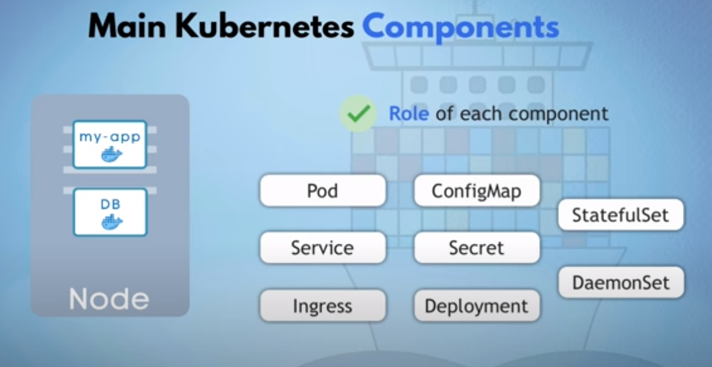

# TechWorld with Nana: Kubernetes Crash Course for Absolute Beginners

> ```https://www.youtube.com/watch?v=s_o8dwzRlu4```

## 0:00:00 - Intro and Course Overview

- GitLab [K8s-in-1-hour](https://gitlab.com/nanuchi/k8s-in-1-hour)

```Shell
kind get clusters
kind create cluster --config ./infra/nanacrashcourse.yaml
kind get clusters
kind get nodes --name nanacrashcourse
kubectl get nodes -o wide
```

- For ingress, apply manifests on `https://kind.sigs.k8s.io/docs/user/ingress/`

## 0:01:44 - What is Kubernetes

- Container orchestration

Main features:

- High avlilability or no downtime
- Scalabilty or high performance
- Disaster recovery

## 0:04:33 - Kubernetes Architecture

- Control Plane Nodes
- Worker Nodes

## 0:09:29 - Node and Pod



## 0:08:58 - Main K8s Components

## 0:09:29 - Node & Pod

## 0:12:19 - Service & Ingress

## 0:14:31 - ConfigMap & Secret

## 0:17:52 - Volume

## 0:19:46 - Deployment & StatefulSet

## 0:26:28 - Kubernetes Configuration

## 0:32:39 - Minikube and Kubectl - Setup K8s cluster locally

## 0:41:17 - Complete Demo Project: Deploy WebApp with MongoDB

- Creating the secret parms

```Shell
echo -n mongouser | base64
echo -n mongopassword | base64
```
- Creating all of four manifests

Estou em `https://www.youtube.com/watch?v=s_o8dwzRlu4` estou em 56:40

## 1:05:40 - Interacting with Kubernetes Cluster

```Shell
kubectl get nodes -o wide
kubectl get pods
kubectl apply -f manifests/mongo-config.yaml 
kubectl apply -f manifests/mongo-secret.yaml 
kubectl apply -f manifests/mongo.yaml 
kubectl apply -f manifests/webapp.yaml 
kubectl get all
kubectl get configmaps 
kubectl get secrets 
kubectl get pods
kubectl describe service webapp-service 
kubectl describe pod webapp-deployment-......
kubectl get pod
kubectl logs webapp-deployment-......
kubectl get service
kubectl get nodes -o wide
ip -br -c a
curl http://172.18.0.3:30100/
```

## 1:11:03 - Congrats! You made it to the end

## That's all folks

___
