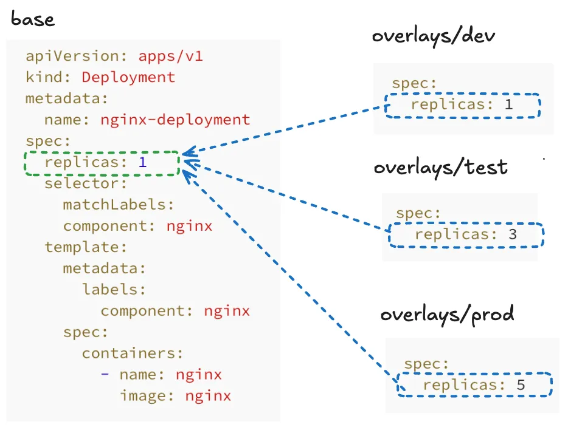
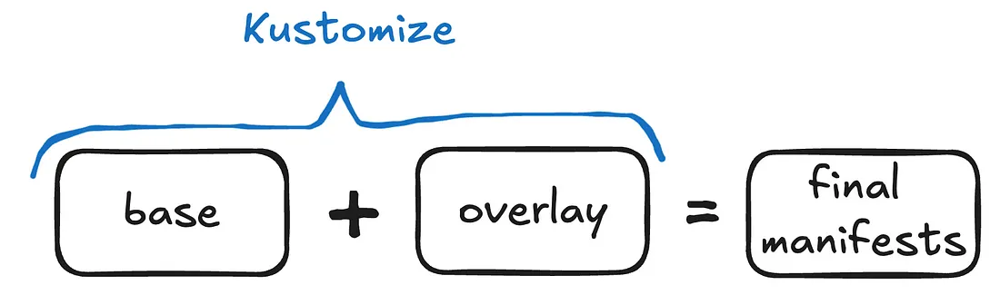

# Learn Kustomize for Kubernetes — mini course

> [`https://medium.com/@josip.cloud/learn-kustomize-for-kubernetes-course-part-1-6cc4ab945f9d`](https://medium.com/@josip.cloud/learn-kustomize-for-kubernetes-course-part-1-6cc4ab945f9d)

Kustomize is a configuration management tool specifically designed for Kubernetes. It solves the issue of customizing manifest files without needing to modify the original configuration files.

## Problem statement which is solved by Kustomize

- [`nginx-deployment.yaml`](./manifests/nginx-deployment.yaml)

## Basic Kustomize structure



***Kustomize - Basic structure***

Folder structure:

```
my-project
|____base/
|    |___________kustomization.yaml
|    |___________deployment.yaml
|    |___________service.yaml
|
|____overlays/
     |____dev/
     |     |___________kustomization.yaml
     |     |___________config-map.yaml
     |
     |____test/
     |     |___________kustomization.yaml
     |     |___________config-map.yaml
     |
     |____prod/
           |___________kustomization.yaml
           |___________config-map.yaml
```



***Kustomize - Workflow***

## Kustomize kustomization.yaml file

`my-project` folder structure:

```
my-project
|___________deployment.yaml
|___________service.yaml
|___________kustomization.yaml
```

- [my-project: `kustomization.yaml`](./manifests/my-project/kustomize.yaml)

Building or building/apply command:

```bash
## building
kustomize build ./manifests/my-project
kubectl kustomize ./manifests/my-project

## building and applying
kustomize build ./manifests/my-project/ | kubectl apply -f -
kubectl kustomize ./manifests/my-project | kubectl apply -f -

## building and applying with alternative way
kubectl apply -k ./manifests/my-project

## deleting with Kustomize
kustomize build ./manifests/my-project/ | kubectl delete -f -
kubectl delete -k ./manifests/my-project
```
