# The LINUX Fundation - Introduction to Kubernetes

> `https://www.edx.org/course/introduction-to-kubernetes`

Want to learn Kubernetes? Get an in-depth primer on this powerful system for managing containerized applications.

## Welcome!

Instructors:

> **Chris Pokorni** is the founder of NQB8 Cloud Tech Consulting and an independent instructor for The Linux Foundation. Chris holds both CKA and CKAD certificates and teaches Kubernetes courses for Administrators and Application Developers. As a consultant for small and global enterprises alike, Chris lead workshops and designed HA Middleware/ESB, Datacenter Monitoring and Hybrid Cloud Architecture solutions.

> **Neependra Khare**, the Founder and Principal Consultant at CloudYuga Technologies, offers training and consulting services around container technologies such as Docker and Kubernetes. He is a Docker Captain and a Certified Kubernetes Administrator (CKA). He has been running the Docker meetup group in Bangalore, India for more than four years now. In 2015, he authored a book on Docker, "_Docker Cookbook_". He also authored "_LFS158x - Introduction to Kubernetes_" and co-authored "_LFS151x - Introduction to Cloud Infrastructure Technologies_" course along with Chip Childers in 2018. In 2017, he authored two container courses for the Linux Foundation: "_LFS253 - Containers Fundamentals_" and "_LFS254 - Containers for Developers and Quality Assurance_".

## Chapter 1. From Monolith to Microservices

### Introduction

Most new companies today run their business processes in the cloud. Newer startups and enterprises which realized early enough the direction technology was headed developed their applications for the cloud.

Not all companies were so fortunate. Some built their success decades ago on top of legacy technologies - **monolithic applications** with all components tightly coupled and almost impossible to separate, a nightmare to manage and deployed on super expensive hardware.

If working for an organization which refers to their main business application "**the black box**”, where nobody knows what happens inside and most logic was never documented, leaving everyone clueless as to what and how things happen from the moment a request enters the application until a response comes out, and you are tasked to convert this business application into a cloud-ready set of applications, then you may be in for a very long and bumpy ride.

### Learning Objectives

By the end of this chapter, you should be able to:

  - Explain what a monolith is.
  - Discuss the monolith's challenges in the cloud.
  - Explain the concept of microservices.
  - Discuss microservices advantages in the cloud.
  - Describe the transformation path from a monolith to microservices.

### The Legacy Monolith

Although most enterprises believe that the cloud will be the new home for legacy apps, not all legacy apps are a fit for the cloud, at least not yet.

Moving an application to the cloud should be as easy as walking on the beach and collecting pebbles in a bucket and easily carry them wherever needed. A 1000-ton boulder, on the other hand, is not easy to carry at all. This boulder represents the monolith application - sedimented layers of features and redundant logic translated into thousands of lines of code, written in a single, not so modern programming language, based on outdated software architecture patterns and principles.

In time, the new features and improvements added to code complexity, making development more challenging - loading, compiling, and building times increase with every new update. However, there is some ease in administration as the application is running on a single server, ideally a Virtual Machine or a Mainframe.

A monolith has a rather expensive taste in hardware. Being a large, single piece of software which continuously grows, it has to run on a single system which has to satisfy its compute, memory, storage, and networking requirements. The hardware of such capacity is both complex and extremely pricey.

Since the entire monolith application runs as a single process, the scaling of individual features of the monolith is almost impossible. It internally supports a hardcoded number of connections and operations. However, scaling the entire application can be achieved by manually deploying a new instance of the monolith on another server, typically behind a load balancing appliance - another pricey solution.

During upgrades, patches or migrations of the monolith application downtime is inevitable and maintenance windows have to be planned well in advance as disruptions in service are expected to impact clients. While there are third party solutions to minimize downtime to customers by setting up monolith applications in a highly available active/passive configuration, they introduce new challenges for system engineers to keep all systems at the same patch level and may introduce new possible licensing costs.

### The Modern Microservice

Pebbles, as opposed to the 1000-ton boulder, are much easier to handle. They are carved out of the monolith, separated from one another, becoming distributed components each described by a set of specific characteristics. Once weighed all together, the pebbles make up the weight of the entire boulder. These pebbles represent loosely coupled microservices, each performing a specific business function. All the functions grouped together form the overall functionality of the original monolithic application. Pebbles are easy to select and group together based on color, size, shape, and require minimal effort to relocate when needed. Try relocating the 1000-ton boulder, effortlessly.

**Microservices** can be deployed individually on separate servers provisioned with fewer resources - only what is required by each service and the host system itself, helping to lower compute resource expenses.

Microservices-based architecture is aligned with Event-driven Architecture and Service-Oriented Architecture (SOA) principles, where complex applications are composed of small independent processes which communicate with each other through APIs over a network. APIs allow access by other internal services of the same application or external, third-party services and applications.

Each microservice is developed and written in a modern programming language, selected to be the best suitable for the type of service and its business function. This offers a great deal of flexibility when matching microservices with specific hardware when required, allowing deployments on inexpensive commodity hardware.

Although the distributed nature of microservices adds complexity to the architecture, one of the greatest benefits of microservices is scalability. With the overall application becoming modular, each microservice can be scaled individually, either manually or automated through demand-based autoscaling.

Seamless upgrades and patching processes are other benefits of microservices architecture. There is virtually no downtime and no service disruption to clients because upgrades are rolled out seamlessly - one service at a time, rather than having to re-compile, re-build and re-start an entire monolithic application. As a result, businesses are able to develop and roll-out new features and updates a lot faster, in an agile approach, having separate teams focusing on separate features, thus being more productive and cost-effective.

### Refactoring

Newer, more modern enterprises possess the knowledge and technology to build cloud-native applications that power their business.

Unfortunately, that is not the case for established enterprises running on legacy monolithic applications. Some have tried to run monoliths as microservices, and as one would expect, it did not work very well. The lessons learned were that a monolithic size multi-process application cannot run as a microservice and that other options had to be explored. The next natural step in the path of the monolith to microservices transition was refactoring. However, migrating a decades-old application to the cloud through refactoring poses serious challenges and the enterprise faces the refactoring approach dilemma: a "Big-bang" approach or an incremental refactoring.

A so-called "Big-bang" approach focuses all efforts with the refactoring of the monolith, postponing the development and implementation of any new features - essentially delaying progress and possibly, in the process, even breaking the core of the business, the monolith.

An incremental refactoring approach guarantees that new features are developed and implemented as modern microservices which are able to communicate with the monolith through APIs, without appending to the monolith's code. In the meantime, features are refactored out of the monolith which slowly fades away while all, or most its functionality is modernized into microservices. This incremental approach offers a gradual transition from a legacy monolith to modern microservices architecture and allows for phased migration of application features into the cloud.

Once an enterprise chose the refactoring path, there are other considerations in the process. Which business components to separate from the monolith to become distributed microservices, how to decouple the databases from the application to separate data complexity from application logic, and how to test the new microservices and their dependencies, are just a few of the decisions an enterprise is faced with during refactoring.

The refactoring phase slowly transforms the monolith into a cloud-native application which takes full advantage of cloud features, by coding in new programming languages and applying modern architectural patterns. Through refactoring, a legacy monolith application receives a second chance at life - to live on as a modular system adapted to fully integrate with today's fast-paced cloud automation tools and services.

### Challenges

The refactoring path from a monolith to microservices is not smooth and without challenges. Not all monoliths are perfect candidates for refactoring, while some may not even "survive" such a modernization phase. When deciding whether a monolith is a possible candidate for refactoring, there are many possible issues to consider.

When considering a legacy Mainframe based system, written in older programming languages - Cobol or Assembler, it may be more economical to just re-build it from the ground up as a cloud-native application. A poorly designed legacy application should be re-designed and re-built from scratch following modern architectural patterns for microservices and even containers. Applications tightly coupled with data stores are also poor candidates for refactoring.

Once the monolith survived the refactoring phase, the next challenge is to design mechanisms or find suitable tools to keep alive all the decoupled modules to ensure application resiliency as a whole. 

Choosing runtimes may be another challenge. If deploying many modules on a single physical or virtual server, chances are that different libraries and runtime environment may conflict with one another causing errors and failures. This forces deployments of single modules per servers in order to separate their dependencies - not an economical way of resource management, and no real segregation of libraries and runtimes, as each server also has an underlying Operating System running with its libraries, thus consuming server resources - at times the OS consuming more resources than the application module itself.

Ultimately application containers came along, providing encapsulated lightweight runtime environments for application modules. Containers promised consistent software environments for developers, testers, all the way from Development to Production. Wide support of containers ensured application portability from physical bare-metal to Virtual Machines, but this time with multiple applications deployed on the very same server, each running in their own execution environments isolated from one another, thus avoiding conflicts, errors, and failures. Other features of containerized application environments are higher server utilization, individual module scalability, flexibility, interoperability and easy integration with automation tools.

### Success Stories

Although a challenging process, moving from monoliths to microservices is a rewarding journey especially once a business starts to see growth and success delivered by a refactored application system. Below we are listing only a handful of the success stories of companies which rose to the challenge to modernize their monolith business applications. A detailed list of success stories is available at the Kubernetes website: [Kubernetes User Case Studies](https://kubernetes.io/case-studies/).

  - [AppDirect](https://kubernetes.io/case-studies/appdirect/) - an end-to-end commerce platform provider, started from a complex monolith application and through refactoring was able to retain limited functionality monoliths receiving very few commits, but all new features implemented as containerized microservices.
  - [box](https://kubernetes.io/case-studies/box/) - a cloud storage solutions provider, started from a complex monolith architecture and through refactoring was able to decompose it into microservices.
  - [Crowdfire](https://kubernetes.io/case-studies/crowdfire/) - a content management solutions provider, successfully broke down their initial monolith into microservices.
  - [GolfNow](https://kubernetes.io/case-studies/golfnow/) - a technology and services provider, decided to break their monoliths apart into containerized microservices.
  - [Pinterest](https://kubernetes.io/case-studies/pinterest/) - a social media services provider, started the refactoring process by first migrating their monolith API.

### Learning Objectives (Review)

You should now be able to:

  - Explain what a monolith is.
  - Discuss the monolith's challenges in the cloud.
  - Explain the concept of microservices.
  - Discuss microservices advantages in the cloud.
  - Describe the transformation path from a monolith to microservices.

## Chapter 2. Container Orchestration

### Introduction 

With container images, we confine the application code, its runtime, and all of its dependencies in a pre-defined format. And, with container runtimes like **runC**, **containerd**, or **cri-o** we can use those pre-packaged images, to create one or more containers. All of these runtimes are good at running containers on a single host. But, in practice, we would like to have a fault-tolerant and scalable solution, which can be achieved by creating a single controller/management unit, after connecting multiple nodes together. This **controller/management** unit is generally referred to as a **container orchestrator**. 

In this chapter, we will explore why we should use container orchestrators, different implementations of container orchestrators, and where to deploy them.

### Learning Objectives

By the end of this chapter, you should be able to:

  - Define the concept of container orchestration.
  - Explain the benefits of using container orchestration.
  - Discuss different container orchestration options.
  - Discuss different container orchestration deployment options.

### What Are Containers?

Before we dive into container orchestration, let's review first what containers are.

**Containers** are an application-centric method to deliver high-performing, scalable applications on any infrastructure of your choice. Containers are best suited to deliver microservices by providing portable, isolated virtual environments for applications to run without interference from other running applications.

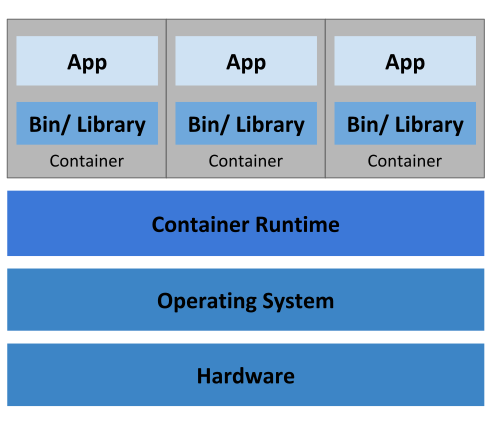

**Microservices** are lightweight applications written in various modern programming languages, with specific dependencies, libraries and environmental requirements. To ensure that an application has everything it needs to run successfully it is packaged together with its dependencies.

Containers encapsulate microservices and their dependencies but do not run them directly. Containers run container images.

A **container image** bundles the application along with its runtime, libraries, and dependencies, and it represents the source of a container deployed to offer an isolated executable environment for the application. Containers can be deployed from a specific image on many platforms, such as workstations, Virtual Machines, public cloud, etc.

### What Is Container Orchestration?

In Development (Dev) environments, running containers on a single host for development and testing of applications may be an option. However, when migrating to Quality Assurance (QA) and Production (Prod) environments, that is no longer a viable option because the applications and services need to meet specific requirements:

  - Fault-tolerance
  - On-demand scalability
  - Optimal resource usage
  - Auto-discovery to automatically discover and communicate with each other
  - Accessibility from the outside world
  - Seamless updates/rollbacks without any downtime.

**Container orchestrators** are tools which group systems together to form clusters where containers' deployment and management is automated at scale while meeting the requirements mentioned above.

### Container Orchestrators

With enterprises containerizing their applications and moving them to the cloud, there is a growing demand for container orchestration solutions. While there are many solutions available, some are mere re-distributions of well-established container orchestration tools, enriched with features and, sometimes, with certain limitations in flexibility.

Although not exhaustive, the list below provides a few different container orchestration tools and services available today:

  - [Amazon Elastic Container Service (ECS)]() is a hosted service provided by [Amazon Web Services (AWS)](https://aws.amazon.com/) to run Docker containers at scale on its infrastructure.
  - [Azure Container Instances (ACI)](https://azure.microsoft.com/en-us/services/container-instances/) is a basic container orchestration service provided by [Microsoft Azure](https://azure.microsoft.com/en-us/).
  - Azure Service Fabric is an open source container orchestrator provided by Microsoft Azure.
  - [Kubernetes](https://kubernetes.io/) is an open source orchestration tool, originally started by Google, today part of the [Cloud Native Computing Foundation (CNCF)](https://www.cncf.io/) project.
  - [Marathon](https://mesosphere.github.io/marathon/) is a framework to run containers at scale on Apache Mesos.
  - [Nomad](https://www.nomadproject.io/) is the container and workload orchestrator provided by HashiCorp.
  - [Docker Swarm](https://docs.docker.com/engine/swarm/) is a container orchestrator provided by [Docker, Inc.](https://www.docker.com/) It is part of [Docker Engine](https://docs.docker.com/engine/).

Container orchestrators are also explored in another edX MOOC, [Introduction to Cloud Infrastructure Technologies (LFS151x)](https://www.edx.org/course/introduction-cloud-infrastructure-linuxfoundationx-lfs151-x). We highly recommend that you take LFS151x.

### Why Use Container Orchestrators?

Although we can manually maintain a couple of containers or write scripts to manage the lifecycle of dozens of containers, orchestrators make things much easier for operators especially when it comes to managing hundreds and thousands of containers running on a global infrastructure.

Most container orchestrators can:

  - Group hosts together while creating a cluster
  - Schedule containers to run on hosts in the cluster based on resources availability
  - Enable containers in a cluster to communicate with each other regardless of the host they are deployed to in the cluster
  - Bind containers and storage resources
  - Group sets of similar containers and bind them to load-balancing constructs to simplify access to containerized applications by creating a level of abstraction between the containers and the user
  - Manage and optimize resource usage
  - Allow for implementation of policies to secure access to applications running inside containers.

With all these configurable yet flexible features, container orchestrators are an obvious choice when it comes to managing containerized applications at scale. In this course, we will explore **Kubernetes**, one of the most in-demand container orchestration tools available today.

### Where to Deploy Container Orchestrators?

Most container orchestrators can be deployed on the infrastructure of our choice - on bare metal, Virtual Machines, on-premises, on public and hybrid cloud. Kubernetes, for example, can be deployed on a workstation, with or without a local hypervisor such as Oracle VirtualBox, inside a company's data center, in the cloud on AWS Elastic Compute Cloud (EC2) instances, Google Compute Engine (GCE) VMs, DigitalOcean Droplets, OpenStack, etc.

There are turnkey solutions which allow Kubernetes clusters to be installed, with only a few commands, on top of cloud Infrastructures-as-a-Service, such as GCE, AWS EC2, Docker Enterprise, IBM Cloud, Rancher, VMware Tanzu, and multi-cloud solutions through IBM Cloud Private or StackPointCloud.

Last but not least, there is the managed container orchestration as-a-Service, more specifically the managed Kubernetes as-a-Service solution, offered and hosted by the major cloud providers, such as [Amazon Elastic Kubernetes Service](https://aws.amazon.com/eks/) (Amazon EKS), [Azure Kubernetes Service](https://azure.microsoft.com/en-us/services/kubernetes-service/) (AKS), [DigitalOcean Kubernetes](https://www.digitalocean.com/products/kubernetes/), [Google Kubernetes Engine](https://cloud.google.com/kubernetes-engine/) (GKE), [IBM Cloud Kubernetes Service](https://www.ibm.com/cloud/container-service), [Oracle Container Engine for Kubernetes](https://cloud.oracle.com/containers/kubernetes-engine), or [VMware Tanzu Kubernetes Grid](https://tanzu.vmware.com/kubernetes-grid).

### Learning Objectives (Review)

You should now be able to:

  - Define the concept of container orchestration.
  - Explain the benefits of using container orchestration.
  - Discuss different container orchestration options.
  - Discuss different container orchestration deployment options.

## Chapter 3. Kubernetes

### Introduction

In this chapter, we will explain what **Kubernetes** is, its features, and the reasons why you should use it. We will explore the evolution of Kubernetes from **Borg**, Google's very own distributed workload manager. 

We will also learn about the **Cloud Native Computing Foundation (CNCF)**, which currently hosts the Kubernetes project, along with other popular cloud-native projects, such as Prometheus, Fluentd, cri-o, containerd, Helm, Envoy, and Contour, just to name a few.

### Learning Objectives

By the end of this chapter, you should be able to:

  - Define Kubernetes.
  - Explain the reasons for using Kubernetes.
  - Discuss the features of Kubernetes.
  - Discuss the evolution of Kubernetes from Borg.
  - Explain the role of the Cloud Native Computing Foundation.

### What Is Kubernetes?

According to the [Kubernetes](https://kubernetes.io/) website: 

> _"Kubernetes is an open-source system for automating deployment, scaling, and management of containerized applications."_


**Kubernetes** comes from the Greek word **κυβερνήτης**, which means _helmsman_ or _ship pilot_. With this analogy in mind, we can think of Kubernetes as the pilot on a ship of containers.

Kubernetes is also referred to as **k8s** (pronounced Kate's), as there are 8 characters between _k_ and _s_.

Kubernetes is highly inspired by the Google Borg system, a container and workload orchestrator for its global operations for more than a decade. It is an open source project written in the Go language and licensed under the [Apache License, Version 2.0](https://www.apache.org/licenses/LICENSE-2.0).

Kubernetes was started by Google and, with its v1.0 release in July 2015, Google donated it to the [Cloud Native Computing Foundation (CNCF)](https://www.cncf.io/). 

New Kubernetes versions are released in 3 months cycles. The current stable version is 1.19 (as of August 2020).

### From Borg to Kubernetes

According to the abstract of Google's [Borg paper](https://research.google.com/pubs/pub43438.html), published in 2015:

> _"Google's Borg system is a cluster manager that runs hundreds of thousands of jobs, from many thousands of different applications, across a number of clusters each with up to tens of thousands of machines"._

For more than a decade, Borg has been Google's secret, running its worldwide containerized workloads in production. Services we use from Google, such as Gmail, Drive, Maps, Docs, etc., they are all serviced using Borg. 

Some of the initial authors of Kubernetes were Google employees who have used Borg and developed it in the past. They poured in their valuable knowledge and experience while designing Kubernetes. Some of the features/objects of Kubernetes that can be traced back to Borg, or to lessons learned from it, are:

  - API servers
  - Pods
  - IP-per-Pod
  - Services
  - Labels.

We will explore all of them, and more, in this course.

### Kubernetes Features I

Kubernetes offers a very rich set of features for container orchestration. Some of its fully supported features are:

  - **Automatic bin packing**: Kubernetes automatically schedules containers based on resource needs and constraints, to maximize utilization without sacrificing availability.
  - **Self-healing**: Kubernetes automatically replaces and reschedules containers from failed nodes. It kills and restarts containers unresponsive to health checks, based on existing rules/policy. It also prevents traffic from being routed to unresponsive containers.
  - **Horizontal scaling**: With Kubernetes applications are scaled manually or automatically based on CPU or custom metrics utilization.
  - **Service discovery and Load balancing**: Containers receive their own IP addresses from Kubernetes, while it assigns a single Domain Name System (DNS) name to a set of containers to aid in load-balancing requests across the containers of the set.

### Kubernetes Features II

Some other fully supported Kubernetes features are:

  - **Automated rollouts and rollbacks**:Kubernetes seamlessly rolls out and rolls back application updates and configuration changes, constantly monitoring the application's health to prevent any downtime.
  - **Secret and configuration management**: Kubernetes manages sensitive data and configuration details for an application separately from the container image, in order to avoid a re-build of the respective image. Secrets consist of sensitive/confidential information passed to the application without revealing the sensitive content to the stack configuration, like on GitHub.
  - **Storage orchestration**: Kubernetes automatically mounts software-defined storage (SDS) solutions to containers from local storage, external cloud providers, distributed storage, or network storage systems.
  - **Batch execution**: Kubernetes supports batch execution, long-running jobs, and replaces failed containers.

There are many additional features currently in alpha or beta phase. They will add great value to any Kubernetes deployment once they become stable features. For example, support for role-based access control (RBAC) is stable only as of the Kubernetes 1.8 release.

### Why Use Kubernetes?

In addition to its fully-supported features, Kubernetes is also portable and extensible. It can be deployed in many environments such as local or remote Virtual Machines, bare metal, or in public/private/hybrid/multi-cloud setups. It supports and it is supported by many 3rd party open source tools which enhance Kubernetes' capabilities and provide a feature-rich experience to its users.

Kubernetes' architecture is modular and pluggable. Not only that it orchestrates modular, decoupled microservices type applications, but also its architecture follows decoupled microservices patterns. Kubernetes' functionality can be extended by writing custom resources, operators, custom APIs, scheduling rules or plugins.

For a successful open source project, the community is as important as having great code. Kubernetes is supported by a thriving community across the world. It has more than 2,800 contributors, who, over time, have pushed over 94,000 commits. There are meet-up groups in different cities and countries which meet regularly to discuss Kubernetes and its ecosystem. There are _Special Interest Groups_ (SIGs), which focus on special topics, such as scaling, bare metal, networking, etc. We will learn more about them in our last chapter, _Kubernetes Communities_.

### Kubernetes Users

With just a few years since its debut, many enterprises of various sizes run their workloads using Kubernetes. It is a solution for workload management in banking, education, finance and investments, gaming, information technology, media and streaming, online retail, ridesharing, telecommunications, and many other industries. There are numerous user [case studies](https://kubernetes.io/case-studies/) and success stories on the Kubernetes website:

  - [BlaBlaCar](https://kubernetes.io/case-studies/blablacar/)
  - [BlackRock](https://kubernetes.io/case-studies/blackrock/)
  - [Box](https://kubernetes.io/case-studies/box/)
  - [eBay](https://www.nextplatform.com/2015/11/12/inside-ebays-shift-to-kubernetes-and-containers-atop-openstack/)
  - [Haufe Group](https://kubernetes.io/case-studies/haufegroup/)
  - [Huawei](https://kubernetes.io/case-studies/huawei/)
  - [IBM](https://kubernetes.io/case-studies/ibm/)
  - [ING](https://kubernetes.io/case-studies/ing/)
  - [Nokia](https://kubernetes.io/case-studies/nokia/)
  - [Pearson](https://kubernetes.io/case-studies/pearson/)
  - [Wikimedia](https://kubernetes.io/case-studies/wikimedia/)
  - And many more.

### Cloud Native Computing Foundation (CNCF)

The [Cloud Native Computing Foundation (CNCF)](https://www.cncf.io/) is one of the projects hosted by the [Linux Foundation](https://www.linuxfoundation.org/). CNCF aims to accelerate the adoption of containers, microservices, and cloud-native applications.


CNCF hosts a multitude of projects, with more to be added in the future. CNCF provides resources to each of the projects, but, at the same time, each project continues to operate independently under its pre-existing governance structure and with its existing maintainers. Projects within CNCF are categorized based on achieved status: Sandbox, Incubating, and Graduated. At the time of this writing, a dozen projects had reached Graduated status with many more Incubating and in the Sandbox.

Graduated projects:

  - [Kubernetes](https://kubernetes.io/) for container orchestration
  - [Prometheus](https://prometheus.io/) for monitoring
  - [Envoy](https://github.com/envoyproxy/envoy) for service mesh
  - [CoreDNS](https://coredns.io/) for service discovery
  - [containerd](http://containerd.io/) for container runtime
  - [Fluentd](http://www.fluentd.org/) for logging
  - [Harbor](https://goharbor.io/) for registry
  - [Helm](https://www.helm.sh/) for package management
  - [Vitess](http://vitess.io/) for cloud-native storage
  - [Jaeger](https://github.com/jaegertracing/jaeger) for distributed tracing
  - [TUF](https://github.com/theupdateframework/specification) for software updates
  - [TiKV](https://tikv.org/) for key/value store

Incubating projects:

  - [CRI-O]https://cri-o.io/) for container runtime
  - [Linkerd](https://linkerd.io/) for service mesh
  - [Contour](https://projectcontour.io/) for ingress
  - [etcd](https://github.com/etcd-io) for key/value store
  - [gRPC](http://www.grpc.io/) for remote procedure call (RPC)
  - [CNI](https://github.com/containernetworking/cni) for networking API
  - [Rook](https://github.com/rook/rook) for cloud-native storage
  - [Notary](https://github.com/theupdateframework/notary) for security
  - [NATS](https://nats.io/) for messaging
  - [OpenTracing](http://opentracing.io/) for distributed tracing
  - [Open Policy Agent](https://www.openpolicyagent.org/) for policy
  - And many more.


There are many projects in the CNCF [Sandbox](https://www.cncf.io/sandbox-projects/) geared towards metrics, monitoring, identity, scripting, serverless, nodeless, edge, expecting to achieve Incubating and possibly Graduated status. While many active projects are preparing for takeoff, others are being archived once they become less active. The first [archived](https://www.cncf.io/archived-projects/) project is the [rkt](https://github.com/rkt/rkt) container runtime. 

The projects under CNCF cover the entire lifecycle of a cloud-native application, from its execution using container runtimes, to its monitoring and logging. This is very important to meet the goals of CNCF.

### CNCF and Kubernetes

For Kubernetes, the Cloud Native Computing Foundation:

  - Provides a neutral home for the Kubernetes trademark and enforces proper usage
  - Provides license scanning of core and vendor code
  - Offers legal guidance on patent and copyright issues
  - Creates open source learning [curriculum](https://github.com/cncf/curriculum), [training](https://www.cncf.io/certification/training/), and certification for both [Certified Kubernetes Administrators (CKA)](https://www.cncf.io/certification/CKA/) and [Certified Kubernetes Application Developers (CKAD)](https://www.cncf.io/certification/ckad/)
  - Manages a software conformance working group
  - Actively markets Kubernetes
  - Supports ad hoc activities
  - Sponsors conferences and meetup events.

### Learning Objectives (Review)

You should now be able to:

  - Define Kubernetes.
  - Explain the reasons for using Kubernetes.
  - Discuss the features of Kubernetes.
  - Discuss the evolution of Kubernetes from Borg.
  - Explain the role of the Cloud Native Computing Foundation.

## Chapter 4. Kubernetes Architecture

### Introduction

In this chapter, we will explore the **Kubernetes architecture**, the components of its **control plane**, the **master** and **worker nodes**, the cluster state management with **etcd** and the network setup requirements. We will also learn about the **Container Network Interface (CNI)**, as Kubernetes' network specification.

### Learning Objectives

By the end of this chapter, you should be able to:

  - Discuss the Kubernetes architecture.
  - Explain the different components for master and worker nodes.
  - Discuss about cluster state management with etcd.
  - Review the Kubernetes network setup requirements.

### Kubernetes Architecture

At a very high level, Kubernetes has the following main components:

  - One or more **master nodes**, part of the **control plane** 
  - One or more **worker nodes**. 


### Master Node Overview

The **master node** provides a running environment for the **control plane** responsible for managing the state of a Kubernetes cluster, and it is the brain behind all operations inside the cluster. The control plane components are agents with very distinct roles in the cluster's management. In order to communicate with the Kubernetes cluster, users send requests to the control plane via a Command Line Interface (CLI) tool, a Web User-Interface (Web UI) Dashboard, or Application Programming Interface (API).

It is important to keep the control plane running at all costs. Losing the control plane may introduce downtime, causing service disruption to clients, with possible loss of business. To ensure the control plane's fault tolerance, master node replicas can be added to the cluster, configured in High-Availability (HA) mode. While only one of the master nodes is dedicated to actively manage the cluster, the control plane components stay in sync across the master node replicas. This type of configuration adds resiliency to the cluster's control plane, should the active master node fail.

To persist the Kubernetes cluster's state, all cluster configuration data is saved to [etcd](https://etcd.io/). **etcd** is a distributed key-value store which only holds cluster state related data, no client workload data. etcd may be configured on the master node ([stacked](https://kubernetes.io/docs/setup/independent/ha-topology/#stacked-etcd-topology) topology), or on its dedicated host ([external](https://kubernetes.io/docs/setup/independent/ha-topology/#external-etcd-topology) topology) to help reduce the chances of data store loss by decoupling it from the other control plane agents.

With stacked etcd topology, HA master node replicas ensure the etcd data store's resiliency as well. However, that is not the case with external etcd topology, where the etcd hosts have to be separately replicated for HA, a configuration that introduces the need for additional hardware.

### Master Node Components

A master node runs the following control plane components:

  - API Server
  - Scheduler
  - Controller Managers
  - Data Store.

In addition, the master node runs:

  - Container Runtime
  - Node Agent
  - Proxy.

### Master Node Components: API Server

All the administrative tasks are coordinated by the **kube-apiserver**, a central control plane component running on the master node. The API Server intercepts RESTful calls from users, operators and external agents, then validates and processes them. During processing the API Server reads the Kubernetes cluster's current state from the etcd data store, and after a call's execution, the resulting state of the Kubernetes cluster is saved in the distributed key-value data store for persistence. The API Server is the only master plane component to talk to the etcd data store, both to read from and to save Kubernetes cluster state information - acting as a middle interface for any other control plane agent inquiring about the cluster's state.

The API Server is highly configurable and customizable. It can scale horizontally, but it also supports the addition of custom secondary API Servers, a configuration that transforms the primary API Server into a proxy to all secondary, custom API Servers and routes all incoming RESTful calls to them based on custom defined rules.

### Master Node Components: Scheduler

The role of the **kube-scheduler** is to assign new workload objects, such as pods, to nodes. During the scheduling process, decisions are made based on current Kubernetes cluster state and new object's requirements. The scheduler obtains from the etcd data store, via the API Server, resource usage data for each worker node in the cluster. The scheduler also receives from the API Server the new object's requirements which are part of its configuration data. Requirements may include constraints that users and operators set, such as scheduling work on a node labeled with **disk==ssd** key/value pair. The scheduler also takes into account Quality of Service (QoS) requirements, data locality, affinity, anti-affinity, taints, toleration, cluster topology, etc. Once all the cluster data is available, the scheduling algorithm filters the nodes with predicates to isolate the possible node candidates which then are scored with priorities in order to select the one node that satisfies all the requirements for hosting the new workload. The outcome of the decision process is communicated back to the API Server, which then delegates the workload deployment with other control plane agents. 

The scheduler is highly configurable and customizable through scheduling policies, plugins, and profiles. Additional custom schedulers are also supported, then the object's configuration data should include the name of the custom scheduler expected to make the scheduling decision for that particular object; if no such data is included, the default scheduler is selected instead.

A scheduler is extremely important and complex in a multi-node Kubernetes cluster. In a single-node Kubernetes cluster, such as the one explored later in this course, the scheduler's job is quite simple.

### Master Node Components: Controller Managers

The **controller managers** are control plane components on the master node running controllers to regulate the state of the Kubernetes cluster. Controllers are watch-loops continuously running and comparing the cluster's desired state (provided by objects' configuration data) with its current state (obtained from etcd data store via the API server). In case of a mismatch corrective action is taken in the cluster until its current state matches the desired state.

The **kube-controller-manager** runs controllers responsible to act when nodes become unavailable, to ensure pod counts are as expected, to create endpoints, service accounts, and API access tokens.

The **cloud-controller-manager** runs controllers responsible to interact with the underlying infrastructure of a cloud provider when nodes become unavailable, to manage storage volumes when provided by a cloud service, and to manage load balancing and routing.

### Master Node Components: Data Store

**etcd** is a strongly consistent, distributed key-value **data store** used to persist a Kubernetes cluster's state. New data is written to the data store only by appending to it, data is never replaced in the data store. Obsolete data is compacted periodically to minimize the size of the data store.

Out of all the control plane components, only the API Server is able to communicate with the etcd data store.

etcd's CLI management tool - **etcdctl**, provides backup, snapshot, and restore capabilities which come in handy especially for a single etcd instance Kubernetes cluster - common in Development and learning environments. However, in Stage and Production environments, it is extremely important to replicate the data stores in HA mode, for cluster configuration data resiliency.

Some Kubernetes cluster bootstrapping tools, such as **kubeadm**, by default, provision stacked etcd master nodes, where the data store runs alongside and shares resources with the other control plane components on the same master node.


For data store isolation from the control plane components, the bootstrapping process can be configured for an external etcd topology, where the data store is provisioned on a dedicated separate host, thus reducing the chances of an etcd failure.

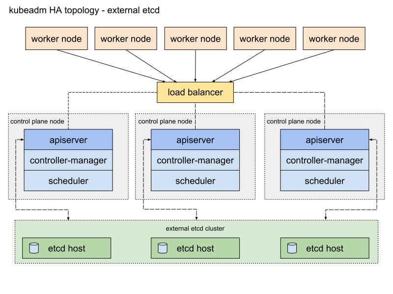

Both stacked and external etcd configurations support HA configurations. etcd is based on the [Raft Consensus Algorithm](https://web.stanford.edu/~ouster/cgi-bin/papers/raft-atc14) which allows a collection of machines to work as a coherent group that can survive the failures of some of its members. At any given time, one of the nodes in the group will be the master, and the rest of them will be the followers. etcd gracefully handles master elections and can tolerate node failure, including master node failures. Any node can be treated as a master. 


etcd is written in the Go programming language. In Kubernetes, besides storing the cluster state, etcd is also used to store configuration details such as subnets, ConfigMaps, Secrets, etc.

### Worker Node Overview

A worker node provides a running environment for client applications. Though containerized microservices, these applications are encapsulated in Pods, controlled by the cluster control plane agents running on the master node. Pods are scheduled on worker nodes, where they find required compute, memory and storage resources to run, and networking to talk to each other and the outside world. A Pod is the smallest scheduling unit in Kubernetes. It is a logical collection of one or more containers scheduled together, and the collection can be started, stopped, or rescheduled as a single unit of work. 

Also, in a multi-worker Kubernetes cluster, the network traffic between client users and the containerized applications deployed in Pods is handled directly by the worker nodes, and is not routed through the master node.

### Worker Node Components

A worker node has the following components:

  - Container Runtime
  - Node Agent - kubelet
  - Proxy - kube-proxy
  - Addons for DNS, Dashboard user interface, cluster-level monitoring and logging

### Worker Node Components: Container Runtime

Although Kubernetes is described as a "container orchestration engine", it does not have the capability to directly handle containers. In order to manage a container's lifecycle, Kubernetes requires a **container runtime** on the node where a Pod and its containers are to be scheduled. Kubernetes supports many container runtimes:

  - [Docker](https://www.docker.com/) - although a container platform which uses **containerd** as a container runtime, it is the most popular container runtime used with Kubernetes
  - [CRI-O](https://cri-o.io/) - a lightweight container runtime for Kubernetes, it also supports Docker image registries
  - [containerd](https://containerd.io/) - a simple and portable container runtime providing robustness
  - [frakti](https://github.com/kubernetes/frakti#frakti) - a hypervisor-based container runtime for Kubernetes

### Worker Node Components: Node Agent - kubelet

The **kubelet** is an agent running on each node and communicates with the control plane components from the master node. It receives Pod definitions, primarily from the API Server, and interacts with the container runtime on the node to run containers associated with the Pod. It also monitors the health and resources of Pods running containers.

The kubelet connects to container runtimes though a plugin based interface - the [Container Runtime Interface (CRI)](https://github.com/kubernetes/community/blob/master/contributors/devel/sig-node/container-runtime-interface.md). The CRI consists of protocol buffers, gRPC API, libraries, and additional specifications and tools that are currently under development. In order to connect to interchangeable container runtimes, kubelet uses a **shim** application which provides a clear abstraction layer between kubelet and the container runtime. 


(Retrieved from [blog.kubernetes.io](http://blog.kubernetes.io/2016/12/container-runtime-interface-cri-in-kubernetes.html))

As shown above, the kubelet acting as grpc client connects to the CRI shim acting as grpc server to perform container and image operations. The CRI implements two services: **ImageService** and **RuntimeService**. The **ImageService** is responsible for all the image-related operations, while the **RuntimeService** is responsible for all the Pod and container-related operations.

Container runtimes used to be hard-coded into kubelet, but since the CRI was introduced, Kubernetes has become more flexible to use different container runtimes without the need to recompile. Any container runtime that implements the CRI can be used by Kubernetes to manage Pods, containers, and container images

### Worker Node Components: kubelet - CRI shims

Shims are CRI implementations, or interfaces, specific to each container runtime supported by Kubernetes. Below we present some examples of CRI shims:

  - **dockershim** - With dockershim, containers are created using Docker installed on the worker nodes. Internally, Docker uses containerd to create and manage containers:
 
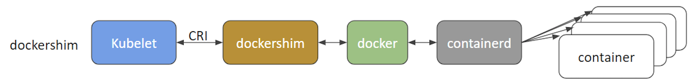

(Retrieved from [blog.kubernetes.io](http://blog.kubernetes.io/2017/11/containerd-container-runtime-options-kubernetes.html)) 

  - **cri-containerd** - With cri-containerd, we can directly use containerd to create and manage containers:


(Retrieved from [blog.kubernetes.io](http://blog.kubernetes.io/2017/11/containerd-container-runtime-options-kubernetes.html)) 

  - **CRI-O** - CRI-O enables the use of any Open Container Initiative (OCI) compatible runtime with Kubernetes. At the time this course was created, CRI-O supported runC and Clear Containers as container runtimes. However, in principle, any OCI-compliant runtime can be plugged-in.
 


(Retrieved from [cri-o.io](http://cri-o.io/))
 
  - **frakti** - frakti enables CRI implementation through hardware virtualization, aimed to achieve a higher level of security and isolation than the traditional Linux OS level containers based on cgroups and namespaces. The frakti CRI shim is aimed at enabling kubelet to interact with Kata Containers:
 
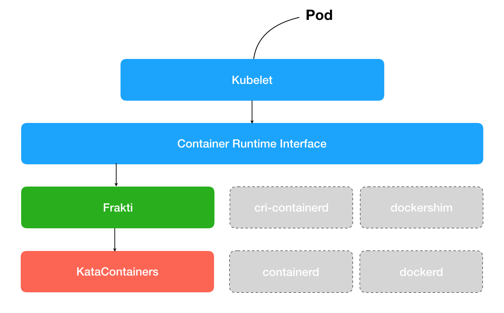

(Retrieved from [github.com/kubernetes/frakti](https://github.com/kubernetes/frakti#frakti))

### Worker Node Components: Proxy - kube-proxy

The **kube-proxy** is the network agent which runs on each node responsible for dynamic updates and maintenance of all networking rules on the node. It abstracts the details of Pods networking and forwards connection requests to Pods. 

The kube-proxy is responsible for TCP, UDP, and SCTP stream forwarding or round-robin forwarding across a set of Pod backends, and it implements forwarding rules defined by users through Service API objects.

### Worker Node Components: Addons

**Addons** are cluster features and functionality not yet available in Kubernetes, therefore implemented through 3rd-party pods and services.

  - **DNS** - cluster DNS is a DNS server required to assign DNS records to Kubernetes objects and resources
  - **Dashboard** - a general purposed web-based user interface for cluster management
  - **Monitoring** - collects cluster-level container metrics and saves them to a central data store
  - **Logging** - collects cluster-level container logs and saves them to a central log store for analysis.

### Networking Challenges

Decoupled microservices based applications rely heavily on networking in order to mimic the tight-coupling once available in the monolithic era. Networking, in general, is not the easiest to understand and implement. Kubernetes is no exception - as a containerized microservices orchestrator it needs to address a few distinct networking challenges:

  - Container-to-container communication inside Pods
  - Pod-to-Pod communication on the same node and across cluster nodes
  - Pod-to-Service communication within the same namespace and across cluster namespaces
  - External-to-Service communication for clients to access applications in a cluster.

All these networking challenges must be addressed before deploying a Kubernetes cluster.

### Container-to-Container Communication Inside Pods

Making use of the underlying host operating system's kernel virtualization features, a container runtime creates an isolated network space for each container it starts. On Linux, this isolated network space is referred to as a **network namespace**. A network namespace can be shared across containers, or with the host operating system.

When a Pod is started, a special **Pause** container is initialized by the Container Runtime for the sole purpose to create a network namespace for the Pod. All additional containers, created through user requests, running inside the Pod will share the Pause container's network namespace so that they can all talk to each other via localhost.

### Pod-to-Pod Communication Across Nodes

In a Kubernetes cluster Pods are scheduled on nodes in a nearly unpredictable fashion. Regardless of their host node, Pods are expected to be able to communicate with all other Pods in the cluster, all this without the implementation of Network Address Translation (NAT). This is a fundamental requirement of any networking implementation in Kubernetes.

The Kubernetes network model aims to reduce complexity, and it treats Pods as VMs on a network, where each VM is equipped with a network interface - thus each Pod receiving a unique IP address. This model is called "**IP-per-Pod**" and ensures Pod-to-Pod communication, just as VMs are able to communicate with each other on the same network.

Let's not forget about containers though. They share the Pod's network namespace and must coordinate ports assignment inside the Pod just as applications would on a VM, all while being able to communicate with each other on **localhost** - inside the Pod. However, containers are integrated with the overall Kubernetes networking model through the use of the [Container Network Interface (CNI)](https://github.com/containernetworking/cni) supported by [CNI plugins](https://github.com/containernetworking/cni#3rd-party-plugins). CNI is a set of a specification and libraries which allow plugins to configure the networking for containers. While there are a few [core plugins](https://github.com/containernetworking/plugins#plugins), most CNI plugins are 3rd-party Software Defined Networking (SDN) solutions implementing the Kubernetes networking model. In addition to addressing the fundamental requirement of the networking model, some networking solutions offer support for Network Policies. [Flannel](https://github.com/coreos/flannel/), [Weave](https://www.weave.works/oss/net/), [Calico](https://www.projectcalico.org/) are only a few of the SDN solutions available for Kubernetes clusters.


The container runtime offloads the IP assignment to CNI, which connects to the underlying configured plugin, such as Bridge or MACvlan, to get the IP address. Once the IP address is given by the respective plugin, CNI forwards it back to the requested container runtime. 

For more details, you can explore the [Kubernetes documentation](https://kubernetes.io/docs/concepts/cluster-administration/networking/).

### Pod-to-External World Communication

A successfully deployed containerized application running in Pods inside a Kubernetes cluster may require accessibility from the outside world. Kubernetes enables external accessibility through **Services**, complex encapsulations of network routing rule definitions stored in **iptables** on cluster nodes and implemented by **kube-proxy** agents. By exposing services to the external world with the aid of **kube-proxy**, applications become accessible from outside the cluster over a virtual IP address.

### Learning Objectives (Review)

You should now be able to:

  - Discuss the Kubernetes architecture.
  - Explain the different components for master and worker nodes.
  - Discuss about cluster state management with etcd.
  - Review the Kubernetes network setup requirements.

## Chapter 5. Installing Kubernetes

### Introduction

In this chapter we will explore Kubernetes cluster deployment considerations. First, we will learn about Kubernetes cluster configuration options, followed by infrastructure requirements and installation tools specific to various cluster deployment models.

### Learning Objectives

By the end of this chapter, you should be able to:

  - Discuss Kubernetes configuration options.
  - Discuss infrastructure considerations before installing Kubernetes.
  - Discuss infrastructure choices for a Kubernetes cluster deployment.
  - Review Kubernetes installation tools and resources.

### Kubernetes Configuration

Kubernetes can be installed using different cluster configurations. The major installation types are described below:

  - **All-in-One Single-Node Installation** - In this setup, all the master and worker components are installed and running on a single-node. While it is useful for learning, development, and testing, it should not be used in production. Minikube is an installation tool originally aimed at single-node cluster installations, and we are going to explore it in future chapters.
  - **Single-Master and Multi-Worker Installation** - In this setup, we have a single-master node running a stacked etcd instance. Multiple worker nodes can be managed by the master node.
  - **Single-Master with Single-Node etcd, and Multi-Worker Installation** - In this setup, we have a single-master node with an external etcd instance. Multiple worker nodes can be managed by the master node.
  - **Multi-Master and Multi-Worker Installation** - In this setup, we have multiple master nodes configured for High-Availability (HA), with each master node running a stacked etcd instance. The etcd instances are also configured in an HA etcd cluster and, multiple worker nodes can be managed by the HA masters.
  - **Multi-Master with Multi-Node etcd, and Multi-Worker Installation** - In this setup, we have multiple master nodes configured in HA mode, with each master node paired with an external etcd instance. The external etcd instances are also configured in an HA etcd cluster, and multiple worker nodes can be managed by the HA masters. This is the most advanced cluster configuration recommended for production environments. 

As the Kubernetes cluster's complexity grows, so does its hardware and resources requirements. While we can deploy Kubernetes on a single host for learning, development, and possibly testing purposes, the community recommends multi-host environments that support High-Availability control plane setups and multiple worker nodes for client workload

### Infrastructure for Kubernetes Installation

Once we decide on the installation type, we need to decide on the infrastructure. Infrastructure related decisions are typically guided by the desired environment type, either learning or production environment. For infrastructure, we need to decide on the following:

  - Should we set up Kubernetes on bare metal, public cloud, private, or hybrid cloud?
  - Which underlying OS should we use? Should we choose a Linux distribution such as RHEL, CentOS, CoreOS, or Windows?
  - Which networking solution should we use?

Explore the [Kubernetes documentation](https://kubernetes.io/docs/setup/) for details on choosing the right solution.

### Localhost Installation

There are a variety of installation tools allowing us to deploy single- or multi-node Kubernetes clusters on our workstations. While not an exhaustive list, below we enumerate a few popular ones:

  - [Minikube](https://minikube.sigs.k8s.io/docs/) - single-node local Kubernetes cluster, recommended for a learning environment deployed on a single host. 
  - [Kind](https://kind.sigs.k8s.io/docs/) - multi-node Kubernetes cluster deployed in Docker containers acting as Kubernetes nodes, recommended for a learning environment. 
  - [Docker Desktop](https://www.docker.com/products/docker-desktop) - including a local Kubernetes cluster for Docker users. 
  - [MicroK8s](https://microk8s.io/) - local and cloud Kubernetes cluster, from Canonical. 
  - [K3S](https://k3s.io/) - lightweight Kubernetes cluster for local, cloud, edge, IoT deployments, from Rancher. 

Minikube is the easiest and most preferred method to create an all-in-one Kubernetes setup locally. We will be using it extensively in this course to manage a single-node cluster. A newer experimental Minikube feature is the multi-node cluster support, which will not be explored at this time

### On-Premise Installation

Kubernetes can be installed on-premise on VMs and bare metal.

  - **On-Premise VMs** - Kubernetes can be installed on VMs created via Vagrant, VMware vSphere, KVM, or another Configuration Management (CM) tool in conjunction with a hypervisor software. There are different tools available to automate the installation, such as [Ansible](https://kubernetes.io/blog/2019/03/15/kubernetes-setup-using-ansible-and-vagrant/) or [kubeadm](https://kubernetes.io/docs/setup/production-environment/tools/kubeadm/). 
  - **On-Premise Bare Metal** - Kubernetes can be installed on on-premise bare metal, on top of different operating systems, like RHEL, CoreOS, CentOS, Fedora, Ubuntu, etc. Most of the tools used to install Kubernetes on VMs can be used with bare metal installations as well.

### Cloud Installation

Kubernetes can be installed and managed on almost any cloud environment for production:

**Hosted Solutions**

With Hosted Solutions, any given software is completely managed by the provider, while the user pays hosting and management charges. Popular vendors providing hosted solutions for Kubernetes are (listed in alphabetical order):

  - [Alibaba Cloud Container Service for Kubernetes (ACK)](https://www.alibabacloud.com/product/kubernetes)
  - [Amazon Elastic Kubernetes Service (EKS)](https://aws.amazon.com/eks/)
  - [Azure Kubernetes Service (AKS)](https://azure.microsoft.com/en-us/services/kubernetes-service/)
  - [DigitalOcean Kubernetes](https://www.digitalocean.com/products/kubernetes/)
  - [Google Kubernetes Engine (GKE)](https://cloud.google.com/kubernetes-engine/)
  - [IBM Cloud Kubernetes Service](https://www.ibm.com/cloud/container-service/)
  - [Oracle Cloud Container Engine for Kubernetes (OKE)](https://www.oracle.com/cloud/compute/container-engine-kubernetes.html)
  - [Platform9 Managed Kubernetes (PMK)](https://platform9.com/managed-kubernetes/)
  - [Red Hat OpenShift](https://www.redhat.com/en/technologies/cloud-computing/openshift)
  - [VMware Tanzu Kubernetes](https://tanzu.vmware.com/kubernetes-grid)

**Turnkey Cloud Solutions**

Below are only a few of the [Turnkey Cloud Solutions](https://kubernetes.io/docs/setup/production-environment/turnkey-solutions/) (listed in alphabetical order), to install Kubernetes on an underlying IaaS platform, such as:

  - Alibaba Cloud 
  - Amazon AWS (AWS EC2) 
  - Google Compute Engine (GCE)
  - IBM Cloud Private.

**Turnkey On-Premise Solutions**

The On-Premise Solutions install Kubernetes on secure internal private clouds:

  - [GKE On-Prem](https://cloud.google.com/anthos/gke/docs/on-prem) part of Google Cloud [Anthos](https://cloud.google.com/anthos)
  - [IBM Private Cloud](https://www.ibm.com/cloud/learn/introduction-to-private-cloud)
  - [OpenShift Container Platform](https://www.openshift.com/products/container-platform) by Red Hat

### Kubernetes Installation Tools/Resources

While discussing installation configuration and the underlying infrastructure, let's take a look at some useful installation tools available:

  - **kubeadm**

[kubeadm](https://kubernetes.io/docs/setup/production-environment/tools/kubeadm/) is a first-class citizen on the Kubernetes ecosystem. It is a secure and recommended method to bootstrap a multi-node production ready Highly Available Kubernetes cluster, on-prem or in the cloud. Kubeadm can also bootstrap a single-node cluster for learning. It has a set of building blocks to setup the cluster, but it is easily extendable to add more features. Please note that [kubeadm](https://kubernetes.io/docs/reference/setup-tools/kubeadm/) does not support the provisioning of hosts. 


  - **kubespray**

With [kubespray](https://kubernetes.io/docs/setup/production-environment/tools/kubespray/) (formerly known as kargo), we can install Highly Available production ready Kubernetes clusters on AWS, GCE, Azure, OpenStack, vSphere, or bare metal. Kubespray is based on Ansible, and is available on most Linux distributions. It is a [Kubernetes Incubator](https://github.com/kubernetes-sigs/kubespray) project. 

  - kops

With [kops](https://kubernetes.io/docs/setup/production-environment/tools/kops/), we can create, upgrade, and maintain production-grade, Highly Available Kubernetes clusters from the command line. It can provision the machines as well. Currently, AWS is officially supported. Support for GCE and OpenStack is in beta, VMware vSphere is in alpha support, and other platforms are planned for the future. Explore the [kops project](https://github.com/kubernetes/kops) for more details. 


  - **kube-aws**

With [kube-aws](https://github.com/kubernetes-incubator/kube-aws) we can create, upgrade and destroy Kubernetes clusters on AWS from the command line. Kube-aws is also a Kubernetes Incubator project. 

In addition, for a manual installation approach, the [_Kubernetes The Hard Way_](https://github.com/kelseyhightower/kubernetes-the-hard-way) GitHub project by [Kelsey Hightower](https://twitter.com/kelseyhightower) is an extremely helpful installation guide and resource. The project aims to teach all the detailed steps involved in the bootstrapping of a Kubernetes cluster.

### Kubernetes on Windows

The Windows operating system plays a key role in running and managing enterprise applications and services. With that in mind, the Kubernetes community worked very hard to bring Windows support to Kubernetes. 

With the release of Kubernetes v1.14, Windows was successfully introduced as a [supported](https://kubernetes.io/docs/setup/production-environment/windows/intro-windows-in-kubernetes/) production ready operating system only for worker nodes of a Kubernetes cluster. This enabled Kubernetes to support the deployment of Windows containers in the cluster, either as a dedicated Windows cluster, or a shared cluster with Windows nodes running alongside Linux nodes. Keep in mind, however, that the control plane nodes are limited to running on Linux only, with no plans to extend the support to Windows master nodes.

With Windows Server 2019 being the only Windows OS supported by Kubernetes, the same container workload orchestration tool can [schedule](https://kubernetes.io/docs/setup/production-environment/windows/user-guide-windows-containers/) and deploy both Linux and Windows containers in the same cluster. The user is responsible to configure the workload scheduling according to the expected OS, that is to schedule Linux and Windows containers on nodes with their respective operating systems when nodes of each OS are found in the same Kubernetes cluster.

### Learning Objectives (Review)

You should now be able to:

  - Discuss Kubernetes configuration options.
  - Discuss infrastructure considerations before installing Kubernetes.
  - Discuss infrastructure choices for a Kubernetes cluster deployment.
  - Review Kubernetes installation tools and resources.

## Chapter 6. Minikube - A Local Kubernetes Cluster

### Introduction

As mentioned earlier, [Minikube](https://kubernetes.io/docs/setup/learning-environment/minikube/) is the easiest and most popular method to run an all-in-one Kubernetes cluster in a virtual machine (VM) locally on our workstations. Minikube is the tool responsible for the installation of Kubernetes components, cluster bootstrapping, and cluster tear-down when no longer needed. It includes a few additional tools aimed to ease the user interaction with the Kubernetes cluster, but nonetheless, it initializes for us an all-in-one single-node Kubernetes cluster. While the latest Minikube release also supports multi-node Kubernetes clusters, this feature is still experimental. 

In this chapter, we will explore the requirements to install Minikube locally on our workstation, together with the installation instructions to set it up on local Linux, macOS, and Windows operating systems.


### Learning Objectives

By the end of this chapter, you should be able to:

  - Understand Minikube.
  - Install Minikube on local Linux, macOS, and Windows workstation.
  - Verify the local installation.

### Requirements for Running Minikube

Minikube is installed and runs directly on a local Linux, macOS, or Windows workstation. However, in order to fully take advantage of all the features Minikube has to offer, a [Type-2 Hypervisor](https://en.wikipedia.org/wiki/Hypervisor) or a Container Runtime should be installed on the local workstation, to run in conjunction with Minikube. This does not mean that we need to create any VMs with guest operating systems with this Hypervisor or Containers. Minikube builds all its infrastructure as long as the Type-2 Hypervisor, or a Container Runtime, is installed on our workstation. 

Minikube uses [libmachine](https://github.com/docker/machine/tree/master/libmachine) to invoke the Hypervisor that provisions the VM which hosts a single-node Kubernetes cluster, or the Container Runtime to run the Container that hosts the cluster. Minikube then uses [kubeadm](https://kubernetes.io/docs/setup/production-environment/tools/kubeadm/create-cluster-kubeadm/) to provision the Kubernetes cluster. Although VirtualBox is Minikube's original hypervisor driver, several other drivers are supported by Minikube when provisioning the environment in which the Kubernetes cluster is to be bootstrapped. Thus we need to make sure that we have the necessary hardware and software required by Minikube to build our environment. 

Below we outline the requirements to run Minikube on our local workstation: 

  - VT-x/AMD-v virtualization must be enabled on the local workstation in BIOS, and/or [verify](https://kubernetes.io/docs/tasks/tools/install-minikube/#before-you-begin) if virtualization is supported by your workstation's OS.
  - [kubectl](https://kubernetes.io/docs/tasks/tools/install-kubectl/) - `kubectl` is a binary used to access and manage any Kubernetes cluster. It is installed through Minikube and accessed through the `minikube` command, or it can be installed separately. We will explore `kubectl` in more detail in future chapters.
  - Type-2 Hypervisor or Container Runtime
    - On Linux [VirtualBox](https://www.virtualbox.org/wiki/Downloads), [KVM2](https://www.linux-kvm.org/page/Main_Page) or Docker and Podman runtimes
    - On macOS [VirtualBox](https://www.virtualbox.org/wiki/Downloads), [HyperKit](https://github.com/moby/hyperkit), [VMware Fusion](http://www.vmware.com/products/fusion.html), [Parallels](https://minikube.sigs.k8s.io/docs/drivers/parallels/) or Docker runtime
    - On Windows [VirtualBox](https://www.virtualbox.org/wiki/Downloads), [Hyper-V](https://docs.microsoft.com/en-us/virtualization/hyper-v-on-windows/quick-start/enable-hyper-v), or Docker runtime.

> _NOTE: Minikube supports a [`--driver=none`](https://minikube.sigs.k8s.io/docs/drivers/none/) (on Linux) option that runs the Kubernetes components directly on the host OS and not inside a VM. With this option a Docker installation is required and a Linux OS on the local workstation, but no hypervisor installation. If you use `--driver=none` in Debian or its derivatives, be sure to download [.deb Docker packages](https://www.docker.com/products/docker-desktop) instead of the snap package which does not work with Minikube. In addition to hypervisors, Minikube also supports a limited number of container runtimes, with the [--driver=docker](https://minikube.sigs.k8s.io/docs/drivers/docker/) (on Linux, macOS, and Windows) and [--driver=podman](https://minikube.sigs.k8s.io/docs/drivers/podman/) (on Linux) options, to install and run the Kubernetes cluster on top of a container runtime._

  - Internet connection at least on first Minikube run - to download packages, dependencies, updates and pull images needed to initialize the Minikube Kubernetes cluster. Subsequent runs will require an internet connection only when new Docker images need to be pulled from a container registry or when deployed containerized applications need it. Once an image has been pulled it can be reused without an internet connection.

In this chapter, we use VirtualBox as hypervisor on all three operating systems - Linux, macOS, and Windows, to allow Minikube to provision the VM which hosts the single-node Kubernetes cluster.

Read more about Minikube from the official [Minikube documentation](https://minikube.sigs.k8s.io/docs/), the official [Kubernetes documentation](https://kubernetes.io/docs/setup/learning-environment/minikube/), or [GitHub](https://github.com/kubernetes/minikube).

### Installing Minikube on Linux

Let's learn how to install the latest Minikube release on Ubuntu Linux 18.04 LTS with VirtualBox v6.1 specifically.

> _NOTE: For other Linux OS distributions or releases, VirtualBox and Minikube versions the installation steps may vary! Check the [Minikube installation](https://kubernetes.io/docs/tasks/tools/install-minikube/)!_

**Verify the virtualization support on your Linux OS (a non-empty output indicates supported virtualization):**

```Shell
$ grep -E --color 'vmx|svm' /proc/cpuinfo
```

**Install the [VirtualBox](https://www.virtualbox.org/wiki/Linux_Downloads) hypervisor**

Add the source repository for the **bionic** distribution (Ubuntu 18.04), download and register the public key, update and install:

```Shell
$ sudo bash -c 'echo "deb [arch=amd64] https://download.virtualbox.org/virtualbox/debian bionic contrib" >> /etc/apt/sources.list'

$ wget -q https://www.virtualbox.org/download/oracle_vbox_2016.asc -O- | sudo apt-key add -

$ sudo apt update

$ sudo apt install -y virtualbox-6.1
```

**Install Minikube**

We can download the latest release or a specific release from the [Minikube release page](https://github.com/kubernetes/minikube/releases). Once downloaded, we need to make it executable and add it to our `PATH`:

```Shell
$ curl -Lo minikube https://storage.googleapis.com/minikube/releases/latest/minikube-linux-amd64 && chmod +x minikube && sudo mv minikube /usr/local/bin/
```

> _NOTE: Replacing /latest/ with a particular version, such as /v1.13.0/ will download that specified version._ 

**Start Minikube**

We can start Minikube with the `minikube start` command, that bootstraps a single-node cluster with the latest stable Kubernetes version release. For a specific Kubernetes version the `--kubernetes-version` option can be used as such `minikube start --kubernetes-version v1.19.0` (where `latest` is default and acceptable version value, and `stable` is also acceptable):

```Shell
$ minikube start

😄  minikube v1.13.1 on Ubuntu 18.04
✨  Automatically selected the virtualbox driver
💿  Downloading VM boot image ...
    > minikube-v1.13.1.iso.sha256: 65 B / 65 B [-------------] 100.00% ? p/s 0s
    > minikube-v1.13.1.iso: 173.91 MiB / 173.91 MiB [] 100.00% 26.59 MiB p/s 6s
👍  Starting control plane node minikube in cluster minikube
💾  Downloading Kubernetes v1.19.2 preload ...
    > preloaded-images-k8s-v6-v1.19.2-docker-overlay2-amd64.tar.lz4: 486.36 MiB
🔥  Creating virtualbox VM (CPUs=2, Memory=3900MB, Disk=20000MB) ...
🐳  Preparing Kubernetes v1.19.2 on Docker 19.03.12 ...
🔎  Verifying Kubernetes components...
🌟  Enabled addons: default-storageclass, storage-provisioner
💡  kubectl not found. If you need it, try: 'minikube kubectl -- get pods -A'
🏄  Done! kubectl is now configured to use "minikube" by default
```

**Check the status**

With the minikube status command, we display the status of Minikube:

```Shell
$ minikube status

minikube
type: Control Plane
host: Running
kubelet: Running
apiserver: Running
kubeconfig: Configured
```

**Stop Minikube**

With the minikube stop command, we can stop Minikube:

```Shell
$ minikube stop

Stopping node "minikube"  ...
1 nodes stopped.
```

### Installing Minikube on macOS

Let's learn how to install the latest Minikube release on Mac OS X with VirtualBox v6.1 specifically.

  > _NOTE: For other VirtualBox and Minikube versions the installation steps may vary! Check the [Minikube installation](https://kubernetes.io/docs/tasks/tools/install-minikube/)!_

Verify the virtualization support on your macOS (VMX in the output indicates enabled virtualization):

```Shell
$ sysctl -a | grep -E --color 'machdep.cpu.features|VMX'
```

Although VirtualBox is the default hypervisor for Minikube, on Mac OS X we can configure Minikube at startup to use another hypervisor (downloaded separately), with the `--driver=parallels` or `--driver=hyperkit` start option.

**Install the [VirtualBox](https://www.virtualbox.org/wiki/Downloads) hypervisor for 'OS X hosts'**

Download and install the `.dmg` package.

**Install Minikube**

We can download the latest release or a specific release from the [Minikube release page](https://github.com/kubernetes/minikube/releases). Once downloaded, we need to make it executable and add it to our PATH:

```Shell
$ curl -Lo minikube https://storage.googleapis.com/minikube/releases/latest/minikube-darwin-amd64 && chmod +x minikube && sudo mv minikube /usr/local/bin/
```

  > _NOTE: Replacing /latest/ with a particular version, such as /v1.13.0/ will download that specified version._

**Start Minikube**

We can start Minikube with the `minikube start` command, that bootstraps a single-node cluster with the latest stable Kubernetes version release. For a specific Kubernetes version the `--kubernetes-version` option can be used as such `minikube start --kubernetes-version v1.19.0` (where `latest` is default and acceptable version value, and `stable` is also acceptable):

```Shell
$ minikube start

😄  minikube v1.13.1 on Darwin 10.15.6
✨  Automatically selected the virtualbox driver
💿  Downloading VM boot image ...
👍  Starting control plane node minikube in cluster minikube
💾  Downloading Kubernetes v1.19.2 preload ...
🔥  Creating virtualbox VM (CPUs=2, Memory=3900MB, Disk=20000MB) ...
🐳  Preparing Kubernetes v1.19.2 on Docker 19.03.12 ...
🔎  Verifying Kubernetes components...
🌟  Enabled addons: default-storageclass, storage-provisioner
💡  kubectl not found. If you need it, try: 'minikube kubectl -- get pods -A'
🏄  Done! kubectl is now configured to use "minikube" by default
```

**Check the status**

With the minikube status command, we display the status of Minikube:

```Shell
$ minikube status

minikube
type: Control Plane
host: Running
kubelet: Running
apiserver: Running
kubeconfig: Configured
```

**Stop Minikube**

With the minikube stop command, we can stop Minikube:

```Shell
$ minikube stop

Stopping node "minikube"  ...
1 nodes stopped.
```

### Installing Minikube on Windows

Let's learn how to install the latest Minikube release on Windows 10 with VirtualBox v6.1 specifically.

  > _NOTE: For other OS, VirtualBox, and Minikube versions, the installation steps may vary! Check the [Minikube installation](https://kubernetes.io/docs/tasks/tools/install-minikube/)!_

Verify the virtualization support on your Windows system (multiple output lines ending with 'Yes' indicate supported virtualization):

```Shell
PS C:\WINDOWS\system32> systeminfo
```

**Install the [VirtualBox](https://www.virtualbox.org/wiki/Downloads) hypervisor for 'Windows hosts'**

Download and install the .exe package.

  > _NOTE: You may need to disable Hyper-V on your Windows host (if previously installed and used) while running VirtualBox._

**Install Minikube**

We can download the latest release or a specific release from the [Minikube release page](https://github.com/kubernetes/minikube/releases). Once downloaded, we need to make sure it is added to our `PATH`.

There are two `.exe` packages available to download for Windows found under a Minikube release:

  - `minikube-windows-amd64.exe` which requires to be added to the `PATH`: manually
  - `minikube-installer.exe` which automatically adds the executable to the `PATH`. 

Let's download and install the **latest** [minikube-installer.exe](https://github.com/kubernetes/minikube/releases/latest/download/minikube-installer.exe) package. 

**Start Minikube**

We can start Minikube using the `minikube start` command, that bootstraps a single-node cluster with the latest stable Kubernetes version release. For a specific Kubernetes version the `--kubernetes-version` option can be used as such `minikube start --kubernetes-version v1.19.0` (where `latest` is default and acceptable version value, and `stable` is also acceptable). Open the PowerShell using the Run as Administrator option and execute the following command:

```Shell
PS C:\WINDOWS\system32> minikube start

😄  minikube v1.13.1 on Windows 10
✨  Automatically selected the virtualbox driver
💿  Downloading VM boot image ...
👍  Starting control plane node minikube in cluster minikube
💾  Downloading Kubernetes v1.19.2 preload ...
🔥  Creating virtualbox VM (CPUs=2, Memory=3900MB, Disk=20000MB) ...
🐳  Preparing Kubernetes v1.19.2 on Docker 19.03.12 ...
🔎  Verifying Kubernetes components...
🌟  Enabled addons: default-storageclass, storage-provisioner
💡  kubectl not found. If you need it, try: 'minikube kubectl -- get pods -A'
🏄  Done! kubectl is now configured to use "minikube" by default
```

**Check the status**

We can see the status of Minikube using the `minikube status` command. Open the PowerShell using the _Run as Administrator_ option and execute the following command:

```Shell
PS C:\WINDOWS\system32> minikube status

minikube
type: Control Plane
host: Running
kubelet: Running
apiserver: Running
kubeconfig: Configured
```

**Stop Minikube**

We can stop Minikube using the `minikube stop` command. Open the PowerShell using the Run as Administrator option and execute the following command:

```Shell
PS C:\WINDOWS\system32> minikube stop

Stopping node "minikube"  ...
1 nodes stopped.
```

### Minikube CRI-O

According to the [CRI-O website](http://cri-o.io/),

  > _"CRI-O is an implementation of the Kubernetes CRI (Container Runtime Interface) to enable using OCI (Open Container Initiative) compatible runtimes."_

**Start Minikube with CRI-O as container runtime, instead of Docker, with the following command:**

  > _NOTE: While `docker` is the default runtime, minikube Kubernetes also supports `cri-o` and `containerd`._ 

```Shell
$ minikube start --container-runtime cri-o

😄  minikube v1.13.1 on Ubuntu 18.04
✨  Automatically selected the virtualbox driver
💿  Downloading VM boot image ...
👍  Starting control plane node minikube in cluster minikube
💾  Downloading Kubernetes v1.19.2 preload ...
    > preloaded-images-k8s-v6-v1.19.2-cri-o-overlay-amd64.tar.lz4: 551.15 MiB /
🔥  Creating virtualbox VM (CPUs=2, Memory=3900MB, Disk=20000MB) ...
🐳  Preparing Kubernetes v1.19.2 on CRI-O 1.17.3 ...
🔗  Configuring bridge CNI (Container Network Interface) ...
🔎  Verifying Kubernetes components...
🌟  Enabled addons: default-storageclass, storage-provisioner
🏄  Done! kubectl is now configured to use "minikube" by default
```

**By describing a running Kubernetes pod, we can extract the Container ID field of the pod that includes the name of the runtime:**

```Shell
$ kubectl -n kube-system describe pod kube-scheduler-minikube | grep "Container ID"

    Container ID:  cri-o://1090869caeea44cb179d31b70ba5b6de...
```

Let's login via ssh into the Minikube's VM:

```Shell
$ minikube ssh

                         _             _
            _         _ ( )           ( )
  ___ ___  (_)  ___  (_)| |/')  _   _ | |_      __
/' _ ` _ `\| |/' _ `\| || , <  ( ) ( )| '_`\  /'__`\
| ( ) ( ) || || ( ) || || |\`\ | (_) || |_) )(  ___/
(_) (_) (_)(_)(_) (_)(_)(_) (_)`\___/'(_,__/'`\____)

$ _
```

  > _NOTE: If you try to list containers using the `docker` command, it will not produce any results, because Docker is not running our containers at this time:_

```Shell
$ sudo docker container ls
Cannot connect to the Docker daemon at unix:///var/run/docker.sock. Is the docker daemon running?
```

**List the containers created by the CRI-O container runtime and extract the container manager from the config file:**

```Shell
$ sudo runc list

ID                                                                 PID         STATUS       BUNDLE                                                                                 CREATED                          OWNER 
1090869caeea44cb179d31b70ba5b6de96f10a8a5f4286536af5dac1c4312030   3661        running     /run/containers/storage/overlay-containers/1090869caeea44cb179d31b70ba5b6de96f10a8a5f4286536af5dac1c4312030/userdata   2020-10-11T02:26:03.675763329Z   root
1e9f8dce6d535b67822e744204098060ff92e574780a1809adbda48ad8605d06   3614        running     /run/containers/storage/overlay-containers/1e9f8dce6d535b67822e744204098060ff92e574780a1809adbda48ad8605d06/userdata   2020-10-11T02:25:21.650715545Z   root
1edcfc78bca52be153cc9f525d9fc64be75ccea478897004a5032f37c6c4c9dc   3812        running     /run/containers/storage/overlay-containers/1edcfc78bca52be153cc9f525d9fc64be75ccea478897004a5032f37c6c4c9dc/userdata   2020-10-11T02:25:33.468528462Z   root
...

$ sudo cat /run/containers/storage/overlay-containers/1090869caeea44cb179d31b70ba5b6de96f10a8a5f4286536af5dac1c4312030/userdata/config.json | grep manager

 "io.container.manager": "cri-o",
```

### Learning Objectives (Review)

You should now be able to:

  - Understand Minikube.
  - Install Minikube on local Linux, macOS, and Windows workstation.
  - Verify the local installation.

## Chapter 7. Accessing Minikube

### Introduction

In this chapter, we will learn about different methods of accessing a Kubernetes cluster.

We can use a variety of external clients or custom scripts to access our cluster for administration purposes. We will explore `kubectl` as a CLI tool to access the **Minikube Kubernetes cluster**, the **Kubernetes Dashboard** as a **web-based user interface** to interact with the cluster, and the curl command with proper credentials to access the cluster via APIs

### Learning Objectives

By the end of this chapter, you should be able to:

  - Compare methods to access a Kubernetes cluster.
  - Configure kubectl for Linux, macOS, and Windows.
  - Access the Minikube Kubernetes cluster from the Dashboard.
  - Access Minikube Kubernetes cluster via APIs.

### Accessing Minikube

Any healthy running Kubernetes cluster can be accessed via any one of the following methods:

  - Command Line Interface (CLI) tools and scripts
  - Web-based User Interface (Web UI) from a web browser
  - APIs from CLI or programmatically

These methods are applicable to all Kubernetes clusters. 

### Accessing Minikube: Command Line Interface (CLI)

[`kubectl`](https://kubernetes.io/docs/reference/kubectl/overview/) is the **Kubernetes Command Line Interface (CLI) client** to manage cluster resources and applications. It is very flexible and easy to integrate with other systems, therefore it can be used standalone, or part of scripts and automation tools. Once all required credentials and cluster access points have been configured for `kubectl`, it can be used remotely from anywhere to access a cluster. 

In later chapters, we will be using kubectl to deploy applications, manage and configure Kubernetes resources.

### Accessing Minikube: Web-based User Interface (Web UI)

The [Kubernetes Dashboard](https://kubernetes.io/docs/tasks/access-application-cluster/web-ui-dashboard/) provides a **Web-Based User Interface (Web UI)** to interact with a Kubernetes cluster to manage resources and containerized applications. In one of the later chapters, we will be using it to deploy a containerized application. 


### Accessing Minikube: APIs

The main component of the Kubernetes control plane is the **API server**, responsible for exposing the Kubernetes APIs. The APIs allow operators and users to directly interact with the cluster. Using both CLI tools and the Dashboard UI, we can access the API server running on the master node to perform various operations to modify the cluster's state. The API server is accessible through its endpoints by agents and users possessing the required credentials.

Below, we can see the representation of the HTTP API directory tree of Kubernetes: 


HTTP API directory tree of Kubernetes can be divided into three independent group types:

  - **Core Group (`/api/v1`)**

  This group includes objects such as Pods, Services, Nodes, Namespaces, ConfigMaps, Secrets, etc.

  - **Named Group**

This group includes objects in `/apis/$NAME/$VERSION` format. These different API versions imply different levels of stability and support:

***Alpha level*** - it may be dropped at any point in time, without notice. For example, `/apis/batch/v2alpha1`.

***Beta level*** - it is well-tested, but the semantics of objects may change in incompatible ways in a subsequent beta or stable release. For example, `/apis/certificates.k8s.io/v1beta1`.
    
***Stable level*** - appears in released software for many subsequent versions. For example, `/apis/networking.k8s.io/v1`.

  - **System-wide**

This group consists of system-wide API endpoints, like `/healthz`, `/logs`, `/metrics`, `/ui`, etc.

We can access an API server either directly by calling the respective API endpoints, using the CLI tools, or the Dashboard UI.

Next, we will see how we can access the Minikube Kubernetes cluster we set up in the previous chapter.

### `kubectl`

`kubectl` allows us to manage local Kubernetes clusters like the Minikube cluster, or remote clusters deployed in the cloud. It is generally installed before installing and starting Minikube, but it can also be installed after the cluster bootstrapping step. Once installed, `kubectl` receives its configuration automatically for Minikube Kubernetes cluster access. However, in different Kubernetes cluster setups, we may need to manually configure the cluster access points and certificates required by `kubectl` to securely access the cluster.

There are different methods that can be used to install `kubectl` listed in the [Kubernetes documentation](https://kubernetes.io/docs/tasks/tools/install-kubectl/). For best results, it is recommended to keep `kubectl` at the same version with the Kubernetes run by Minikube. Next, we will look at a few steps to install it on Linux, macOS, and Windows systems.

Details about the `kubectl` command line client can be found in the [kubectl book](https://kubectl.docs.kubernetes.io/), the [Kubernetes official documentation](https://kubernetes.io/search/?q=kubectl), or its [github repository](https://github.com/kubernetes/kubectl).

### Installing kubectl on Linux

To install `kubectl` on Linux, follow the instruction below:

Download the latest stable `kubectl` binary, make it executable and move it to the `PATH`:

```Shell
$ curl -LO "https://storage.googleapis.com/kubernetes-release/release/$(curl -s https://storage.googleapis.com/kubernetes-release/release/stable.txt)/bin/linux/amd64/kubectl" && chmod +x kubectl && sudo mv kubectl /usr/local/bin/
```

Where `https://storage.googleapis.com/kubernetes-release/release/stable.txt` aims to display the latest Kubernetes stable release version.

  > **NOTE:** To download and setup a specific version of `kubectl` (such as v1.19.1), issue the following command:

```Shell
$ curl -LO https://storage.googleapis.com/kubernetes-release/release/v1.19.1/bin/linux/amd64/kubectl && chmod +x kubectl && sudo mv kubectl /usr/local/bin/
```

A typical helpful post-installation configuration is to enable [shell autocompletion](https://kubernetes.io/docs/tasks/tools/install-kubectl/#enabling-shell-autocompletion) for `kubectl`. It can be achieved by running the following four commands: 

```Shell
$ sudo apt install -y bash-completion

$ source /usr/share/bash-completion/bash_completion

$ source <(kubectl completion bash)

$ echo 'source <(kubectl completion bash)' >>~/.bashrc
```

### Installing kubectl on macOS

There are two methods to install `kubectl` on macOS: manually and using the Homebrew package manager. Next, we present both installation methods.

To manually install `kubectl`, download the latest stable kubectl binary, make it executable and move it to the `PATH` with the following command:

```Shell
$ curl -LO "https://storage.googleapis.com/kubernetes-release/release/$(curl -s https://storage.googleapis.com/kubernetes-release/release/stable.txt)/bin/darwin/amd64/kubectl" && chmod +x kubectl && sudo mv kubectl /usr/local/bin/
```

Where `https://storage.googleapis.com/kubernetes-release/release/stable.txt` aims to display the latest Kubernetes stable release version.

  > **NOTE:** To download and setup a specific version of `kubectl` (such as v1.19.1), issue the following command:

```Shell
$ curl -LO https://storage.googleapis.com/kubernetes-release/release/v1.19.1/bin/darwin/amd64/kubectl && chmod +x kubectl && sudo mv kubectl /usr/local/bin/
```

To install `kubectl` with [Homebrew package manager](https://brew.sh/), issue the following command:

```Shell
$ brew install kubernetes

or

$ brew install kubernetes-cli
```

A typical helpful post-installation configuration is to enable [shell autocompletion](https://kubernetes.io/docs/tasks/tools/install-kubectl/#enabling-shell-autocompletion) for `kubectl`.

### Installing kubectl on Windows

To install `kubectl`, we can download the binary directly or use curl from the CLI. Once downloaded the binary needs to be added to the `PATH`.

Direct download link for v1.19.2 binary (just click below):

  `https://storage.googleapis.com/kubernetes-release/release/v1.19.2/bin/windows/amd64/kubectl.exe`

  **NOTE:** Obtain the latest `kubectl` stable release version number from the link below, and if needed, edit the download link for the desired binary version from above: 

  `https://storage.googleapis.com/kubernetes-release/release/stable.txt`

Use the curl command (if installed) from the CLI:

```Shell
curl -LO https://storage.googleapis.com/kubernetes-release/release/v1.19.2/bin/windows/amd64/kubectl.exe
```

Once downloaded, move the `kubectl` binary to the PATH.

  > **NOTE:** **Docker Desktop** for Windows adds its own version of `kubectl` to `PATH`. If you have installed **Docker Desktop** before, you may need to place your `PATH` entry before the one added by the **Docker Desktop** installer or remove the **Docker Desktop's** `kubectl`.

### kubectl Configuration File

To access the Kubernetes cluster, the `kubectl` client needs the master node endpoint and appropriate credentials to be able to securely interact with the API server running on the master node. While starting Minikube, the startup process creates, by default, a configuration file, `config`, inside the `.kube` directory (often referred to as the [`kubeconfig`](https://kubernetes.io/docs/concepts/configuration/organize-cluster-access-kubeconfig/)), which resides in the user's home directory. The configuration file has all the connection details required by `kubectl`. By default, the `kubectl` binary parses this file to find the master node's connection endpoint, along with credentials. Multiple `kubeconfig` files can be configured with a single `kubectl` client. To look at the connection details, we can either display the content of the `~/.kube/config` file (on Linux) or run the following command: 

```Shell
$ kubectl config view
```

```yaml
apiVersion: v1
clusters:
- cluster:
    certificate-authority: /home/student/.minikube/ca.crt
    server: https://192.168.99.100:8443
  name: minikube
contexts:
- context:
    cluster: minikube
    user: minikube
  name: minikube
current-context: minikube
kind: Config
preferences: {}
users:
- name: minikube
  user:
    client-certificate: /home/student/.minikube/profiles/minikube/client.crt
    client-key: /home/student/.minikube/profiles/minikube/client.key
```

The kubeconfig includes the API server's endpoint **server**: `https://192.168.99.100:8443` and the **minikube** user's client authentication **key** and **certificate** data.

Once kubectl is installed, we can display information about the Minikube Kubernetes cluster with the kubectl cluster-info command: 

```Shell
$ kubectl cluster-info

Kubernetes master is running at https://192.168.99.100:8443
KubeDNS is running at https://192.168.99.100:8443/api/v1/namespaces/kube-system/services/kube-dns:dns/proxy

To further debug and diagnose cluster problems, use 'kubectl cluster-info dump'.
```

You can find more details about the kubectl command line options [here](https://kubernetes.io/docs/reference/kubectl/overview/).

Although for the Kubernetes cluster installed by Minikube the `~/.kube/config` file gets created automatically, this is not the case for Kubernetes clusters installed by other tools. In other cases, the config file has to be created manually and sometimes re-configured to suit various networking and client/server setups.

### Kubernetes Dashboard

As mentioned earlier, the [Kubernetes Dashboard](https://kubernetes.io/docs/tasks/access-application-cluster/web-ui-dashboard/) provides a web-based user interface for Kubernetes cluster management. To access the dashboard from Minikube, we can use the `minikube dashboard` command, which opens a new tab in our web browser, displaying the Kubernetes Dashboard:

```Shell
$ minikube dashboard 
```


  > **NOTE:** In case the browser is not opening another tab and does not display the Dashboard as expected, verify the output in your terminal as it may display a link for the Dashboard (together with some Error messages). Copy and paste that link in a new tab of your browser. Depending on your terminal's features you may be able to just click or right-click the link to open directly in the browser. The link may look similar to:

  `http://localhost:37751/api/v1/namespaces/kubernetes-dashboard/services/https:kubernetes-dashboard:/proxy/`

Chances are that the only difference is the PORT number 37751 above, while your port number may be different.

After a logout/login or a reboot of your workstation the normal behavior should be expected (where the `minikube dashboard` command directly opens a new tab in your browser displaying the Dashboard).

### Kubernetes Dashboard with 'kubectl proxy'

Issuing the kubectl proxy command, kubectl authenticates with the API server on the master node and makes the Dashboard available on a slightly different URL than the one earlier, this time through the default proxy port 8001.

First, we issue the kubectl proxy command:

```Shell
$ kubectl proxy

Starting to serve on 127.0.0.1:8001
```

It locks the terminal for as long as the proxy is running, unless we run it in the background (with `kubectl proxy &`). With the **proxy** running we can access the **Dashboard** over the new URL (just click on it below - it should work on your workstation). Once we stop the proxy (with `CTRL + C`) the Dashboard URL is no longer accessible.

  `http://localhost:8001/api/v1/namespaces/kubernetes-dashboard/services/http:kubernetes-dashboard:/proxy/`


### APIs with `kubectl proxy`

When `kubectl proxy` is running, we can send requests to the API over the `localhost` on the default proxy port `8001` (from another terminal, since the proxy locks the first terminal when running in foreground):

```Shell
$ curl http://localhost:8001/

{
 "paths": [
   "/api",
   "/api/v1",
   "/apis",
   "/apis/apps",
   ......
   ......
   "/logs",
   "/metrics",
   "/openapi/v2",
   "/version"
 ]
}
```

With the above curl request, we requested all the API endpoints from the API server. Clicking on the link above (in the `curl` command), it will open the same listing output in a browser tab.

We can explore several path combinations with `curl` or in a browser as well, such as:

  `http://localhost:8001/api/v1`

  `http://localhost:8001/apis/apps/v1`

  `http://localhost:8001/healthz`

  `http://localhost:8001/metrics`

### APIs with Authentication

When not using the `kubectl proxy`, we need to authenticate to the API server when sending API requests. We can authenticate by providing a **Bearer Token** when issuing a `curl`, or by providing a set of **keys** and **certificates**.

A **Bearer Token** is an **access token** which is generated by the authentication server (the API server on the master node) and given back to the client. Using that token, the client can connect back to the Kubernetes API server without providing further authentication details, and then, access resources.

**Get the token:**

```Shell
$ TOKEN=$(kubectl describe secret -n kube-system $(kubectl get secrets -n kube-system | grep default | cut -f1 -d ' ') | grep -E '^token' | cut -f2 -d':' | tr -d '\t' | tr -d " ")
```

**Get the API server endpoint:**

```Shell
$ APISERVER=$(kubectl config view | grep https | cut -f 2- -d ":" | tr -d " ")
```

Confirm that the `APISERVER` stored the same IP as the Kubernetes master IP by issuing the following 2 commands and comparing their outputs:

```Shell
$ echo $APISERVER

https://192.168.99.100:8443

$ kubectl cluster-info

Kubernetes master is running at https://192.168.99.100:8443 ...
```

Access the API server using the curl command, as shown below:

```Shell
$ curl $APISERVER --header "Authorization: Bearer $TOKEN" --insecure

{
 "paths": [
   "/api",
   "/api/v1",
   "/apis",
   "/apis/apps",
   ......
   ......
   "/logs",
   "/metrics",
   "/openapi/v2",
   "/version"
 ]
}
```

Instead of the `access token`, we can extract the client certificate, client key, and certificate authority data from the `.kube/config` file. Once extracted, they can be encoded and then passed with a `curl` command for authentication. The new curl command would look similar to the example below. Keep in mind, however, that the below example command would only work with the encoded client certificae, key and certificate authority data.

```Shell
$ curl $APISERVER --cert encoded-cert --key encoded-key --cacert encoded-ca
```

### Learning Objectives (Review)

You should now be able to:

  - Compare methods to access a Kubernetes cluster.
  - Configure kubectl for Linux, macOS, and Windows.
  - Access the Minikube Kubernetes cluster from the Dashboard.
  - Access Minikube Kubernetes via APIs.

## Chapter 8. Kubernetes Building Blocks

### Introduction

In this chapter, we will explore the **Kubernetes object model** and describe some of its fundamental building blocks, such as **Pods**, **ReplicaSets**, **Deployments**, **Namespaces**, etc. We will also discuss the essential role of **Labels** and **Selectors** in a microservices driven architecture as they logically group decoupled objects together.

### Learning Objectives

By the end of this chapter, you should be able to:

  - Describe the Kubernetes object model.
  - Discuss Kubernetes building blocks, e.g. Pods, ReplicaSets, Deployments,
  - Namespaces.
  - Discuss Labels and Selectors.

### Kubernetes Object Model

Kubernetes has a very rich object model, representing different persistent entities in the Kubernetes cluster. Those entities describe:

  - What containerized applications we are running
  - The nodes where the containerized applications are deployed
  - Application resource consumption
  - Policies attached to applications, like restart/upgrade policies, fault tolerance, etc.

With each object, we declare our intent, or the desired state of the object, in the `spec` section. The Kubernetes system manages the `status` section for objects, where it records the actual state of the object. At any given point in time, the Kubernetes Control Plane tries to match the object's actual state to the object's desired state.

Examples of Kubernetes objects are Pods, ReplicaSets, Deployments, Namespaces, etc. We will explore them next.

When creating an object, the object's configuration data section from below the `spec` field has to be submitted to the Kubernetes API server. The API request to create an object must have the `spec` section, describing the desired state, as well as other details. Although the API server accepts object definition files in a JSON format, most often we provide such files in a YAML format which is converted by `kubectl` in a JSON payload and sent to the API server.

Below is an example of a [Deployment](https://kubernetes.io/docs/concepts/workloads/controllers/deployment/) object's configuration manifest in YAML format:

```yaml
apiVersion: apps/v1
kind: Deployment
metadata:
  name: nginx-deployment
  labels:
    app: nginx
spec:
  replicas: 3
  selector:
    matchLabels:
      app: nginx
  template:
    metadata:
      labels:
        app: nginx
    spec:
      containers:
      - name: nginx
        image: nginx:1.15.11
        ports:
        - containerPort: 80
```

The `apiVersion` field is the first required field, and it specifies the API endpoint on the API server which we want to connect to; it must match an existing version for the object type defined. The second required field is `kind`, specifying the object type - in our case it is `Deployment`, but it can be Pod, Replicaset, Namespace, Service, etc. The third required field `metadata`, holds the object's basic information, such as name, labels, namespace, etc. Our example shows two `spec` fields (`spec` and `spec.template.spec`). The fourth required field `spec` marks the beginning of the block defining the desired state of the Deployment object. In our example, we are requesting that 3 replicas, or 3 instances of the Pod, are running at any given time. The Pods are created using the Pod Template defined in `spec.template`. A nested object, such as the Pod being part of a Deployment, retains its `metadata` and `spec` and loses the `apiVersion` and `kind` - both being replaced by `template`. In `spec.template.spec`, we define the desired state of the Pod. Our Pod creates a single container running the `nginx:1.15.11` image from [Docker Hub](https://hub.docker.com/_/nginx).

Once the Deployment object is created, the Kubernetes system attaches the `status` field to the object and populates it with all necessary status fields.

### Pods

A [Pod](https://kubernetes.io/docs/concepts/workloads/pods/) is the smallest and simplest Kubernetes object. It is the unit of deployment in Kubernetes, which represents a single instance of the application. A Pod is a logical collection of one or more containers, which:

  - Are scheduled together on the same host with the Pod
  - Share the same network namespace, meaning that they share a single IP address originally assigned to the Pod
  - Have access to mount the same external storage (volumes).


Pods are ephemeral in nature, and they do not have the capability to self-heal themselves. That is the reason they are used with controllers which handle Pods' replication, fault tolerance, self-healing, etc. Examples of controllers are Deployments, ReplicaSets, ReplicationControllers, etc. We attach a nested Pod's specification to a controller object using the Pod Template, as we have seen in the previous section.

Below is an example of a Pod object's configuration manifest in `YAML` format:

```yaml
apiVersion: v1
kind: Pod
metadata:
  name: nginx-pod
  labels:
    app: nginx
spec:
  containers:
  - name: nginx
    image: nginx:1.15.11
    ports:
    - containerPort: 80
```

The `apiVersion` field must specify `v1` for the `Pod` object definition. The second required field is `kind` specifying the `Pod` object type. The third required field `metadata`, holds the object's name and label. The fourth required field `spec` marks the beginning of the block defining the desired state of the Pod object - also named the `PodSpec`. Our Pod creates a single container running the `nginx:1.15.11` image from [Docker Hub](https://hub.docker.com/_/nginx). The `containerPort` field specifies the container port to be exposed by Kubernetes resources for inter-application access or external client access.

### Labels

[Labels]() are **key-value** pairs attached to Kubernetes objects (e.g. Pods, ReplicaSets, Nodes, Namespaces, Persistent Volumes). Labels are used to organize and select a subset of objects, based on the requirements in place. Many objects can have the same Label(s). Labels do not provide uniqueness to objects. Controllers use Labels to logically group together decoupled objects, rather than using objects' names or IDs.


In the image above, we have used two Label keys: `app` and `env`. Based on our requirements, we have given different values to our four Pods. The Label `env=dev` logically selects and groups the top two Pods, while the Label `app=frontend` logically selects and groups the left two Pods. We can select one of the four Pods - bottom left, by selecting two Labels: **`app=frontend` AND `env=qa`**.

### Label Selectors

Controllers use [Label Selectors](https://kubernetes.io/docs/concepts/overview/working-with-objects/labels/#label-selectors) to select a subset of objects. Kubernetes supports two types of Selectors:

  - **Equality-Based Selectors**

Equality-Based Selectors allow filtering of objects based on Label keys and values. Matching is achieved using the `=`, `==` (equals, used interchangeably), or `!=` (not equals) operators. For example, with `env==dev` or `env=dev` we are selecting the objects where the `env` Label key is set to value `dev`. 

  - **Set-Based Selectors**

Set-Based Selectors allow filtering of objects based on a set of values. We can use `in`, `notin` operators for Label values, and `exist/does not exist` operators for Label keys. For example, with `env` in `(dev,qa)` we are selecting objects where the `env` Label is set to either `dev` or `qa`; with `!app` we select objects with no Label key `app`.


### ReplicationControllers

Although no longer a recommended controller, a [ReplicationController](https://kubernetes.io/docs/concepts/workloads/controllers/replicationcontroller/) ensures a specified number of replicas of a Pod is running at any given time, by constantly comparing the actual state with the desired state of the managed application. If there are more Pods than the desired count, the replication controller randomly terminates the number of Pods exceeding the desired count, and, if there are fewer Pods than the desired count, then the replication controller requests additional Pods to be created until the actual count matches the desired count. Generally, we do not deploy a Pod independently, as it would not be able to re-start itself if terminated in error because a Pod misses the much desired self-healing feature that Kubernetes otherwise promises. The recommended method is to use some type of a controller to run and manage Pods. 

The default recommended controller is the [Deployment](https://kubernetes.io/docs/concepts/workloads/controllers/deployment/) which configures a [ReplicaSet](https://kubernetes.io/docs/concepts/workloads/controllers/replicaset/) controller to manage Pods' lifecycle.

### ReplicaSets I

A [ReplicaSet](https://kubernetes.io/docs/concepts/workloads/controllers/replicaset/) is, in part, the next-generation ReplicationController, as it implements the replication and self-healing aspects of the ReplicationController. ReplicaSets support both equality- and set-based Selectors, whereas ReplicationControllers only support equality-based Selectors. 

With the help of a ReplicaSet, we can scale the number of Pods running a specific application container image. Scaling can be accomplished manually or through the use of an [autoscaler](https://kubernetes.io/docs/tasks/run-application/horizontal-pod-autoscale/).

Below we graphically represent a ReplicaSet, with the replica count set to 3 for a specific Pod template. Pod-1, Pod-2, and Pod-3 are identical, running the same application container image, being cloned from the same Pod template. For now, the current state matches the desired state. 

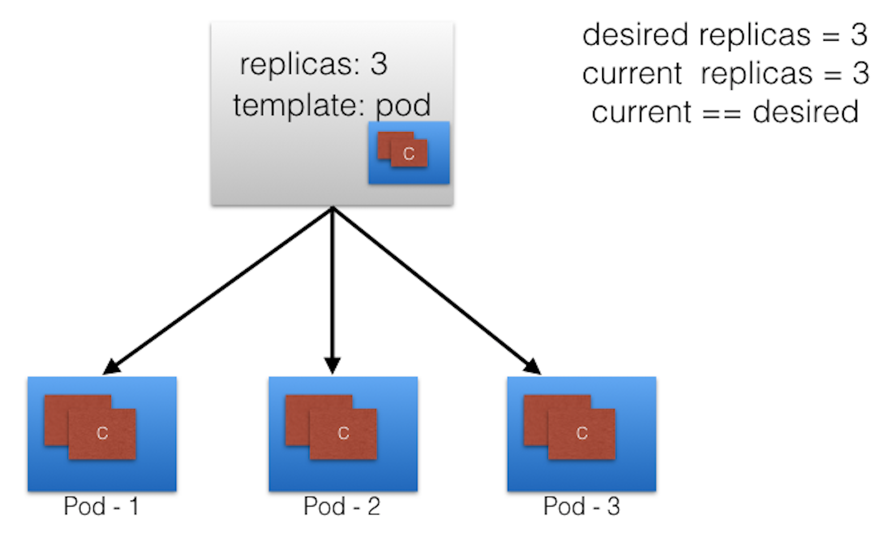

### ReplicaSets II

Let's continue with the same ReplicaSet example and assume that one of the Pods is forced to unexpectedly terminate (due to insufficient resources, timeout, etc.), causing the current state to no longer match the desired state.

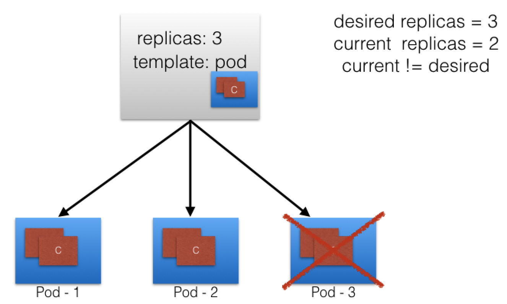

### ReplicaSets III

The ReplicaSet detects that the current state is no longer matching the desired state and triggers a request for an additional Pod to be created, thus ensuring that the current state matches the desired state. 

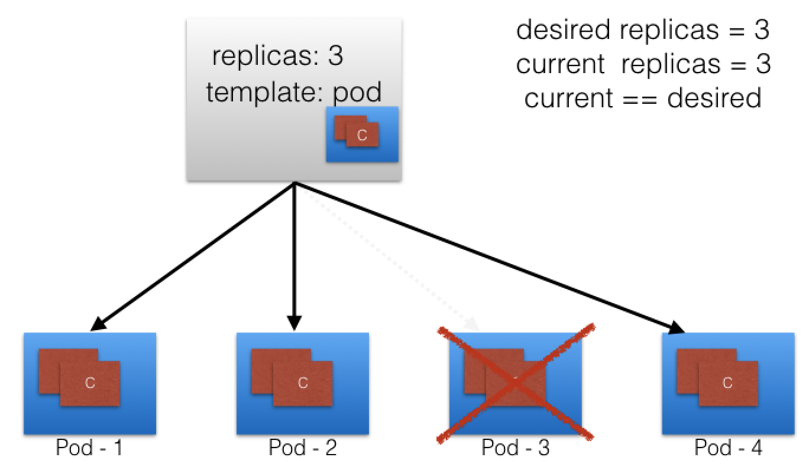

ReplicaSets can be used independently as Pod controllers but they only offer a limited set of features. A set of complementary features are provided by Deployments, the recommended controllers for the orchestration of Pods. Deployments manage the creation, deletion, and updates of Pods. A Deployment automatically creates a ReplicaSet, which then creates a Pod. There is no need to manage ReplicaSets and Pods separately, the Deployment will manage them on our behalf.

We will take a closer look at Deployments next.

### Deployments I

[Deployment](https://kubernetes.io/docs/concepts/workloads/controllers/deployment/) objects provide declarative updates to Pods and ReplicaSets. The `DeploymentController` is part of the master node's controller manager, and as a controller it also ensures that the current state always matches the desired state. It allows for seamless application updates and rollbacks through `rollouts` and `rollbacks`, and it directly manages its `ReplicaSets` for application scaling. 

In the following example, a new `Deployment` creates `ReplicaSet A` which then creates `3 Pods`, with each Pod Template configured to run one `nginx:1.7.9` container image. In this case, the `ReplicaSet A` is associated with `nginx:1.7.9` representing a state of the Deployment. This particular state is recorded as `Revision 1`.


### Deployments II

In time, we need to push updates to the application managed by the Deployment object. Let's change the Pods' Template and update the container image from `nginx:1.7.9` to `nginx:1.9.1`. The `Deployment` triggers a new `ReplicaSet B` for the new container image versioned 1.9.1 and this association represents a new recorded state of the `Deployment, Revision 2`. The seamless transition between the two ReplicaSets, from `ReplicaSet A` with 3 Pods versioned 1.7.9 to the new `ReplicaSet B` with 3 new Pods versioned 1.9.1, or from `Revision 1` to `Revision 2`, is a Deployment `rolling update`. 

A `rolling update` is triggered when we update specific properties of the Pod Template for a deployment. While updating the container image, container port, volumes, and mounts would trigger a new Revision, other operations like scaling or labeling the deployment do not trigger a rolling update, thus do not change the Revision number.

Once the rolling update has completed, the `Deployment` will show both `ReplicaSets A` and `B`, where `A` is scaled to 0 (zero) Pods, and `B` is scaled to 3 Pods. This is how the Deployment records its prior state configuration settings, as `Revisions`. 

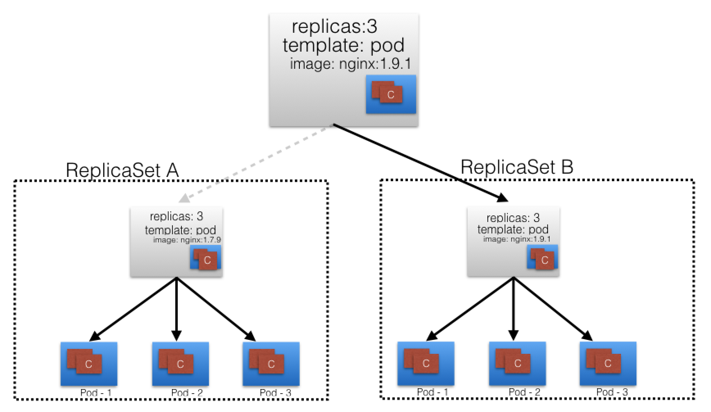

### Deployments III

Once `ReplicaSet B` and its 3 Pods versioned 1.9.1 are ready, the `Deployment` starts actively managing them. However, the Deployment keeps its prior configuration states saved as Revisions which play a key factor in the `rollback` capability of the Deployment - returning to a prior known configuration state. In our example, if the performance of the new `nginx:1.9.1` is not satisfactory, the Deployment can be rolled back to a prior Revision, in this case from `Revision 2` back to `Revision 1` running `nginx:1.7.9` once again.

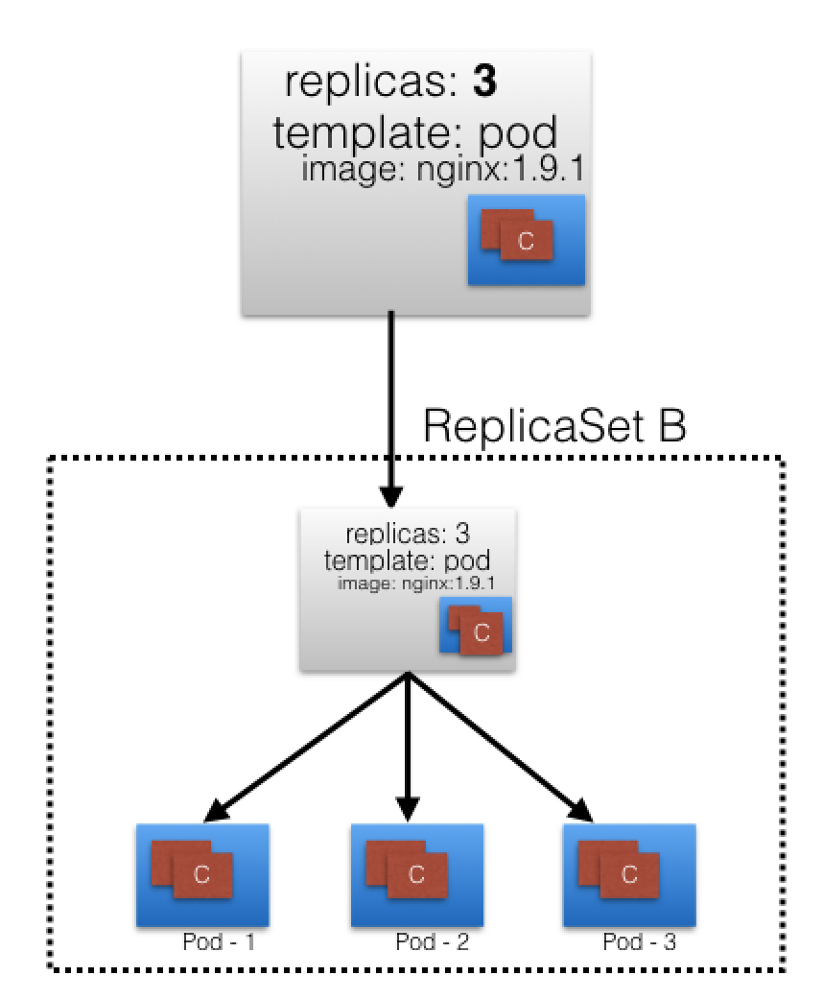

### Namespaces

If multiple users and teams use the same Kubernetes cluster we can partition the cluster into virtual sub-clusters using [Namespaces](https://kubernetes.io/docs/concepts/overview/working-with-objects/namespaces/). The names of the resources/objects created inside a Namespace are unique, but not across Namespaces in the cluster.

To list all the Namespaces, we can run the following command:

```Shell
$ kubectl get namespaces
NAME              STATUS       AGE
default           Active       11h
kube-node-lease   Active       11h
kube-public       Active       11h
kube-system       Active       11h
```

Generally, Kubernetes creates four Namespaces out of the box: `kube-system, kube-public, kube-node-lease`, and `default`. The `kube-system` Namespace contains the objects created by the Kubernetes system, mostly the control plane agents. The `default` Namespace contains the objects and resources created by administrators and developers, and objects are assigned to it by default unless another Namespace name is provided by the user. `kube-public` is a special Namespace, which is unsecured and readable by anyone, used for special purposes such as exposing public (non-sensitive) information about the cluster. The newest Namespace is `kube-node-lease` which holds node lease objects used for node heartbeat data. Good practice, however, is to create additional Namespaces, as desired, to virtualize the cluster and isolate users, developer teams, applications, or tiers.

Namespaces are one of the most desired features of Kubernetes, securing its lead against competitors, as it provides a solution to the multi-tenancy requirement of today's enterprise development teams. 

[Resource Quotas](https://kubernetes.io/docs/concepts/policy/resource-quotas/) help users limit the overall resources consumed within Namespaces, while [LimitRanges](https://kubernetes.io/docs/concepts/policy/limit-range/) help limit the resources consumed by Pods or Containers in a Namespace. We will briefly cover quota management in a later chapter.

### Learning Objectives (Review)

You should now be able to:

  - Describe the Kubernetes object model.
  - Discuss Kubernetes building blocks, e.g. Pods, ReplicaSets, Deployments, Namespaces.
  - Discuss Labels and Selectors.

## Chapter 9. Authentication, Authorization, Admission Control

### Introduction

Every API request reaching the API server has to go through several control stages before being accepted by the server and acted upon. In this chapter, we will learn about the Authentication, Authorization, and Admission Control stages of the Kubernetes API access control.

### Learning Objectives

By the end of this chapter, you should be able to:

  - Discuss the authentication, authorization, and access control stages of the Kubernetes API access.
  - Understand the different kinds of Kubernetes users.
  - Explore the different modules for authentication and authorization.

### Authentication, Authorization, and Admission Control - Overview

To access and manage Kubernetes resources or objects in the cluster, we need to access a specific API endpoint on the API server. Each access request goes through the following access control stages:

  - **Authentication**: Logs in a user.
  - **Authorization**: Authorizes the API requests submitted by the authenticated user.
  - **Admission Control**: Software modules that validate and/or modify user requests based.

The following image depicts the above stages:

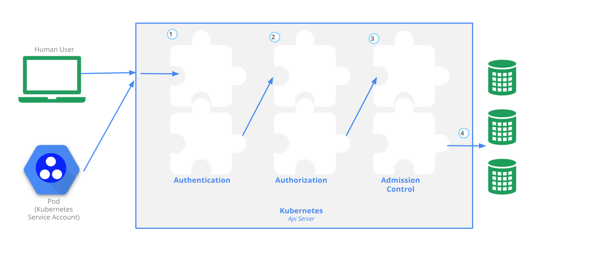
(Retrieved from [kubernetes.io](https://kubernetes.io/docs/admin/accessing-the-api/))

### Authentication I

Kubernetes does not have an object called user, nor does it store usernames or other related details in its object store. However, even without that, Kubernetes can use usernames for the [Authentication](https://kubernetes.io/docs/reference/access-authn-authz/authentication/) phase of the API access control, and to request logging as well. 

Kubernetes supports two kinds of [users](https://kubernetes.io/docs/reference/access-authn-authz/authentication/#users-in-kubernetes):

  - **Normal Users**: They are managed outside of the Kubernetes cluster via independent services like User/Client Certificates, a file listing usernames/passwords, Google accounts, etc.
  - **Service Accounts**: Service Accounts allow in-cluster processes to communicate with the API server to perform various operations. Most of the Service Accounts are created automatically via the API server, but they can also be created manually. The Service Accounts are tied to a particular Namespace and mount the respective credentials to communicate with the API server as Secrets.

If properly configured, Kubernetes can also support [anonymous requests](https://kubernetes.io/docs/reference/access-authn-authz/authentication/#anonymous-requests), along with requests from Normal Users and Service Accounts. [User impersonation](https://kubernetes.io/docs/reference/access-authn-authz/authentication/#user-impersonation) is also supported allowing a user to act as another user, a helpful feature for administrators when troubleshooting authorization policies.

### Authentication II

For authentication, Kubernetes uses a series of [authentication modules](https://kubernetes.io/docs/reference/access-authn-authz/authentication/#authentication-strategies):

  - **X509 Client Certificates**: To enable client certificate authentication, we need to reference a file containing one or more certificate authorities by passing the --client-ca-file=SOMEFILE option to the API server. The certificate authorities mentioned in the file would validate the client certificates presented by users to the API server. A demonstration video covering this topic can be found at the end of this chapter.
  - **Static Token File**: We can pass a file containing pre-defined bearer tokens with the --token-auth-file=SOMEFILE option to the API server. Currently, these tokens would last indefinitely, and they cannot be changed without restarting the API server.
  - **Bootstrap Tokens**: Tokens used for bootstrapping new Kubernetes clusters.
  - **Service Account Tokens**: Automatically enabled authenticators that use signed bearer tokens to verify requests. These tokens get attached to Pods using the ServiceAccount Admission Controller, which allows in-cluster processes to talk to the API server.
  - **OpenID Connect Tokens**: OpenID Connect helps us connect with OAuth2 providers, such as Azure Active Directory, Salesforce, and Google, to offload the authentication to external services.
  - **Webhook Token Authentication**: With Webhook-based authentication, verification of bearer tokens can be offloaded to a remote service.
  - **Authenticating Proxy**: Allows for the programming of additional authentication logic.

We can enable multiple authenticators, and the first module to successfully authenticate the request short-circuits the evaluation. To ensure successful user authentication, we should enable at least two methods: the service account tokens authenticator and one of the user authenticators. 

### Authorization I

After a successful authentication, users can send the API requests to perform different operations. Here, these API requests get [authorized](https://kubernetes.io/docs/reference/access-authn-authz/authorization/) by Kubernetes using various authorization modules, that allow or deny the requests.

Some of the API request attributes that are reviewed by Kubernetes include user, group, extra, Resource, Namespace, or API group, to name a few. Next, these attributes are evaluated against policies. If the evaluation is successful, then the request is allowed, otherwise it is denied. Similar to the Authentication step, Authorization has multiple modules, or authorizers. More than one module can be configured for one Kubernetes cluster, and each module is checked in sequence. If any authorizer approves or denies a request, then that decision is returned immediately.

### Authorization II

Authorization modes (Part 1):

  - **Node**: Node authorization is a special-purpose authorization mode which specifically authorizes API requests made by kubelets. It authorizes the kubelet's read operations for services, endpoints, or nodes, and writes operations for nodes, pods, and events. For more details, please review the [Node authorization](https://kubernetes.io/docs/reference/access-authn-authz/node/).
  - **Attribute-Based Access Control (ABAC)**: With the ABAC authorizer, Kubernetes grants access to API requests, which combine policies with attributes. In the following example, user student can only read Pods in the Namespace `lfs158`.

```yaml
{
  "apiVersion": "abac.authorization.kubernetes.io/v1beta1",
  "kind": "Policy",
  "spec": {
    "user": "student",
    "namespace": "lfs158",
    "resource": "pods",
    "readonly": true
  }
}
```

To enable ABAC mode, we start the API server with the `--authorization-mode=ABAC` option, while specifying the authorization policy with `--authorization-policy-file=PolicyFile.json`. For more details, please review the [ABAC authorization](https://kubernetes.io/docs/reference/access-authn-authz/abac/).

  - **Webhook**: In Webhook mode, Kubernetes can request authorization decisions to be made by third-party services, which would return true for successful authorization, and false for failure. In order to enable the Webhook authorizer, we need to start the API server with the `--authorization-webhook-config-file=SOME_FILENAME` option, where `SOME_FILENAME` is the configuration of the remote authorization service. For more details, please see the [Webhook mode](https://kubernetes.io/docs/reference/access-authn-authz/webhook/).

### Authorization III

Authorization modes (Part 2):

  - **Role-Based Access Control (RBAC)**: In general, with RBAC we regulate the access to resources based on the Roles of individual users. In Kubernetes, multiple Roles can be attached to subjects like users, service accounts, etc. While creating the Roles, we restrict resource access by specific operations, such as `create, get, update, patch`, etc. These operations are referred to as verbs.

In RBAC, we can create two kinds of Roles:

**Role**: A Role grants access to resources within a specific Namespace.

**ClusterRole**: A ClusterRole grants the same permissions as Role does, but its scope is cluster-wide.

In this course, we will focus on the first kind, **Role**. Below you will find an example:

```yaml
apiVersion: rbac.authorization.k8s.io/v1
kind: Role
metadata:
  namespace: lfs158
  name: pod-reader
rules:
- apiGroups: [""] # "" indicates the core API group
  resources: ["pods"]
  verbs: ["get", "watch", "list"]
```

The manifest defines a `pod-reader` role, which has access only to read the Pods of `lfs158` Namespace. Once the role is created, we can bind it to users with a RoleBinding object.

There are two kinds of RoleBindings:

**RoleBinding**: It allows us to bind users to the same namespace as a Role. We could also refer a ClusterRole in RoleBinding, which would grant permissions to Namespace resources defined in the ClusterRole within the RoleBinding’s Namespace.

**ClusterRoleBinding**: It allows us to grant access to resources at a cluster-level and to all Namespaces.

In this course, we will focus on the first kind, `RoleBinding`. Below, you will find an example:

```yaml
apiVersion: rbac.authorization.k8s.io/v1
kind: RoleBinding
metadata:
  name: pod-read-access
  namespace: lfs158
subjects:
- kind: User
  name: student
  apiGroup: rbac.authorization.k8s.io
roleRef:
  kind: Role
  name: pod-reader
  apiGroup: rbac.authorization.k8s.io
```

The manifest defines a bind between the `pod-reader` Role and the `student` user, to restrict the user to only read the Pods of the `lfs158` Namespace.

To enable the RBAC mode, we start the API server with the --authorization-mode=RBAC option, allowing us to dynamically configure policies. For more details, please review the [RBAC mode](https://kubernetes.io/docs/reference/access-authn-authz/rbac/). 

### Admission Control

[Admission Controllers](https://kubernetes.io/docs/reference/access-authn-authz/admission-controllers/) are used to specify granular access control policies, which include allowing privileged containers, checking on resource quota, etc. We force these policies using different admission controllers, like ResourceQuota, DefaultStorageClass, AlwaysPullImages, etc. They come into effect only after API requests are authenticated and authorized.

To use admission controls, we must start the Kubernetes API server with the `--enable-admission-plugins`, which takes a comma-delimited, ordered list of controller names:

  `--enable-admission-plugins=NamespaceLifecycle,ResourceQuota,PodSecurityPolicy,DefaultStorageClass`

Kubernetes has some admission controllers enabled by default. For more details, please review the [list of Admission Controllers](https://kubernetes.io/docs/reference/access-authn-authz/admission-controllers/#what-does-each-admission-controller-do). 

Kubernetes admission control can also be implemented though custom plugins, for a [Dynamic Admission Control](https://kubernetes.io/docs/reference/access-authn-authz/extensible-admission-controllers/) method. These plugins are developed as extensions and run as admission webhooks. 

### Authentication and Authorization Demo Guide

This exercise guide assumes the following environment, which by default uses the certificate and key from `/var/lib/minikube/certs/`, and `RBAC` mode for authorization:

  - Minikube v1.13.1
  - Kubernetes v1.19.2
  - Docker 19.03.12-ce

This exercise guide was prepared for the video demonstration following on the next page. 

Start Minikube:

```Shell
$ minikube start
```

View the content of the `kubectl` client's configuration manifest, observing the only context `minikube` and the only user `minikube`, created by default:

```Shell
$ kubectl config view

apiVersion: v1
clusters:
- cluster:
    certificate-authority: /home/student/.minikube/ca.crt
    server: https://192.168.99.100:8443
  name: minikube
contexts:
- context:
    cluster: minikube
    user: minikube
  name: minikube
current-context: minikube
kind: Config
preferences: {}
users:
- name: minikube
  user:
    client-certificate: /home/student/.minikube/profiles/minikube/client.crt
    client-key: /home/student/.minikube/profiles/minikube/client.key
```

Create `lfs158` namespace:

```Shell
$ kubectl create namespace lfs158

namespace/lfs158 created
```

Create the `rbac` directory and cd into it:

```Shell
$ mkdir rbac

$ cd rbac/
```

Create a `private key` for the `student` user with `openssl` tool, then create a `certificate signing request` for the `student` user with `openssl` tool:

```Shell
~/rbac$ openssl genrsa -out student.key 2048

Generating RSA private key, 2048 bit long modulus (2 primes)
.................................................+++++
.........................+++++
e is 65537 (0x010001)

~/rbac$ openssl req -new -key student.key -out student.csr -subj "/CN=student/O=learner"
```

Create a YAML manifest for a `certificate signing request` object, and save it with a blank value for the `request` field: 

```Shell
~/rbac$ vim signing-request.yaml

apiVersion: certificates.k8s.io/v1
kind: CertificateSigningRequest
metadata:
  name: student-csr
spec:
  groups:
  - system:authenticated
  request: <assign encoded value from next cat command>
  signerName: kubernetes.io/kube-apiserver-client
  usages:
  - digital signature
  - key encipherment
  - client auth
```

View the `certificate`, encode it in `base64`, and assign it to the `request` field in the `signing-request.yaml` file:

```Shell
~/rbac$ cat student.csr | base64 | tr -d '\n','%'

LS0tLS1CRUd...1QtLS0tLQo=

~/rbac$ vim signing-request.yaml

apiVersion: certificates.k8s.io/v1
kind: CertificateSigningRequest
metadata:
  name: student-csr
spec:
  groups:
  - system:authenticated
  request: LS0tLS1CRUd...1QtLS0tLQo=
  signerName: kubernetes.io/kube-apiserver-client
  usages:
  - digital signature
  - key encipherment
  - client auth
```

Create the `certificate signing request` object, then list the certificate signing request objects. It shows a `pending` state:

```Shell
~/rbac$ kubectl create -f signing-request.yaml

certificatesigningrequest.certificates.k8s.io/student-csr created

~/rbac$ kubectl get csr

NAME          AGE   SIGNERNAME                            REQUESTOR       CONDITION

student-csr   12s   kubernetes.io/kube-apiserver-client   minikube-user   Pending
```

Approve the `certificate signing request` object, then list the certificate signing request objects again. It shows both `approved` and `issued` states:

```Shell
~/rbac$ kubectl certificate approve student-csr

certificatesigningrequest.certificates.k8s.io/student-csr approved

~/rbac$ kubectl get csr

NAME          AGE   SIGNERNAME                            REQUESTOR       CONDITION

student-csr   57s   kubernetes.io/kube-apiserver-client   minikube-user   Approved,Issued
```

Extract the approved `certificate` from the `certificate signing request`, decode it with `base64` and save it as a `certificate file`. Then view the certificate in the newly created certificate file:

```Shell
~/rbac$ kubectl get csr student-csr -o jsonpath='{.status.certificate}' | base64 --decode > student.crt

~/rbac$ cat student.crt

-----BEGIN CERTIFICATE-----
MIIDGzCCA...
...
...NOZRRZBVunTjK7A==
-----END CERTIFICATE-----
```

Configure the `kubectl` client's configuration manifest with the `student` user's credentials by assigning the `key` and `certificate`: 

```Shell
~/rbac$ kubectl config set-credentials student --client-certificate=student.crt --client-key=student.key

User "student" set.
```

Create a new `context` entry in the `kubectl` client's configuration manifest for the `student` user, associated with the `lfs158` namespace in the `minikube` cluster:

```Shell
~/rbac$ kubectl config set-context student-context --cluster=minikube --namespace=lfs158 --user=student

Context "student-context" created.
```

View the contents of the `kubectl` client's configuration manifest again, observing the new `context` entry `student-context`, and the new `user` entry `student`:

```Shell
~/rbac$ kubectl config view

apiVersion: v1
clusters:
- cluster:
    certificate-authority: /home/student/.minikube/ca.crt
    server: https://192.168.99.100:8443
  name: minikube
contexts:
- context:
    cluster: minikube
    user: minikube
  name: minikube
- context:
    cluster: minikube
    namespace: lfs158
    user: student
  name: student-context
current-context: minikube
kind: Config
preferences: {}
users:
- name: minikube
  user:
    client-certificate: /home/student/.minikube/profiles/minikube/client.crt
    client-key: /home/student/.minikube/profiles/minikube/client.key
- name: student
  user:
    client-certificate: /home/student/rbac/student.crt
    client-key: /home/student/rbac/student.key
```

While in the default `minikube context`, create a new `deployment` in the `lfs158` namespace:

```Shell
~/rbac$ kubectl -n lfs158 create deployment nginx --image=nginx:alpine

deployment.apps/nginx created
```

From the new `context student-context` try to list pods. The attempt fails because the `student` user has no permissions configured for the `student-context`:

```Shell
~/rbac$ kubectl --context=student-context get pods

Error from server (Forbidden): pods is forbidden: User "student" cannot list resource "pods" in API group "" in the namespace "lfs158"
```

The following steps will assign a limited set of permissions to the `student` user in the `student-context`. 

Create a YAML configuration manifest for a `pod-reader` Role object, which allows only `get, watch, list` actions in the `lfs158` namespace against `pod` objects. Then create the `role` object and list it from the default `minikube context`, but from the `lfs158` namespace:

```Shell
~/rbac$ vim role.yaml

apiVersion: rbac.authorization.k8s.io/v1
kind: Role
metadata:
  name: pod-reader
  namespace: lfs158
rules:
- apiGroups: [""]
  resources: ["pods"]
  verbs: ["get", "watch", "list"]

~/rbac$ kubectl create -f role.yaml

role.rbac.authorization.k8s.io/pod-reader created

~/rbac$ kubectl -n lfs158 get roles

NAME         CREATED AT
pod-reader   2020-10-07T03:47:45Z
```

Create a YAML configuration manifest for a `rolebinding` object, which assigns the permissions of the `pod-reader` Role to the `student` user. Then create the `rolebinding` object and list it from the default `minikube context`, but from the `lfs158` namespace:

```Shell
~/rbac$ vim rolebinding.yaml

apiVersion: rbac.authorization.k8s.io/v1
kind: RoleBinding
metadata:
  name: pod-read-access
  namespace: lfs158
subjects:
- kind: User
  name: student
  apiGroup: rbac.authorization.k8s.io
roleRef:
  kind: Role
  name: pod-reader
  apiGroup: rbac.authorization.k8s.io

~/rbac$ kubectl create -f rolebinding.yaml 

rolebinding.rbac.authorization.k8s.io/pod-read-access created

~/rbac$ kubectl -n lfs158 get rolebindings

NAME              ROLE              AGE
pod-read-access   Role/pod-reader   28s
```

Now that we have assigned permissions to the student user, we can successfully list `pods` from the new `context student-context`.

```Shell
~/rbac$ kubectl --context=student-context get pods

NAME                     READY   STATUS    RESTARTS   AGE
nginx-565785f75c-kl25r   1/1     Running   0          7m41s
```

### Learning Objectives (Review)

You should now be able to:

  - Discuss the authentication, authorization, and access control stages of the Kubernetes API access.
  - Understand the different kinds of Kubernetes users.
  - Explore the different modules for authentication and authorization.

## Chapter 10. Services

### Introduction 

Although the microservices driven architecture aims to decouple the components of an application, microservices still need agents to logically tie or group them together for management purposes, or to load balance traffic to the ones that are part of such a logical set.

In this chapter, we will learn about [Service](https://kubernetes.io/docs/concepts/services-networking/service/) objects used to abstract the communication between cluster internal microservices, or with the external world. A Service offers a single DNS entry for a containerized application managed by the Kubernetes cluster, regardless of the number of replicas, by providing a common load balancing access point to a set of pods logically grouped and managed by a controller such as a Deployment, ReplicaSet, or DaemonSet. 

We will also learn about the `kube-proxy` daemon, which runs on each master and worker node to implement the services' configuration and to provide access to services. In addition we will discuss `service discovery` and `service types`, which decide the access scope of a service. 

### Learning Objectives

By the end of this chapter, you should be able to:

  - Discuss the benefits of logically grouping Pods with Services to access an application.
  - Explain the role of the `kube-proxy` daemon running on each node.
  - Explore the Service discovery options available in Kubernetes.
  - Discuss different Service types.

### Connecting Users or Applications to Pods

To access the application, a user or another application need to connect to the Pods. As Pods are ephemeral in nature, resources like IP addresses allocated to them cannot be static. Pods could be terminated abruptly or be rescheduled based on existing requirements.

Let's take, for example, a scenario where a user/client is connected to Pods using their IP addresses. 


Unexpectedly, one of the Pods the user/client is connected to is terminated, and a new Pod is created by the controller. The new Pod will have a new IP address, that will not be immediately known by the user/client of the earlier Pod.


To overcome this situation, Kubernetes provides a higher-level abstraction called `Service`, which logically groups Pods and defines a policy to access them. This grouping is achieved via `Labels` and `Selectors`.

### Services

Labels and Selectors use a `key/value` pair format. In the following graphical representation, `app` is the Label `key`, frontend and `db` are Label `values` for different Pods. 


Using the selectors `app==frontend` and `app==db`, we group Pods into two logical sets: one set with 3 Pods, and one set with a single Pod.

We assign a name to the logical grouping, referred to as a `Service`. The Service name also is registered with the cluster's internal DNS service. In our example, we create two Services, `frontend-svc`, and `db-svc`, and they have the `app==frontend` and the `app==db` Selectors, respectively. 


Services can expose single Pods, ReplicaSets, Deployments, DaemonSets, and StatefulSets.

### Service Object Example

The following is an example of a Service object definition:

```yaml
apiVersion: v1
kind: Service
metadata:
  name: frontend-svc
spec:
  selector:
    app: frontend
  ports:
  - protocol: TCP
    port: 80
    targetPort: 5000
```

In this example, we are creating a `frontend-svc` Service by selecting all the Pods that have the Label `key=app` set to `value=frontend`. By default, each Service receives an IP address routable only inside the cluster, known as `ClusterIP`. In our example, we have `172.17.0.4` and `172.17.0.5` as `ClusterIP`s assigned to our `frontend-svc` and `db-svc` Services, respectively. 


The user/client now connects to a Service via its `ClusterIP`, which forwards traffic to one of the Pods attached to it. A Service provides load balancing by default while selecting the Pods for traffic forwarding.

While the Service forwards traffic to Pods, we can select the `targetPort` on the Pod which receives the traffic. In our example, the `frontend-svc` Service receives requests from the user/client on `port: 80` and then forwards these requests to one of the attached Pods on the `targetPort: 5000`. If the `targetPort` is not defined explicitly, then traffic will be forwarded to Pods on the `port` on which the Service receives traffic. It is very important to ensure that the value of the `targetPort`, which is `5000` in this example, matches the value of the `containerPort` property of the Pod `spec` section. 

A logical set of a Pod's IP address, along with the `targetPort` is referred to as a `Service endpoint`. In our example, the `frontend-svc` Service has 3 endpoints: `10.0.1.3:5000`, `10.0.1.4:5000`, and `10.0.1.5:5000`. Endpoints are created and managed automatically by the Service, not by the Kubernetes cluster administrator.

### kube-proxy

Each cluster node runs a daemon called [kube-proxy](https://kubernetes.io/docs/concepts/services-networking/service/#virtual-ips-and-service-proxies), that watches the API server on the master node for the addition, updates, and removal of Services and endpoints. `kube-proxy` is responsible for implementing the Service configuration on behalf of an administrator or developer, in order to enable traffic routing to an exposed application running in Pods. In the example below, for each new Service, on each node, `kube-proxy` configures `iptables` rules to capture the traffic for its `ClusterIP` and forwards it to one of the Service's endpoints. Therefore any node can receive the external traffic and then route it internally in the cluster based on the `iptables` rules. When the Service is removed, `kube-proxy` removes the corresponding `iptables` rules on all nodes as well.


### Service Discovery

As Services are the primary mode of communication between containerized applications managed by Kubernetes, it is helpful to be able to discover them at runtime. Kubernetes supports two methods for discovering Services:

  - **Environment Variables**

As soon as the Pod starts on any worker node, the `kubelet` daemon running on that node adds a set of environment variables in the Pod for all active Services. For example, if we have an active Service called `redis-master`, which exposes port `6379`, and its `ClusterIP` is `172.17.0.6`, then, on a newly created Pod, we can see the following environment variables:

```Shell
REDIS_MASTER_SERVICE_HOST=172.17.0.6
REDIS_MASTER_SERVICE_PORT=6379
REDIS_MASTER_PORT=tcp://172.17.0.6:6379
REDIS_MASTER_PORT_6379_TCP=tcp://172.17.0.6:6379
REDIS_MASTER_PORT_6379_TCP_PROTO=tcp
REDIS_MASTER_PORT_6379_TCP_PORT=6379
REDIS_MASTER_PORT_6379_TCP_ADDR=172.17.0.6
```

With this solution, we need to be careful while ordering our Services, as the Pods will not have the environment variables set for Services which are created after the Pods are created.

  - **DNS**

Kubernetes has an add-on for DNS, which creates a [DNS](https://kubernetes.io/docs/concepts/services-networking/dns-pod-service/) record for each Service and its format is `my-svc.my-namespace.svc.cluster.local`. Services within the same Namespace find other Services just by their names. If we add a Service `redis-master` in `my-ns` Namespace, all Pods in the same `my-ns` Namespace lookup the Service just by its name, `redis-master`. Pods from other Namespaces, such as `test-ns`, lookup the same Service by adding the respective Namespace as a suffix, such as `redis-master.my-ns` or providing the **FQDN** of the service as `redis-master.my-ns.svc.cluster.local`.

This is the most common and highly recommended solution. For example, in the previous section's image, we have seen that an internal DNS is configured, which maps our Services `frontend-svc` and `db-svc` to `172.17.0.4` and `172.17.0.5` IP addresses respectively.

### ServiceType

While defining a Service, we can also choose its access scope. We can decide whether the Service:

  - Is only accessible within the cluster
  - Is accessible from within the cluster and the external world
  - Maps to an entity which resides either inside or outside the cluster.

Access scope is decided by `ServiceType` property, defined when creating the Service.

### ServiceType: ClusterIP and NodePort

`ClusterIP` is the default [ServiceType](https://kubernetes.io/docs/concepts/services-networking/service/#nodeport). A Service receives a Virtual IP address, known as its ClusterIP. This Virtual IP address is used for communicating with the Service and is accessible only from within the cluster. 

With the [NodePort](https://kubernetes.io/docs/concepts/services-networking/service/#nodeport) `ServiceType`, in addition to a ClusterIP, a high-port, dynamically picked from the default range `30000-32767`, is mapped to the respective Service, from all the worker nodes. For example, if the mapped NodePort is `32233` for the service `frontend-svc`, then, if we connect to any worker node on port `32233`, the node would redirect all the traffic to the assigned `ClusterIP - 172.17.0.4`. If we prefer a specific high-port number instead, then we can assign that high-port number to the NodePort from the default range when creating the Service. 

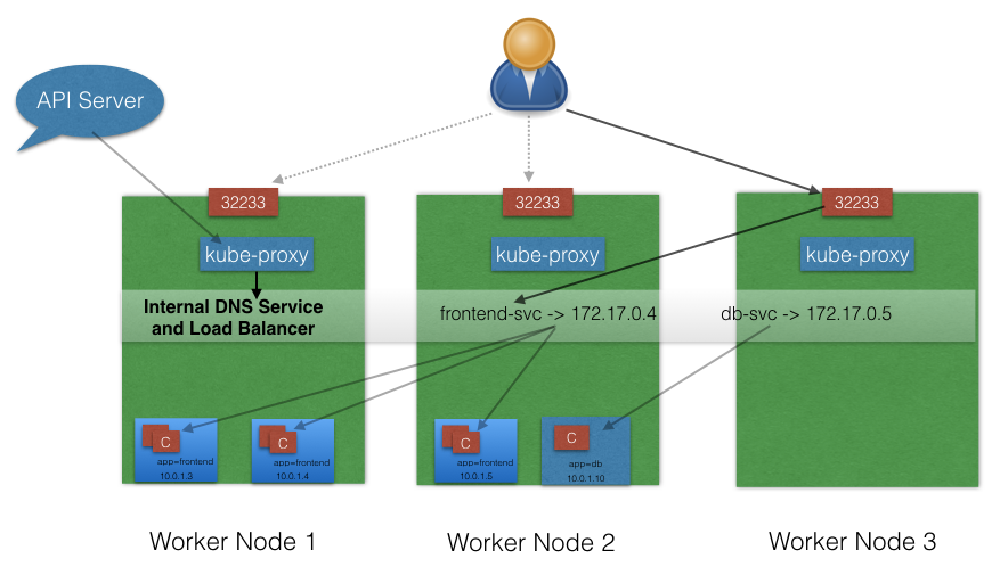

The `NodePort ServiceType` is useful when we want to make our Services accessible from the external world. The end-user connects to any worker node on the specified high-port, which proxies the request internally to the ClusterIP of the Service, then the request is forwarded to the applications running inside the cluster. Let's not forget that the Service is load balancing such requests, and only forwards the request to one of the Pods running the desired application. To manage access to multiple application Services from the external world, administrators can configure a reverse proxy - an ingress, and define rules that target specific Services within the cluster.

### ServiceType: LoadBalancer

With the [LoadBalancer](https://kubernetes.io/docs/concepts/services-networking/service/#loadbalancer) `ServiceType`:

  - NodePort and ClusterIP are automatically created, and the external load balancer will route to them
  - The Service is exposed at a static port on each worker node
  - The Service is exposed externally using the underlying cloud provider's load balancer feature.
 


The `LoadBalancer ServiceType` will only work if the underlying infrastructure supports the automatic creation of Load Balancers and have the respective support in Kubernetes, as is the case with the Google Cloud Platform and AWS. If no such feature is configured, the LoadBalancer IP address field is not populated, it remains in Pending state, but the Service will still work as a typical NodePort type Service. 

### ServiceType: ExternalIP

A Service can be mapped to an [ExternalIP](https://kubernetes.io/docs/concepts/services-networking/service/#external-ips) address if it can route to one or more of the worker nodes. Traffic that is ingressed into the cluster with the ExternalIP (as destination IP) on the Service port, gets routed to one of the Service endpoints. This type of service requires an external cloud provider such as Google Cloud Platform or AWS and a Load Balancer configured on the cloud provider's infrastructure.


Please note that ExternalIPs are not managed by Kubernetes. The cluster administrator has to configure the routing which maps the ExternalIP address to one of the nodes.

### ServiceType: ExternalName

[ExternalName](https://kubernetes.io/docs/concepts/services-networking/service/#externalname) is a special `ServiceType`, that has no Selectors and does not define any endpoints. When accessed within the cluster, it returns a `CNAME` record of an externally configured Service.

The primary use case of this `ServiceType` is to make externally configured Services like `my-database.example.com` available to applications inside the cluster. If the externally defined Service resides within the same Namespace, using just the name `my-database` would make it available to other applications and Services within that same Namespace.

### Learning Objectives (Review)

You should now be able to:

  - Discuss the benefits of logically grouping Pods with Services to access an application.
  - Explain the role of the `kube-proxy` daemon running on each node.
  - Explore the Service discovery options available in Kubernetes.
  - Discuss different Service types.

## Chapter 11. Deploying a Stand-Alone Application

### Introduction

In this chapter, we will learn how to deploy an application using the **Dashboard (Kubernetes WebUI)** and the **Command Line Interface (CLI)**. We will also expose the application with a NodePort type Service, and access it from outside the Minikube cluster.

### Learning Objectives

By the end of this chapter, you should be able to:

  - Deploy an application from the dashboard.
  - Deploy an application from a YAML file using kubectl.
  - Expose a service using NodePort.
  - Access the application from outside the Minikube cluster.

### 

## Chapter 12. Kubernetes Volume Management

## Chapter 13. ConfigMaps and Secrets

## Chapter 14. Ingress

## Chapter 15. Advanced Topics

## Chapter 16. Kubernetes Community

## Final Exam

## That's all folks!!!
___
