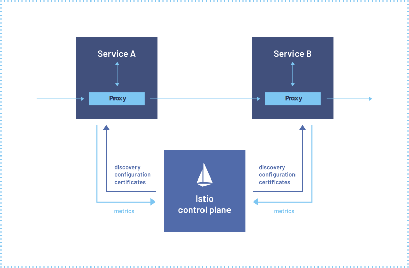

# Descomplicando o Istio

## About

> [LINUXtips: Descomplicando o Istio](https://school.linuxtips.io/path-player?courseid=descomplicando-o-istio)

- [Istio site](https://istio.io/)
- [Istio GitHub](https://github.com/istio/istio)
- [Istio Documentation](https://istio.io/latest/docs/)

## O que é Service Mesh?

**Service Mesh: Uma camada de infraestrutura para microsserviços.**

Em arquiteturas de microsserviços, onde um aplicativo é composto por vários serviços menores que se comunicam entre si, o gerenciamento dessa comunicação pode se tornar complexo. É aí que entra o **Service Mesh**, uma camada de infraestrutura dedicada que facilita e otimiza a comunicação entre os microsserviços.

> **Analogia:** Imagine uma cidade movimentada, com várias empresas (microsserviços) que precisam trocar informações e produtos entre si. O **Service Mesh** seria como um sistema de trânsito inteligente, que gerencia o fluxo de veículos (requisições) de forma eficiente, garantindo que cheguem ao destino certo, no tempo certo e com segurança.

Principais funções do Service Mesh:

- **Gerenciamento de tráfego:** Controla o fluxo de requisições entre os microsserviços, permitindo implementar estratégias como balanceamento de carga, roteamento baseado em regras, injeção de falhas e testes A/B.
- **Segurança:** Oferece recursos avançados de segurança, como autenticação mútua, autorização e criptografia de ponta a ponta, protegendo os microsserviços contra ameaças.
- **Observabilidade:** Coleta dados detalhados sobre o desempenho e o comportamento dos microsserviços, fornecendo insights valiosos para monitorar, depurar e otimizar os aplicativos.
- **Resiliência:** Ajuda a tornar os aplicativos mais resilientes, permitindo que se recuperem de falhas e interrupções de forma mais rápida e eficiente.

Como funciona:

O Service Mesh utiliza um modelo de "malha de serviço", onde um proxy é implantado como um "sidecar" junto a cada microsserviço. Esse proxy intercepta todo o tráfego de entrada e saída do microsserviço, permitindo que o Service Mesh controle e gerencie a comunicação entre os serviços de forma transparente.

Benefícios de usar o Service Mesh:

- **Simplifica o gerenciamento de microsserviços:** Abstrai as complexidades da comunicação entre serviços, permitindo que os desenvolvedores se concentrem na lógica de negócios.
- **Melhora a confiabilidade e resiliência:** Garante que as requisições sejam entregues de forma confiável e que os aplicativos se recuperem de falhas.
- **Aumenta a segurança:** Protege os microsserviços contra ameaças internas e externas.
- **Otimiza o desempenho:** Permite implementar estratégias de gerenciamento de tráfego para melhorar o desempenho e a eficiência dos aplicativos.

Exemplos de Service Mesh:

- **Istio:** Uma plataforma de código aberto popular e amplamente utilizada.
- **Linkerd:** Outra opção de código aberto, com foco em simplicidade e leveza.
- **Consul Connect:** Uma solução da HashiCorp que se integra bem com o Consul.

Considerações:

- **Complexidade:** Adiciona uma camada de complexidade à infraestrutura, exigindo conhecimento e expertise para configurar e gerenciar.
- **Curva de aprendizado:** Requer tempo e investimento para aprender e dominar as ferramentas e conceitos do Service Mesh.

## O que é o Istio?

Istio é uma plataforma de código aberto que facilita a conexão, o gerenciamento e a proteção de microsserviços em um ambiente distribuído. Ele oferece uma camada de infraestrutura que permite que os desenvolvedores se concentrem na lógica de negócios de seus aplicativos, em vez de se preocuparem com os desafios complexos da comunicação entre serviços, segurança e observabilidade.

Principais recursos e funcionalidades do Istio:

- **Gerenciamento de tráfego:** Istio permite controlar o fluxo de tráfego entre os microsserviços, facilitando a implementação de estratégias como balanceamento de carga, roteamento baseado em regras, injeção de falhas e testes A/B.
- **Segurança:** Istio oferece recursos avançados de segurança, como autenticação mútua, autorização e criptografia de ponta a ponta, garantindo a proteção dos microsserviços contra ameaças externas e internas.
- **Observabilidade:** Istio coleta dados detalhados sobre o desempenho e o comportamento dos microsserviços, fornecendo insights valiosos para monitorar, depurar e otimizar os aplicativos.

Como o Istio funciona:

Istio utiliza um modelo de **"malha de serviço" (service mesh)**, onde um proxy chamado **Envoy** é implantado como um **"sidecar"** junto a cada microsserviço. Esse proxy intercepta todo o tráfego de entrada e saída do microsserviço, permitindo que o Istio controle e gerencie a comunicação entre os serviços de forma transparente.



## Instalando o cluster Kubernetes com Kind

Kind local cluster:

```bash
## create kind cluster
kind create cluster --config ./manifests/kind-istio.yaml

## install NGINX gateway fabric
kubectl kustomize "https://github.com/nginxinc/nginx-gateway-fabric/config/crd/gateway-api/standard?ref=v1.4.0" | kubectl apply -f -
kubectl apply -f https://raw.githubusercontent.com/nginxinc/nginx-gateway-fabric/v1.4.0/deploy/crds.yaml
kubectl apply -f https://raw.githubusercontent.com/nginxinc/nginx-gateway-fabric/v1.4.0/deploy/nodeport/deploy.yaml

## configuring NGINX gateway fabric
kubectl apply -f ./manifests/nginx-gateway.yaml
```

## Instalando o Istio
