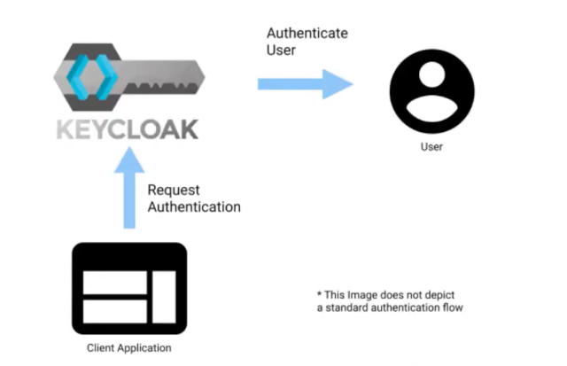
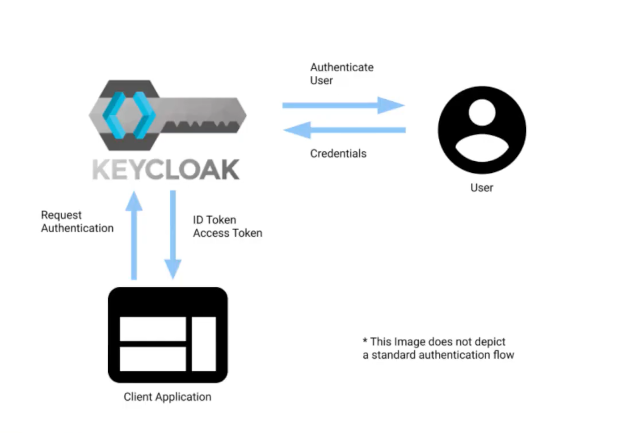
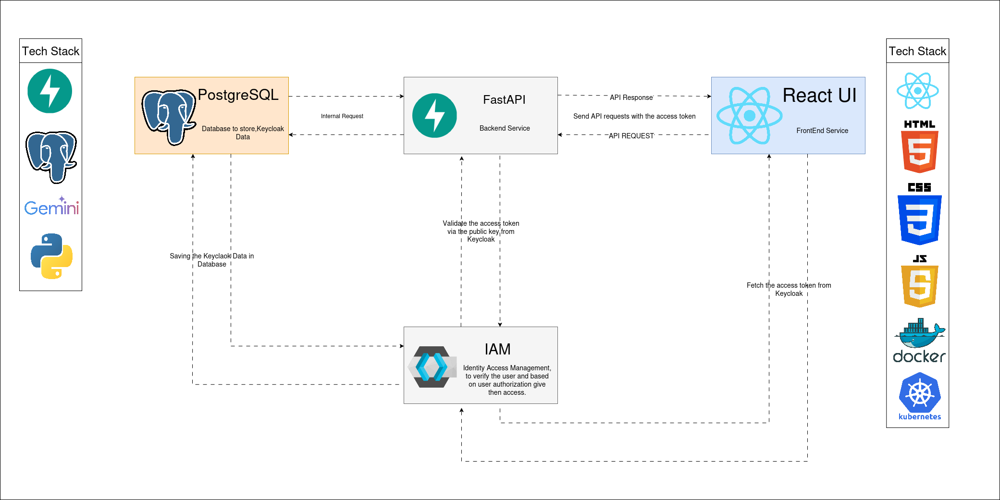

# Keycloak: SSO Course from Zero to Hero

## About

> [`https://www.udemy.com/course/keycloak-sso-course-from-zero-to-hero`](https://www.udemy.com/course/keycloak-sso-course-from-zero-to-hero)

SSO with Keycloak, IAM, Keycloak API, Integration with Spring Boot, Angular, Fast API, React and Event Listeners.

In this course, you will learn Keycloak, an open-source software product that allows single sign-on with Identity and Access Management aimed at modern applications.

**Keycloak** is an open-source tool that provides identity and access management for web applications and services. It supports standard protocols such as OpenID Connect, OAuth 2.0, and SAML 2.0, and offers features such as single sign-on, user federation, social login, and authorization policies.

## Introduction

### Why learn Keycloak?

- User registration and login
- Developer can focus on core technology
- Uses best practices
- Centralized user Management
- SSO, Social Identity Providers, and Federation

Keycloak is a powerful open-source identity and access management (IAM) solution that provides Single Sign-On (SSO), user authentication, and authorization capabilities. Let’s break down why normal users might want to learn about Keycloak:

**Single Sign-On (SSO)**:

- **Convenience:** With SSO, users can log in once and access multiple applications without needing to remember separate credentials for each service. It streamlines the login process.
- **Time-Saving:** Imagine not having to enter your username and password every time you switch between different tools or services. SSO makes that possible.

**Security and Centralized Authentication**:

- **Enhanced Security:** Keycloak ensures secure authentication by supporting various authentication mechanisms (e.g., username/password, social logins, multi-factor authentication).
- **Centralized User Management:** Organizations can manage user accounts, roles, and permissions centrally in Keycloak. This simplifies administration and reduces the risk of security breaches.

**Authorization and Fine-Grained Access Control**:

- **Role-Based Access Control (RBAC):** Keycloak allows for the definition of roles and their association with users. Users can be granted specific permissions based on their roles.
- **Scopes and Claims:** Keycloak supports OAuth 2.0 and OpenID Connect, enabling fine-grained control over what data an application can access.

**Social Logins and Federation**:

- **Social Identity Providers:** Keycloak integrates with popular social platforms (like Google, Facebook, and GitHub) for seamless login experiences.
- **Federation:** Organizations can connect Keycloak to external identity providers (e.g., Active Directory, LDAP) to federate user identities.

**Customizable User Interfaces**:

- **Branding:** Keycloak allows customization of login pages, themes, and email templates. Organizations can maintain a consistent brand experience.
- **User Self-Service:** Users can reset passwords, manage their profiles, and view their sessions—all through Keycloak’s user-friendly interfaces.

**Open Source and Community Support**:

- **Cost-Effective:** Keycloak is free and open source, making it an attractive option for organizations looking to implement IAM without hefty licensing fees.
- **Active Community:** The Keycloak community actively contributes to its development, provides support, and shares best practices.

Remember, even though Keycloak is often used by developers and administrators, understanding its benefits can empower regular users to navigate secure systems more effectively!

### Features of Keycloak

Keycloak is an open-source identity and access management (IAM) solution. Here are the key points, presented in bullet format:

**Single Sign-On (SSO)**:

- **Centralized Authentication:** Keycloak provides a unified login experience across multiple applications. Users log in once and gain access to all connected services.
- **Session Management:** Users maintain a single session, reducing the need for repeated logins.

**User Federation**:

- **External Identity Providers:** Keycloak can integrate with external systems (LDAP, Active Directory, social platforms) to federate user identities.
- **Identity Brokering:** Users can log in using their existing accounts from other providers (e.g., Google, Facebook).

**Authentication Mechanisms**:

- **Username/Password:** Traditional login using credentials.
- **Social Logins:** Users can sign in via social media accounts.
- **Multi-Factor Authentication (MFA):** Enhances security by requiring additional verification steps (e.g., SMS codes, authenticator apps).

**Authorization and Fine-Grained Access Control**:

- **Roles and Permissions:** Define roles and associate them with users. Control access based on roles.
- **Scopes and Claims:** Keycloak supports OAuth 2.0 and OpenID Connect, allowing fine-grained control over data access.

**User Self-Service**:

- **Profile Management:** Users can update their profiles, change passwords, and manage sessions.
- **Password Reset:** Self-service password recovery.

**Customizable Themes and Branding**:

- **Login Pages:** Customize the look and feel of login screens.
- **Email Templates:** Personalize email notifications sent by Keycloak.

**Security Features**:

- **Token-Based Authentication:** Uses tokens (JWTs) for secure communication between applications.
- **OAuth 2.0 and OpenID Connect:** Industry-standard protocols for secure authentication and authorization.

**Admin Console and REST API**:

- **Admin Console:** Web-based interface for managing users, roles, clients, and realms.
- **REST API:** Programmatic access for automation and integration.

**Client Adapters**:

- **Java, JavaScript, and More:** Keycloak provides client libraries for various languages and platforms.
- **Adapter Configuration:** Easily secure your applications with Keycloak.

**Events and Auditing**:

- **Audit Logs:** Track user actions, login attempts, and administrative changes.
- **Event Listeners:** React to specific events (e.g., user registration, login).

**Clustering and High Availability**:

- **Distributed Deployment:** Keycloak can be clustered for scalability and fault tolerance.
- **Database Replication:** Support for various databases.

**Open Source Community and Support**:

- **Active Community:** Keycloak benefits from contributions and support from developers worldwide.
- **Documentation and Forums:** Rich resources for learning and troubleshooting.

Remember, Keycloak empowers organizations to manage user identities securely, making it a valuable tool for both developers and administrators!

## Installation

### Git Hub Repos

- **python-keycloak-fast-api:** `https://github.com/raj713335/python-keycloak-fast-api`
- **react-keycloak:** `https://github.com/raj713335/react-keycloak`
- **keycloak-spring-boot:** `https://github.com/raj713335/keycloak-spring-boot`
- **keycloak-angular-app:** `https://github.com/raj713335/keycloak-angular-app`
- **keycloak-demo-event-listener:** `https://github.com/raj713335/keycloak-demo-event-listener`

### Install Keycloak by Docker

> `https://www.keycloak.org/getting-started/getting-started-docker`

To install keycloak using the docker image, you need to pull the image from the Docker Hub and run it with the appropriate environment variables. For example, you can run:

```sh
docker run -d --rm --name keycloak -p 8080:8080 -e KEYCLOAK_ADMIN=admin -e KEYCLOAK_ADMIN_PASSWORD=changeit quay.io/keycloak/keycloak:24.0.1 start-dev

docker run -d --rm --name keycloak --network=service-network -p 8080:8080 -e KEYCLOAK_ADMIN=admin -e KEYCLOAK_ADMIN_PASSWORD=changeit quay.io/keycloak/keycloak:24.0.1 start-dev
```

To install keycloak using the docker image within an OpenShift runtime, you need to create a new project and deploy the image from the OpenShift catalog. You also need to set the admin user and password as environment variables. For example, you can run:

```sh
oc new-project keycloak
oc new-app --template=keycloak -p KEYCLOAK_USER=admin -p KEYCLOAK_PASSWORD=changeit
```

After installing keycloak, you can access the admin console at `http://localhost:8080/auth/admin/` and log in with the admin user and password you set. You can then create and configure realms, clients, users, roles, and other settings for your keycloak server.

### Install PostgreSQL by Docker

Running PostgreSQL within Docker provides a convenient, isolated, and portable way to manage your database instances, especially for development and testing environments.

```sh
docker volume create postgresql_data
docker run -d --rm --name postgresql -e POSTGRES_PASSWORD=changeit -p 5432:5432 -v postgresql_data:/var/lib/postgresql/data postgres

docker network create service-network

docker volume create postgres_data
docker volume create pgadm_data

docker run --rm -d --name postgres --network=service-network -e POSTGRES_PASSWORD=changeit123! -p 5432:5432 -v postgres_data:/var/lib/postgresql/data postgres
docker run --rm -d --name pgadmin  --network=service-network -e PGADMIN_DEFAULT_EMAIL=tarsoqueiroz@gmail.com -e PGADMIN_DEFAULT_PASSWORD=changeit123! -p 8432:80 dpage/pgadmin4
```

### Install Keycloak + PostgreSQL by Docker Compose

- [`docker-compose.yaml`](./manifest/docker-compose.yaml)

### Connect Keycloak with PostgreSQL Database

To connect keycloak with pgadmin, you need to have both keycloak and postgresql running on the same network, and configure keycloak to use postgresql as its database. You also need to have pgadmin installed and running on your system and create a server connection to PostgreSQL.

Here are some possible steps to follow:

- Run keycloak and postgresql using docker, and create a custom network for them. For example, you can use the following commands:

```sh
docker network create keycloak-network
 
docker run -p 5432:5432 --name postgresP -d --net keycloak-network -e POSTGRES_PASSWORD=admin -e POSTGRES_USER=admin -e POSTGRES_DB=keycloakDB postgres:latest
 
docker run -p 8080:8080 --name keycloakP --net keycloak-network -e KEYCLOAK_USER=admin -e KEYCLOAK_PASSWORD=admin -e DB_VENDOR=postgres -e DB_ADDR=postgresP -e DB_DATABASE=keycloakDB -e DB_USER=admin -e DB_PASSWORD=admin quay.io/keycloak/keycloak:latest
```

- Run pgadmin using docker, and expose its port to your host. For example, you can use the following command:

```sh
docker run -p 5050:80 --name pgadmin -e PGADMIN_DEFAULT_EMAIL=admin@pgadmin.dev -e PGADMIN_DEFAULT_PASSWORD=admin dpage/pgadmin4
```

- Access pgadmin from your browser at `http://localhost:5050` and log in with the email and password you set.
- Create a new server connection to postgresql by clicking on the Add New Server button. Give it a name, such as keycloak, and enter the connection details. You need to use the container name of postgresql as the host name, and the credentials you set. For example:
- Save the server connection and expand it to see the keycloakDB database and its tables. You can query the data using the Query Tool or the Browser panel.

I hope this helps you connect keycloak with pgadmin. 😊

If you want to learn more about keycloak, postgresql, or pgadmin, you can check out these resources:

- [Keycloak Documentation](https://medium.com/@gantong.eu/docker-compose-file-for-keycloak-with-without-postgresql-deployment-dcf5028829c8)
- [PostgreSQL Documentation](https://docs.oracle.com/en/learn/podman-keycloak/)
- [pgAdmin Documentation](https://simonscholz.dev/tutorials/keycloak-quarkus-postgres-docker-compose)

## Using Keycloak

### Use of Keycloak Admin Console

The **Keycloak Admin Console** is where the magic happens—it’s the control center for managing all aspects of your Keycloak server. Whether you’re an administrator or a realm manager, this console is your gateway to configuring, securing, and orchestrating the entire Keycloak ecosystem.

Here’s what you can do with the Keycloak Admin Console:

- **Realm Management:**
  - Create and manage realms. Realms act as isolated security domains, allowing you to separate different applications, users, and configurations.
  - Define roles, permissions, and policies within realms.
  - Configure identity providers (like LDAP, social logins, or custom providers) for authentication.
- **User Management:**
  - Create and manage users and groups.
  - Set up user federation to synchronize users from external systems (LDAP, Active Directory, etc.).
  - Control user sessions and view user history.
- **Application Management:**
  - Register and configure applications (clients) that rely on Keycloak for authentication and authorization.
  - Define fine-grained access policies for each application.
  - Set up identity brokering (integrating with external identity providers).
- **Security Configuration:**
  - Enable or disable various features (e.g., Single Sign-On, Two-Factor Authentication).
  - Manage keys and certificates for secure communication.
  - Configure password policies and token lifetimes.
- **Fine-Grained Authorization:**
  - Define and manage authorization policies based on roles, attributes, or custom logic.
  - Control access to specific resources within applications.
- **Themes and Customization:**
  - Customize the look and feel of login pages, emails, and other UI elements.
  - Brand your Keycloak instance to match your organization’s style.

And that’s just the tip of the authentication iceberg! The Keycloak Admin Console empowers you to wield the power of identity and access management like a pro. So, whether you’re securing a small app or orchestrating a complex microservices architecture, this console is your trusty sidekick.

### What is Keycloak Realm ?

Let’s dive into the concept of **realms** in Keycloak.

**What Is a Realm**?

- A realm in Keycloak refers to a security and administrative domain. It’s like a namespace where you manage all your metadata, configurations, users, applications, and roles.
- Think of a realm as a self-contained area where authentication, authorization, and user management occur.
- You can create multiple realms based on your requirements.

**Why Use Realms**?

- **Isolation and Organization**: Realms allow you to isolate different parts of your system. For example:
  - If you’re building an application with both internal employees and external customers, you can create separate realms—one for employees and one for customers.
  - Each realm has its own set of users, roles, and applications.
- **Security Boundaries**: Realms act as security boundaries. Users within a realm can’t directly access resources (like applications or APIs) in another realm.
- **Configuration Flexibility**: Each realm has its own configuration settings, themes, and policies. You can customize authentication flows, password policies, and more at the realm level.
- **Scalability and Management**: Realms make it easier to manage large numbers of users and applications. You can delegate administration to different teams, each responsible for their own realm.

**Master Realm**:

- Keycloak comes with a default realm called the “master” realm.
- The master realm is primarily for administration purposes. It’s where you manage Keycloak itself, including users with administrative privileges.
- It’s generally recommended not to use the master realm for your actual applications. Instead, create separate realms for your projects.

Remember, realms are a powerful way to organize and secure your applications within Keycloak. Whether you’re building a single application or a complex ecosystem, realms provide the flexibility and control you need!

### Keycloak Clients

**What is a client in Keycloak**?

Clients are entities that can request authentication of a user.

**Types of clients**:

- **Type 1:** An application that wants to participate in single-sign-on
- **Type 2:** An application that requests an access token to invoke other services on behalf of the authenticated user.

**Client communication protocols**:

1. **OpenID Connect**
2. **SAML**

- Keycloak supports both OpenID Connect (OIDC) and SAML protocols for communicating with clients.
- OIDC is preferred since it was designed to be web-friendly and work well with HTML5 & JavaScript applications.
- SAML is a mature protocol but it tends to be a bit more verbose than OIDC
- But with Keycloak, developers have the freedom to choose any of the above protocols based on their requirements.





### Keycloak Clients Scope

**Pre-requisites**:

- Protocol mappers
- Role scope mapping

**Client Scope**:

- Contains a set of protocol mappers & role scope mappings
- Can be associated with any number of clients
- Sharable among multiple Keycloak clients

## Sending Email via Keycloak using MailHog

### Install MailHog via Docker

MailHog is an email testing tool that allows you to send and receive emails from your web application using a fake SMTP server. It also provides a web interface and an API to view and manage the emails. MailHog is useful for developers who want to test their app’s email functionality without using a real email service or inbox.

There are different ways to install MailHog, depending on your preferred platform and method.

You can download the binary file from GitHub, use Docker, or use other tools such as Homebrew, Chocolatey, or Snap. [You can find the detailed installation instructions for each option on the MailHog website or on other sources](https://www.hunker.com/13417805/how-to-install-a-well-pressure-tank).

### Run MailHog via Docker

```sh
docker run -p 8025:8025 -p 1025:1025 mailhog/mailhog
```

After installing MailHog, you can run it with the default settings or configure it according to your needs. You can access the web interface at `http://localhost:8025` and the SMTP server at `localhost:1025`. You can also use the HTTP API to interact with MailHog programmatically.

I hope this helps you understand what MailHog is and how to install it. 😊

If you want to learn more about MailHog, you can check out these resources:

- [MailHog Documentation](https://github.com/mailhog/MailHog)
- [MailHog Tutorial](http://iankent.uk/project/mailhog/)
- [MailHog: web application e-mail testing](https://www.faqshub.com/linux/installing-and-configuring-mailhog-on-ubuntu)

## Using Keycloak RestAPIs

The Keycloak REST API is essential for several reasons:

- **Automation:** It allows for the automation of administrative tasks such as creating, updating, and deleting users, roles, clients, and realms. This is particularly useful for large-scale deployments where manual management would be impractical.
- **Integration:** The REST API facilitates the integration of Keycloak with other systems, services, or custom applications. This enables developers to extend the functionality of Keycloak and tailor it to specific use cases.
- **Programmatic Access:** It provides programmatic access to Keycloak’s features, enabling developers to manage Keycloak entities through code, which can be more efficient and less error-prone than manual management.
- **Flexibility:** With the REST API, Keycloak can be managed using any programming language that supports HTTP requests, offering flexibility in the choice of technology stack.
- **Remote Management:** The API allows Keycloak to be managed remotely, which is beneficial for distributed systems and for administrators who need to manage the system from different locations.
- **Consistency:** Using the REST API ensures that changes made to the Keycloak configuration are consistent and in line with the best practices defined by the Keycloak team.

For more detailed information on how to use the Keycloak REST API, you can refer to the official [Keycloak Admin REST API documentation](https://www.keycloak.org/docs-api/21.1.1/rest-api/) or explore resources that provide insights on [authentication and authorization using the Keycloak REST API](https://developers.redhat.com/blog/authentication-and-authorization-using-the-keycloak-rest-api). Additionally, [there are tutorials available that guide you through securing frontend and backend applications with Keycloak](https://www.mastertheboss.com/keycloak/how-to-use-keycloak-admin-rest-api/)

## Creating Keycloak custom templates

### Best Practices for designing Keycloak Custom Templates

When designing custom templates for Keycloak, it’s important to follow best practices to ensure that your themes are effective, maintainable, and secure. Here are some best practices based on the information I found:


- **Extend Existing Themes:** Instead of modifying the existing themes directly, create a new theme that extends one of the pre-built themes. This way, you can maintain the core functionality while customizing the look and feel.
- **Use Freemarker Templates:** Keycloak uses Freemarker templates for its themes. Familiarize yourself with Freemarker syntax to effectively customize your templates.
- **Maintain a Clear Structure:** Organize your theme into the correct subdirectories for each type of theme (e.g., login, admin, account). This helps keep your customizations organized and easier to manage.
- **Keep Security in Mind:** When customizing themes, especially those that involve user input, ensure that you’re not introducing security vulnerabilities. Sanitize and validate all inputs to prevent XSS and other attacks.
- **Test Thoroughly:** Before deploying your custom theme, test it extensively to ensure that it works correctly across different browsers and devices.
- **Version Control:** Use version control systems like Git to manage your theme files. This allows you to track changes, revert to previous versions if necessary, and collaborate with others.
- **Documentation:** Document your customizations and the structure of your themes. This is helpful for future maintenance and for other developers who may work with your themes.
- **Responsive Design:** Ensure that your themes are responsive and provide a good user experience on both desktop and mobile devices.
- **Customization Over Replacement:** If you only need to make minor changes, consider adding custom CSS or JavaScript to override the default styles rather than replacing entire files.
- **Leverage Keycloak’s Features:** Take advantage of Keycloak’s built-in features, such as internationalization and theme properties, to make your themes more dynamic and adaptable.

By following these best practices, you can create custom Keycloak templates that are not only visually appealing but also robust and secure. [For more detailed guidance, you can refer to resources like Baeldung, DEV Community, and Mastertheboss](https://www.baeldung.com/spring-keycloak-custom-themes) which provide insights into customizing Keycloak themes.

### Why we need Keycloak custom templates ?

Custom templates in Keycloak are needed for several reasons:


- **Branding:** Custom templates allow you to align the look and feel of the authentication pages with your company’s branding guidelines, providing a consistent user experience across your applications and services.
- **User Experience:** They enable you to design an intuitive and user-friendly user interface, improving the overall experience for end-users during the authentication process.
- **Custom Features:** You can add custom features or modify existing ones to meet specific business requirements not covered by the default templates.
- **Localization:** Custom templates can provide localization support, ensuring that the authentication pages are available in multiple languages to cater to a global audience.
- **Compliance:** They help in adhering to various compliance and regulatory requirements by allowing you to include necessary legal disclaimers, privacy policies, or terms of service on the authentication pages.
- **Security:** By customizing templates, you can implement additional security measures, such as custom captcha or password policies, to enhance the security of the authentication process.

For more detailed insights into customizing Keycloak themes, you can refer to resources like the DEV Community, Baeldung, and Mastertheboss which guide creating and managing custom Keycloak themes. 

## Keycloak Integration with Full Stack App



***Architecture Diagram***

Integrating Keycloak with a full-stack application involves securing both the frontend and backend components with Keycloak’s authentication and authorization capabilities. Here’s a high-level overview of how you can achieve this:

**Frontend Integration**:

- Use Keycloak’s JavaScript adapter for Single Page Applications (SPAs) like React or Angular.
- Implement the login flow using Keycloak’s APIs to authenticate users.
- Handle the tokens (access, ID, and refresh tokens) provided by Keycloak to manage user sessions.

**Backend Integration**:

- Secure your backend services, such as APIs built with Spring Boot or Node.js, by validating the tokens from the front end.
- Set up Keycloak adapters or gateways on the server side to intercept requests and check for valid tokens.
- Configure roles and permissions in Keycloak to manage access control to your backend resources.

**Keycloak Configuration**:

- Set up realms, clients, and roles in Keycloak to match your application’s security requirements.
- Configure identity providers and user federations to support various user sources.
- Utilize Keycloak’s features like Social Login, Two-Factor Authentication, and Single Sign-On (SSO) for enhanced security.

[For a detailed guide on securing full-stack web applications with technologies like React, Spring Boot, and Keycloak, you can refer to resources that provide step-by-step instructions and best practices. Additionally, there are guides available for integrating Keycloak with Angular applications](https://walkingtree.tech/securing-full-stack-web-applications-react-spring-boot-keycloak/), which can be adapted for other frontend frameworks as well.

> [`https://walkingtree.tech/securing-full-stack-web-applications-react-spring-boot-keycloak/`](https://walkingtree.tech/securing-full-stack-web-applications-react-spring-boot-keycloak/)

Remember, the goal is to ensure that your application is not only functional and user-friendly but also secure from various cyber threats by leveraging Keycloak’s robust authentication and authorization mechanisms.

### FastAPI Keycloak Integration

Getting Started With The Fast API Application

```sh
git clone https://github.com/raj713335/python-keycloak-fast-api.git
cd python-keycloak-fast-ap
pip install -r requirements.txt
python main.py
```

Recursos para esta aula: [`python-keycloak-fast-api1.zip`](./resources/python-keycloak-fast-api1.zip)

### Initialise a React Project

To create a new React project, you can use the `create-react-app` command-line utility which sets up everything you need for a React application. Here’s how you can do it:

- **Ensure Node.js is Installed**: You’ll need to have Node.js version 14.0.0 or later on your machine.
- **Create a New React App**: Open your terminal and run the following command to create a new app named “my-app”:

```sh
npx create-react-app react-keycloak
```

- **Start the Development Server**: Change into your new app’s directory and start the development server:

```sh
cd react-keycloak
npm start
```

This will create a new React application in the “`my-app`” directory and start a development server `localhost:3000` where you can see your app running. When you’re ready to deploy your app, you can create a production build with `npm run build`.

For more detailed instructions, you can refer to the official [Create React App documentation](https://create-react-app.dev/docs/getting-started/). 😊

### React Repository

Getting Started With React Application

```sh
git clone https://github.com/raj713335/react-keycloak.git
cd react-keycloak
npm i
npm start
```
Recursos para esta aula: [`react-keycloak1.zip`](./resources/react-keycloak1.zip)

### Adding Api.js to make API calls with Keycloak token

Recursos para esta aula: [`react-keycloak2.zip`](./resources/react-keycloak2.zip)

### Fixing the CORS issue

Recursos para esta aula: [`python-keycloak-fast-api2.zip`](./resources/python-keycloak-fast-api2.zip)

## Keycloak Sprint Boot integration

### GitHub Repo

GitHub Repo: [`https://github.com/raj713335/keycloak-spring-boot`](https://github.com/raj713335/keycloak-spring-boot)

### Setting up Keycloak

- [`Keyclaok-Spring-Boot.postman_collection.json`](./resources/Keyclaok-Spring-Boot.postman_collection.json)
- [`keycloak-spring-boot.zip`](./resources/keycloak-spring-boot.zip)

## Keycloak Angular integration

### Initialize Keycloak

- [`keycloak-angular-app.zip`](./resources/keycloak-angular-app.zip)

### Keycloak Integration with Angular (Docs)

Visit the GitHub Repository for further details:

- [`https://github.com/raj713335/keycloak-angular-app`](https://github.com/raj713335/keycloak-angular-app)

## Keycloak Event Listener

### Introduction

Keycloak event listeners are components that listen to events and perform an action based on that event.

Keycloak supports almost 100 different event types.

Two built-in listeners come with Keycloak:

- **Logging Event Listener**: Writes to a log file whenever an event occurs. It is enabled by default.
- **Email Event Listener**: Sends an email based on the event.

You can also create custom event listeners. For example, you can create an event listener that emails an admin whenever a new user registers. This involves implementing the `org.keycloak.events.EventListenerProvider` interface.

In addition to the built-in and custom event listeners, there are also useful Keycloak event listener implementations and utilities available, such as:

- Generic script event listener
- Event emitter to send events to an HTTP endpoint
- A mechanism for retrieving event listener configurations from realm attributes
- A mechanism for running multiple event listeners of the same type with different configurations.

These event listeners can be particular and tailored to your needs, providing a powerful tool for monitoring and responding to events within your Keycloak environment.

Recursos para esta aula: [`keycloak-demo-event-listener.zip`](./resources/keycloak-demo-event-listener.zip)

Git Hub Repository: [`https://github.com/raj713335/keycloak-demo-event-listener`](https://github.com/raj713335/keycloak-demo-event-listener)

## Conclusion

- [`Keycloak+SSO+Course+From+Zero+to+Hero.zip`](./resources/Keycloak+SSO+Course+From+Zero+to+Hero.zip)

## That's all

...folks!!!
