# Tekton - The quick start

## About

> [Udemy: Tekton - The quick start](https://www.udemy.com/course/tekton-the-quick-start)

Este curso é uma introdução com exercícios práticos para estudar Tekton CI/CD Pipelines para um nível melhor.

## Introdução

In recent years, the IT landscape has experienced significant transformations, with the emergence of Cloud, DevOps, and GitOps, each advocating a particular philosophy and introducing a multitude of tools. These philosophies share a common goal: to enhance companies' software development and application delivery procedures. Within this context, the concepts of Continuous Integration and Continuous Delivery (CI/CD) have gained prominence, referring to the mechanisms facilitating seamless integration and deployment processes.

DevOps initially aimed to bridge the gap between Development and Operations teams. However, another barrier remained: establishing a unified platform capable of accommodating both Development and Operations infrastructures, ensuring agility and scalability to meet evolving team requirements. This requirement underscores the importance of leveraging Kubernetes and the Cloud effectively. This discussion will delve into Cloud-Native and Kubernetes-Native Pipelines, with TEKTON emerging as a technology adept at fulfilling these demands, a focus of this course.

Course Objective: This course endeavors to equip participants with the necessary skills to implement TEKTON for automating CI/CD processes within a Kubernetes environment.

Compared to Jenkins, Travis CI, CircleCI, and similar platforms, Tekton stands out as uniquely cloud-native, making it exceptionally well-suited for the cloud-native ecosystem.

If you're passionate about cloud-native technologies and you want to keep up with recent technologies, this course is tailored specifically for you.

Tekton é um projeto da CDF (Continuous Delivery Foundation), composto por CRDs que definem pipelines como objetos de primeira classe no cluster.

## CI/CD (Integração e Entrega Contínua) - Visão de Infra

Automatizar e padronizar o caminho do código (dev) até a produção (infra), reduzindo erros e acelerando entregas.

### CI (Integração Contínua)

**Foco**: Desenvolvedores.

**O que faz**: Automatiza a validação do código.

**Ações típicas**:

- Build (compilação)
- Testes unitários e de integração
- Análise estática de código (linting, segurança)

**Resultado**: Um artefato válido e pronto (ex: imagem de container, binário).

**Diferença**: O CI é sobre garantia de qualidade do código. É o "como" se constrói.

### CD (Entrega Contínua)

**Foco**: Operações/Infra.

**O que faz**: Automatiza a implantação do artefato em ambientes (homolog, produção).

**Ações típicas**:

- Deploy em ambientes
- Testes end-to-end (E2E)
- Rollback automático em caso de falha

**Resultado**: O software entregue e rodando no ambiente destino.

**Diferença**: O CD é sobre garantia de entrega e confiabilidade operacional. É o "como" se implanta e opera.

### Resumo para Infra:

- **CI** cria o pacote de software de forma confiável.
- **CD** pega esse pacote e o coloca para rodar de forma confiável.

**Preocupação para Infraestrutura**: O **CD** é onde a infraestrutura (K8s, redes, segurança) é ativada. Você garante que o processo de deploy seja seguro, estável e reversível.

## Tekton

Tekton é um orquestrador de CI/CD nativo para Kubernetes. 

### Conceitos-Chave para o Tekton

- **Task**: Unidade atômica de trabalho (e.g., clonar repo, buildar imagem, rodar testes). Uma `Task` define uma série de `Steps` (containers).
- **Pipeline**: Sequência de `Tasks` organizadas em DAG (Grafo Acíclico Direcionado), definindo dependências e ordem de execução.
- **PipelineRun**: Instância de execução de uma `Pipeline`. Fornece os parâmetros concretos (e.g., git repo, tag da imagem).
- **TaskRun**: Instância de execução de uma `Task`. Criada automaticamente por uma `PipelineRun` ou manualmente.
- **Workspace**: Mecanismo para persistir dados e compartilhar estado entre `Tasks` (e.g., volume PVC, emptyDir, configMap).
- **Trigger (Tekton Triggers)**: Permite acionar `PipelineRuns` automaticamente baseado em eventos (e.g., webhook do GitHub).

### Por que Tekton?

- **Kubernetes-Nativo**: Escala com o cluster, usa RBAC, Secrets, Service Accounts nativamente.
- **Reutilizável**: `Tasks` e `Pipelines` são declarativas e modularizáveis.
- **Portável**: A definição da pipeline é abstracta do runner, evitando vendor lock-in.
- **Extensível**: Escreva suas próprias `Tasks` em qualquer linguagem (container é a unidade).

### Exemplos Práticos

> *Os exemplos que seguem apresentam um YAML simplificado.*

- [Task para clonar repositório](./resources/git-clone.yaml)
- [Pipeline que usa a Task](./resources/ci-pipeline.yaml)
- [Executando](./resources/pipelinerun.yaml)

### Ferramentas do Ecossistema

- **tkn**: CLI oficial para interagir com o Tekton.
- **Tekton Dashboard**: UI para visualizar pipelines e logs.
- **Tekton Catalog**: Repositório de `Tasks` reutilizáveis e confiáveis (prefira as do catalog às caseiras).
- **Tekton Chains**: Para assinar digitalmente artefatos da CI/CD (ex.: imagens OCI).

### Arquitetura do Tekton (Componentes Principais)

- **Controlador (Tekton Controller)**: O cérebro. Reconhece os CRDs (Custom Resource Definitions) do Tekton (Task, Pipeline, etc.) e orquestra a criação dos Pods para execução.
- **CRDs (Custom Resource Definitions)**: Os blocos de construção. Extendem a API do Kubernetes para definir os recursos do Tekton.
- **Tekton Pipelines Pod**: O executor. Cada `TaskRun` e `PipelineRun` cria um ou mais Pods no cluster onde os `Steps` (containers) são executados.
- **Tekton Triggers (Opcional)**: O gatilho. Detecta eventos externos (ex: webhook do Git) e inicia automaticamente uma `PipelineRun`.

### Elementos/CRDs Chave

- **Task**: Define os passos de uma tarefa (cada passo é um container).
- **Pipeline**: Define uma sequência de Tasks com dependências.
- **PipelineRun**: Instância de execução de uma Pipeline (fornece inputs reais).
- **TaskRun**: Instância de execução de uma Task.
- **Workspace**: Abstração de um volume (PVC, emptyDir, etc.) para compartilhar dados entre tarefas.

### Fluxo de Execução (Simplificado)

- **Declaração**: O usuário aplica os manifests de Task e Pipeline no cluster.
- **Acionamento**:
  - **Manual**: O usuário cria um recurso PipelineRun (via kubectl ou tkn).
  - **Automático**: O Tekton Triggers intercepta um evento e cria o PipelineRun.
- **Orquestração**: O Controlador do Tekton:
  - Interpreta a PipelineRun.
  - Cria um TaskRun para cada Task na pipeline.
- **Execução**: Cada TaskRun criado:
  - Agenda um Pod no Kubernetes.
  - Cada Step da Task é executado como um container dentro deste Pod, na ordem definida.
- **Resultado**: O Controlador atualiza o status dos recursos (TaskRun, PipelineRun) para Succeeded ou Failed.



***Diagrama de fluxo de execução***

### Ponto de Atenção Crucial

Tekton abstrai a complexidade do Jenkins mas a substitui pela complexidade operacional do Kubernetes. Você precisa dominar:

- Gerenciamento de **Workspaces** (volumes).
- Configuração de **ServiceAccounts** e **Secrets** para registros e git.
- **Monitoramento** de recursos (PipelineRun consome CPU/memória como qualquer Pod).

## Instalação

**Pre-requisitos**:

- [Docker](https://github.com/tarsoqueiroz/fastITips/tree/primary/Docker/Install)
- [Kind (Kubernetes)](https://github.com/tarsoqueiroz/fastITips/tree/primary/Kubernetes/KinD)
- [kubectl](https://github.com/tarsoqueiroz/fastITips/tree/primary/Kubernetes/KubeCTL)

```sh
# create kind cluster
kind create cluster --config resources/kind-tekton.yaml
```

**Tekton installation**:

- [Tekton.dev](https://tekton.dev/)

```sh
# install tekton last release
tekton_cluster="tekton-cluster"
kubectl config use "kind-$tekton_cluster"
kubectl config current-context

kubectl apply --filename https://storage.googleapis.com/tekton-releases/pipeline/latest/release.yaml

# check install
kubectl get ns

kubectl get pods -n tekton-pipelines

kubectl get pods -n tekton-pipelines-resolvers
```

## Tasks e Pipelines

### Task

- A definição do trabalho. É um modelo que descreve os passos (containers) para executar uma tarefa (ex.: build, teste). É o "o quê" fazer.
- Unidade atômica e reutilizável de trabalho.

```sh
kubectl apply -f resources/4.01-task.yaml 
kubectl get task 
kubectl get task 4-01-echo-task 
kubectl describe task 4-01-echo-task 
```

### TaskRun

- A execução de uma Task. É uma instância concreta que fornece os parâmetros reais (ex.: URL do repositório Git) e roda os containers. É o "como" e "quando" fazer.
- Execução individual de Task

```sh
kubectl apply -f resources/4.02-taskrun.yaml 
kubectl get taskrun
kubectl get pods
kubectl logs 4-02-echo-task-run-pod
```

### Pipeline

- A orquestração de Tasks. Define a sequência e as dependências entre várias Tasks, formando um fluxo de trabalho completo (ex.: `build -> test -> deploy`). É o "fluxo" do processo.
- Tekton Pipelines are a way to define and manage CI/CD workflows.
- Enablement to string together a sequence of Tasks to create CI/CD.
- With possibility to customise execution conditions according to the required business needs

```sh
kubectl apply -f resources/4.03-pipeline.yaml 
kubectl get pipelines
kubectl describe pipelines 4-03-example-pipeline 
```

### PipelineRun

- A execução de uma Pipeline. É uma instância concreta que aciona toda a sequência de Tasks definida na Pipeline, fornecendo os parâmetros e workspaces necessários. É a "corrida" completa do fluxo.

```sh
kubectl apply -f resources/4.04-pipelinerun.yaml 
kubectl get pipelineruns
kubectl get taskruns
kubectl delete pipelinerun 4-04-example-pipeline-run 
kubectl get taskruns
```

### Analogia: Receita de Bolo

- **Task**: Receita de um recheio.
- **TaskRun**: Você fazendo o recheio (com os ingredientes reais).
- **Pipeline**: O livro de receitas que ordena: massa -> recheio -> cobertura.
- **PipelineRun**: Você assando o bolo inteiro do começo ao fim.

### Input-Parameterizing

```sh
kubectl apply -f ./resources/4.05-task-with-input.yaml 
kubectl apply -f ./resources/4.05-task-run-with-input.yaml 
kubectl get pods
kubectl logs 4-05-example-taskrun-override-pod 
kubectl apply -f ./resources/4.05-pipeline-with-input.yaml 
kubectl apply -f ./resources/4.05-pipelinerun-with-input.yaml 
kubectl get pods
kubectl logs 4-05-example-pipeline-with-input-run-task-run-1-pod 
kubectl logs 4-05-example-pipeline-with-input-run-task-run-2-pod 
```

### Results

```sh
kubectl apply -f ./resources/4.06-uppercase-task-with-input-and-result.yaml -f ./resources/4.06-example-uppercase-pipeline.yaml 
kubectl apply -f ./resources/4.06-example-uppercase-pipeline-run.yaml 
kubectl get taskrun
kubectl describe taskrun 4-06-example-uppercase-pipeline-run-task-process-input 
kubectl get po
kubectl logs 4-06-example-uppercase-pipeline-run-print-message-pod 
```

### Workspaces

```sh
kubectl apply -f ./resources/4.07-task-write-on-workspace.yaml -f ./resources/4.07-task-read-from-workspace.yaml 
kubectl apply -f ./resources/4.07-example-pipeline-workspace.yaml 
kubectl get pvc -A

kubectl describe pvc 4-07-tekton-test-claim
kubectl apply -f ./resources/4.07-example-pipeline-run-workspace.yaml 
kubectl get pvc -A
kubectl describe pvc 4-07-tekton-test-claim

kubectl get pipelinerun
kubectl logs 4-07-example-pipeline-run-workspace-demo-read-message-pod 
```

### Authentication

```sh
kubectl apply -f ./resources/4.08-task-git-clone.yaml 
kubectl apply -f ./resources/4.08-task-run-git-clone.yaml 
kubectl get taskrun
kubectl get pods
kubectl logs 4-08-task-run-git-clone-pod 
kubectl apply -f ./resources/4.08-git-secret.yaml 
kubectl edit serviceaccount default
kubectl delete taskrun 4-08-task-run-git-clone 
kubectl apply -f ./resources/4.08-task-run-git-clone.yaml 
kubectl logs 4-08-task-run-git-clone-pod 
```

### ClusterTask

```sh
kubectl apply -f ./resources/4.09-cluster-task-echo.yaml 
kubectl apply -f ./resources/4.09-task-run-echo.yaml 
kubectl get taskruns -n default
```

### Resolvers

```sh
kubectl apply -f ./resources/4.10-pipeline-hub-resolver.yaml 
kubectl apply -f ./resources/4.10-pipeline-run-hub-resolver.yaml 
kubectl logs 4-10-curl-pipeline-run-curl-pod 
```

## Troggers e Eventlisteners

### Setup Tekton Triggers

- [tekton.dev: Triggers and EventListeners](https://tekton.dev/docs/triggers/)

```sh
kubectl apply --filename https://storage.googleapis.com/tekton-releases/triggers/latest/release.yaml
kubectl apply --filename https://storage.googleapis.com/tekton-releases/triggers/latest/interceptors.yaml
kubectl get pods -n tekton-pipelines
```

### Tekton Triggers

```sh

```

## Utilitários do Tekton

### Tekton Cli

- [Tekton.dev: Install Tekton cli](https://tekton.dev/docs/cli/#installation)

### Tekton Plugins

### Tekton Dashboards

### Tekton Hub

- [Tekton Hub](https://tekton.dev/docs/operator/tektonhub/)
- [Tekton Hub (deprecated)](https://hub.tekton.dev/)

## Tekton Enterprise

## That's all

...folks!!!
